> **文档元信息**
>
> | 项目 | 内容 |
> |------|------|
> | 文档版本 | v1.0 |
> | 作者 | DTCoder（系分生成技能自动产出） |
> | 创建日期 | 2026-07-31 |
> | 需求来源 | 人员看板-openT2：开发一个人员看板，有入口记录员工的基本信息以及增删改查，支持导入以及记录成本预算——白名单、批量导入 |
> | 所属仓库 | cloud-main |
> | 技术栈 | TypeScript pnpm monorepo / Drizzle ORM (MySQL) / tRPC / Next.js App Router / React 19 |

---

## 一、Step 1: 需求与范围分析

### 1.1 需求概述

开发一个「人员看板」模块，提供员工基本信息的统一管理入口。核心能力包括：员工信息的增删改查、批量导入、成本预算记录、白名单机制。

### 1.2 核心功能列表与优先级

| 编号 | 功能点 | 优先级 | 功能描述 | 原始需求依据 |
|------|--------|--------|----------|--------------|
| F01 | 员工基本信息管理（创建） | P0 | 通过表单入口录入员工基本信息（姓名、工号、部门、岗位、联系方式、入职日期等） | "有入口记录员工的基本信息" |
| F02 | 员工基本信息查询 | P0 | 支持分页列表查询、条件筛选（姓名/工号/部门/状态）、关键字搜索 | "增删改查" |
| F03 | 员工信息更新 | P0 | 支持编辑员工基本信息字段，更新时记录修改人与时间 | "增删改查" |
| F04 | 员工信息删除 | P0 | 软删除（逻辑删除），删除后状态置为"已停用"，保留历史数据 | "增删改查" |
| F05 | 批量导入员工 | P0 | 通过 Excel/CSV 文件批量导入员工信息，支持下载导入模板、导入预览校验、错误反馈 | "支持导入"、"批量导入" |
| F06 | 成本预算记录 | P1 | 为员工/部门记录成本预算信息（预算金额、周期、类型），支持预算的增删改查 | "记录成本预算" |
| F07 | 白名单管理 | P1 | 维护白名单列表，白名单内员工可享受特定权益/准入，支持白名单的增删改查和批量导入 | "白名单" |
| F08 | 人员看板展示 | P1 | 看板视图：按部门/状态汇总统计、成本预算汇总、白名单标记可视化 | "人员看板" |

### 1.3 非功能要求

| 维度 | 要求 |
|------|------|
| 性能 | 员工列表分页查询 P99 < 500ms（单租户 1 万员工规模）；批量导入支持单文件 5000 行 |
| 安全 | 敏感字段（手机号、身份证号如有）需脱敏展示；操作需水平+垂直权限校验 |
| 可用性 | 看板统计接口具备缓存降级能力 |
| 兼容性 | 接口设计向后兼容，新增字段不影响既有调用方 |

### 1.4 排除范围

- 员工考勤/绩效/薪酬发放流程（仅记录成本预算，不含薪资计算）
- 组织架构树管理（部门信息作为员工属性字段，不单独建组织架构管理模块）
- 员工账号体系/登录认证（复用现有平台用户体系）

### 1.5 需求追溯矩阵

| 编号 | 功能点 | Step 5 对应模块 | Step 3 对应实体 | Step 4 对应接口 |
|------|--------|-----------------|-----------------|-----------------|
| F01 | 员工创建 | 员工管理模块 | employee | I01 |
| F02 | 员工查询 | 员工管理模块 | employee | I02 |
| F03 | 员工更新 | 员工管理模块 | employee | I03 |
| F04 | 员工删除 | 员工管理模块 | employee | I04 |
| F05 | 批量导入 | 批量导入模块 | employee, import_task | I05, I06, I07 |
| F06 | 成本预算 | 成本预算模块 | cost_budget | I08, I09, I10, I11 |
| F07 | 白名单 | 白名单模块 | whitelist | I12, I13, I14 |
| F08 | 看板展示 | 看板统计模块 | employee, cost_budget, whitelist | I15, I16 |

### 1.6 假设与待确认项

| 编号 | 假设/待确认项 | 选择理由 |
|------|--------------|----------|
| A01 | 假设：员工数据归属于组织（org_id），复用现有 org 体系 | cloud-main 已有 organization 概念，人员看板按组织隔离数据 |
| A02 | 假设：成本预算粒度为"员工+预算周期"，而非部门级聚合 | 需求"记录成本预算"指向人员维度记录，部门汇总通过看板统计实现 |
| A03 | 假设：白名单为员工级别的标记列表，含生效/失效时间 | 白名单通常需控制时效 |
| A04 | 假设：批量导入支持 .xlsx 和 .csv 两种格式 | 覆盖主流导入场景 |
| A05 | 已确认：需要身份证号字段（加密存储） | 采用默认值——预留 id_card_no 字段，应用层 AES-256 加密存储 |
| A06 | 已确认：成本预算直接记录，无审批流 | 采用默认值——预算为直接记录模式，不含审批状态机 |

---

## 二、Step 2: 架构与模块划分

### 2.1 整体架构

人员看板作为 cloud-main `apps/web` 中的新功能域，遵循现有分层架构：

```
Next.js App Router (Page/Component)
        ↓ tRPC client
tRPC Router (procedure 层 — 入参校验 + 编排)
        ↓
Service 层 (业务逻辑)
        ↓
Repository / Drizzle ORM (数据访问)
        ↓
MySQL (packages/db schema)
```

### 2.2 模块划分

| 模块 | 职责 | 子功能点 | 依赖模块 |
|------|------|----------|----------|
| 员工管理模块 | 员工基本信息的 CRUD | F01-F04 | 无 |
| 批量导入模块 | 文件解析、数据校验、批量写入 | F05 | 员工管理模块 |
| 成本预算模块 | 成本预算的 CRUD 与汇总 | F06 | 员工管理模块 |
| 白名单模块 | 白名单 CRUD 与批量导入 | F07 | 员工管理模块 |
| 看板统计模块 | 多维度汇总统计展示 | F08 | 员工管理、成本预算、白名单 |

### 2.3 模块依赖关系图

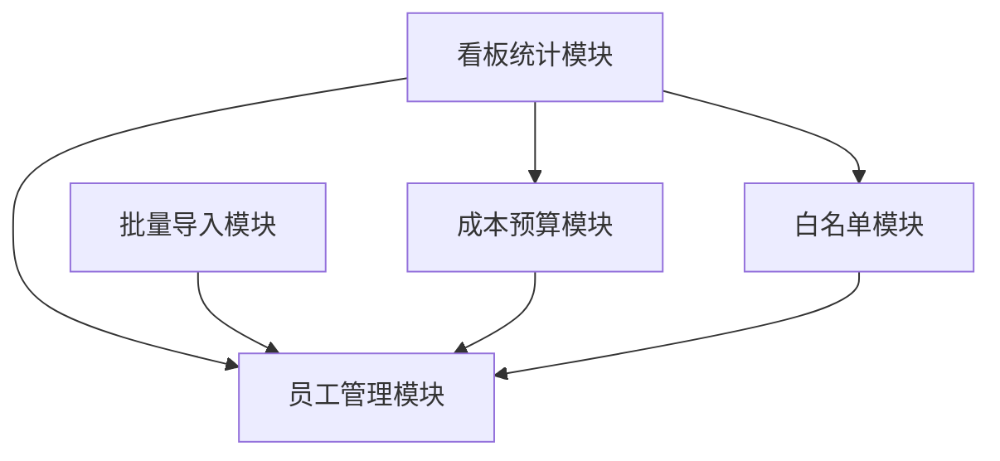

依赖说明：看板统计依赖员工、成本预算、白名单三个模块的查询能力；批量导入依赖员工管理模块的写入能力；成本预算和白名单均以员工为关联主体。无循环依赖。

### 2.4 外部系统集成

| 集成点 | 协议/接口类型 | 调用关系 | 说明 |
|--------|--------------|----------|------|
| 组织（org）体系 | 内部 Service 调用 | 人员看板 → org service | 获取组织信息，数据按 org_id 隔离 |
| 现有平台用户体系 | 内部 Service 调用 | 人员看板 → user service | 获取操作人身份、权限校验 |

无外部第三方系统集成。人员看板为平台内部自建功能。

### 2.5 技术选型方案对比

**决策项：批量导入实现方式**

| 方案 | 描述 | 优势 | 劣势 |
|------|------|------|------|
| 方案 A：同步解析+批量插入 | 上传文件后同步解析、校验、批量写入，返回结果摘要 | 实现简单，即时反馈 | 大文件（>5000行）可能超时 |
| 方案 B：异步任务+轮询 | 上传后创建导入任务，后台异步处理，前端轮询进度 | 支持大文件，不阻塞请求 | 实现复杂度高，需任务状态管理 |
| 方案 C：同步为主+大文件降级异步 | 5000 行以内同步处理，超过则降级异步任务 | 兼顾体验与复杂度 | 需双路径维护 |

**推荐：方案 A（同步解析+批量插入）**。理由：需求场景为人员管理，单次导入量通常 < 5000 行；同步处理体验最佳、实现最简；对超大文件场景可通过前端限制单次导入行数规避超时风险。导入任务表（import_task）仍保留用于记录导入历史与结果。

**决策项：白名单实现方式**

| 方案 | 描述 | 优势 | 劣势 |
|------|------|------|------|
| 方案 A：独立白名单表 | whitelist 表存储员工 ID + 生效时间 + 备注 | 灵活，支持时效控制与备注 | 需 JOIN 查询判断是否在白名单 |
| 方案 B：员工表 is_whitelisted 标记位 | employee 表加布尔字段 | 查询简单，无 JOIN | 不支持时效控制、备注等维度 |

**推荐：方案 A（独立白名单表）**。理由：需求中白名单与成本预算并列提及，通常涉及准入/权益控制场景，需时效管理与备注信息，独立表扩展性更强。

---

## 三、Step 3: 数据模型与存储

### 3.1 实体清单

| 实体名 | 说明 | 所属模块 | 关系 |
|--------|------|----------|------|
| employee | 员工基本信息 | 员工管理 | 一个 org 下有多 employee；被 cost_budget、whitelist 关联 |
| cost_budget | 成本预算记录 | 成本预算 | 属于一个 employee；一个 employee 可有多条预算 |
| whitelist | 白名单记录 | 白名单 | 属于一个 employee；一个 employee 可有多条白名单（含历史） |
| import_task | 导入任务记录 | 批量导入 | 记录每次批量导入的执行情况与结果 |

### 3.2 实体关系图

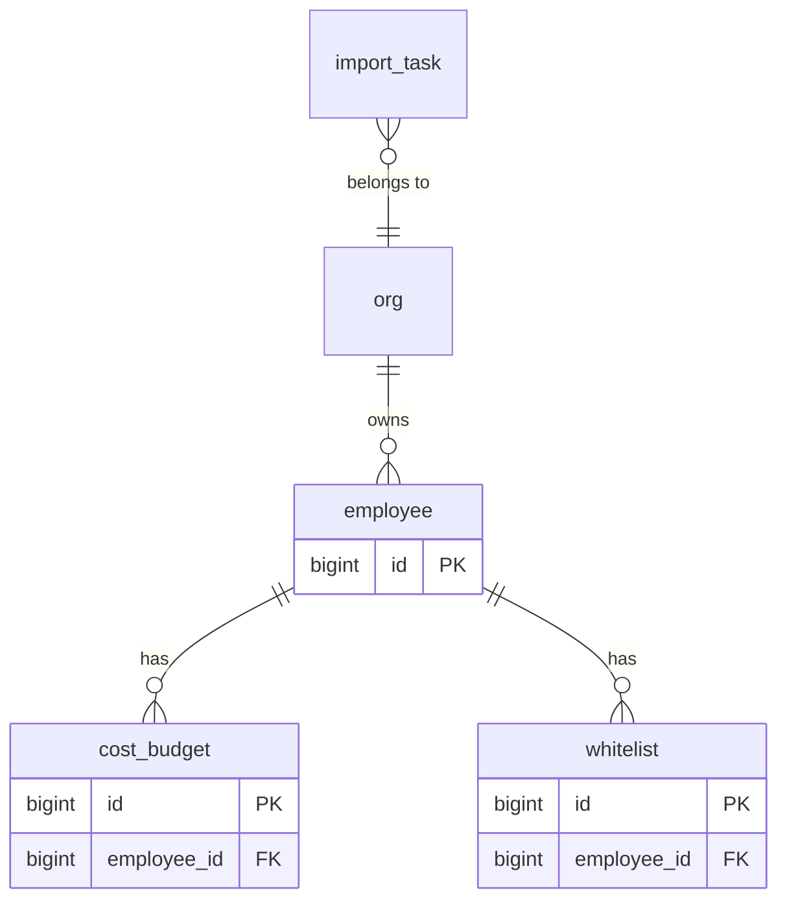

关系说明：
- employee 与 cost_budget：一对多，一个员工可有多条成本预算记录（不同周期/类型）。
- employee 与 whitelist：一对多，一个员工可有多条白名单记录（含历史失效记录）。
- org 与 employee：一对多，组织下拥有多个员工。
- import_task 与 org：多对一，导入任务归属于组织。
- 所有外键关系在应用层维护（Drizzle ORM 层），数据库层不建外键（遵循 db.md 规范：禁止使用外键）。

### 3.3 缓存设计

| 缓存对象 | 缓存策略 | 说明 |
|----------|----------|------|
| 看板统计数据 | Redis 缓存，TTL 5 分钟 | 部门/状态汇总、预算汇总等统计结果缓存，减少实时聚合查询压力 |
| 白名单判断 | 内存缓存 + TTL 10 分钟 | 批量导入时校验白名单，本地缓存避免频繁查库 |

---

## 四、Step 4: 接口设计

### 4.1 接口列表总览

| 编号 | 名称 | 方法 | 路径/签名 | 所属模块 |
|------|------|------|-----------|----------|
| I01 | 创建员工 | tRPC mutation | staff.create | 员工管理 |
| I02 | 查询员工列表 | tRPC query | staff.list | 员工管理 |
| I03 | 更新员工 | tRPC mutation | staff.update | 员工管理 |
| I04 | 删除员工 | tRPC mutation | staff.delete | 员工管理 |
| I05 | 下载导入模板 | tRPC query | staff.importTemplate | 批量导入 |
| I06 | 批量导入员工 | tRPC mutation | staff.batchImport | 批量导入 |
| I07 | 查询导入任务列表 | tRPC query | staff.importTasks | 批量导入 |
| I08 | 创建成本预算 | tRPC mutation | costBudget.create | 成本预算 |
| I09 | 查询成本预算列表 | tRPC query | costBudget.list | 成本预算 |
| I10 | 更新成本预算 | tRPC mutation | costBudget.update | 成本预算 |
| I11 | 删除成本预算 | tRPC mutation | costBudget.delete | 成本预算 |
| I12 | 添加白名单 | tRPC mutation | whitelist.add | 白名单 |
| I13 | 查询白名单列表 | tRPC query | whitelist.list | 白名单 |
| I14 | 移除白名单 | tRPC mutation | whitelist.remove | 白名单 |
| I15 | 看板汇总统计 | tRPC query | staffDashboard.summary | 看板统计 |
| I16 | 看板部门维度统计 | tRPC query | staffDashboard.byDepartment | 看板统计 |

接口形式说明：本平台对外接口统一采用 tRPC procedure（Web 控制台 oneapi 形式），前端通过 tRPC client 直接调用。tRPC procedure 路径如 `staff.list` 对应 HTTP `POST /api/trpc/staff.list`。

---

## 五、Step 5: 功能模块设计

### 5.0 全局约定

| 约定项 | 规则 |
|--------|------|
| 错误码格式 | `{MODULE}_{SEQ}`，如 `STAFF_001`、`BUDGET_001`、`WL_001`、`IMPORT_001`、`DASH_001` |
| 通用出参结构 | `{ code: number, msg: string, data: T }`；code=0 表示成功，非 0 表示业务错误 |
| 通用分页入参 | `{ page: number, pageSize: number, ...filters }`，page 从 1 开始 |
| 通用分页出参 | `{ list: T[], total: number, page: number, pageSize: number }` |
| 时间字段 | 统一 `gmt_create` / `gmt_modified`，datetime 类型，代码层维护 |
| 主键 | bigint 自增，字段名 `id` |
| 软删除 | `is_deleted` 布尔字段，删除置 1，查询默认过滤 is_deleted=0 |

#### 模块映射表

| 模块名 | 错误码前缀 | 对应实体 |
|--------|-----------|----------|
| 员工管理 | STAFF | employee |
| 成本预算 | BUDGET | cost_budget |
| 白名单 | WL | whitelist |
| 批量导入 | IMPORT | import_task |
| 看板统计 | DASH | employee, cost_budget, whitelist |

### 5.1 员工管理模块

#### 5.1.1 表结构设计：employee

> 遵循 references/db.md 规范：表名小写下划线、整形单列主键、bigint、datetime、禁 enum/外键/float。

| 字段名 | 类型 | 是否非空 | 默认值 | 注释 |
|--------|------|---------|--------|------|
| id | bigint unsigned | NOT NULL | AUTO_INCREMENT | 主键 |
| org_id | bigint unsigned | NOT NULL |  | 组织 ID，数据隔离用 |
| employee_no | varchar(64) | NOT NULL |  | 工号，组织内唯一 |
| name | varchar(128) | NOT NULL |  | 员工姓名 |
| department | varchar(128) | NULL | NULL | 部门名称 |
| position | varchar(128) | NULL | NULL | 岗位名称 |
| phone | varchar(32) | NULL | NULL | 手机号（脱敏展示） |
| email | varchar(128) | NULL | NULL | 邮箱 |
| id_card_no | varchar(128) | NULL | NULL | 身份证号（加密存储） |
| status | tinyint | NOT NULL | 1 | 员工状态：1在职 2试用期 3已离职 |
| entry_date | date | NULL | NULL | 入职日期 |
| leave_date | date | NULL | NULL | 离职日期 |
| remark | varchar(512) | NULL | NULL | 备注 |
| is_deleted | tinyint | NOT NULL | 0 | 是否删除：0否 1是 |
| gmt_create | datetime | NOT NULL | CURRENT_TIMESTAMP | 创建时间 |
| gmt_modified | datetime | NOT NULL | CURRENT_TIMESTAMP | 更新时间 |
| creator_id | bigint unsigned | NULL | NULL | 创建人 ID |
| modifier_id | bigint unsigned | NULL | NULL | 更新人 ID |

索引设计：

| 索引名 | 类型 | 字段 | 说明 |
|--------|------|------|------|
| pk_employee_id | 主键 | id | 主键索引 |
| uk_employee_org_no | 唯一索引 | (org_id, employee_no) | 组织内工号唯一 |
| idx_employee_org_status | 普通索引 | (org_id, status) | 按组织+状态列表查询 |
| idx_employee_org_department | 普通索引 | (org_id, department) | 按组织+部门筛选 |
| idx_employee_name | 普通索引 | org_id, name | 按组织+姓名搜索（左前缀） |

范式分析：满足第三范式。department 冗余存储部门名称（非外键关联部门表），理由：需求未要求独立组织架构模块，部门作为员工属性，冗余可避免额外 JOIN，且部门名称修改频率低，符合 db.md 冗余字段规范。

#### 5.1.2 枚举与常量定义

**EmployeeStatus（员工状态）**

| 枚举值 | 名称 | 说明 |
|--------|------|------|
| 1 | ACTIVE | 在职 |
| 2 | PROBATION | 试用期 |
| 3 | RESIGNED | 已离职 |

> 注：数据库层使用 tinyint 存储（遵循 db.md 禁止 enum 类型），枚举值在应用层（schema-types.ts）维护。

#### 5.1.3 接口详细设计

##### I01: staff.create — 创建员工

| 参数 | 类型 | 必填 | 说明 |
|------|------|------|------|
| orgId | number | 是 | 组织 ID（从上下文获取，不前端传） |
| employeeNo | string | 是 | 工号 |
| name | string | 是 | 姓名 |
| department | string | 否 | 部门 |
| position | string | 否 | 岗位 |
| phone | string | 否 | 手机号 |
| email | string | 否 | 邮箱 |
| idCardNo | string | 否 | 身份证号 |
| status | number | 否 | 状态，默认 1 |
| entryDate | string | 否 | 入职日期 YYYY-MM-DD |
| remark | string | 否 | 备注 |

| 出参字段 | 类型 | 说明 |
|----------|------|------|
| id | number | 创建的员工 ID |
| employeeNo | string | 工号 |
| name | string | 姓名 |

| 错误码 | 含义 |
|--------|------|
| STAFF_001 | 工号在组织内已存在 |
| STAFF_002 | 必填字段缺失 |
| STAFF_003 | 手机号格式不合法 |

请求示例：`{ "employeeNo": "EMP001", "name": "张三", "department": "研发部", "position": "工程师", "phone": "138****0001", "status": 1, "entryDate": "2026-07-01" }`

响应示例：`{ "code": 0, "msg": "success", "data": { "id": 1001, "employeeNo": "EMP001", "name": "张三" } }`

##### I02: staff.list — 查询员工列表

| 参数 | 类型 | 必填 | 说明 |
|------|------|------|------|
| page | number | 否 | 页码，默认 1 |
| pageSize | number | 否 | 每页条数，默认 20 |
| keyword | string | 否 | 搜索关键字（匹配姓名/工号） |
| department | string | 否 | 部门筛选 |
| status | number | 否 | 状态筛选 |

| 出参字段 | 类型 | 说明 |
|----------|------|------|
| list | Employee[] | 员工列表 |
| total | number | 总数 |
| page | number | 当前页 |
| pageSize | number | 每页条数 |

Employee 结构含：id, employeeNo, name, department, position, phone(脱敏), email, status, entryDate, gmtCreate

| 错误码 | 含义 |
|--------|------|
| STAFF_004 | 分页参数不合法 |

##### I03: staff.update — 更新员工

| 参数 | 类型 | 必填 | 说明 |
|------|------|------|------|
| id | number | 是 | 员工 ID |
| name | string | 否 | 姓名 |
| department | string | 否 | 部门 |
| position | string | 否 | 岗位 |
| phone | string | 否 | 手机号 |
| email | string | 否 | 邮箱 |
| status | number | 否 | 状态 |
| entryDate | string | 否 | 入职日期 |
| leaveDate | string | 否 | 离职日期（状态改为离职时填写） |
| remark | string | 否 | 备注 |

| 出参字段 | 类型 | 说明 |
|----------|------|------|
| id | number | 员工 ID |
| updatedAt | string | 更新时间 |

| 错误码 | 含义 |
|--------|------|
| STAFF_005 | 员工不存在或已删除 |
| STAFF_006 | 无可更新字段 |

##### I04: staff.delete — 删除员工

| 参数 | 类型 | 必填 | 说明 |
|------|------|------|------|
| id | number | 是 | 员工 ID |

| 出参字段 | 类型 | 说明 |
|----------|------|------|
| id | number | 员工 ID |
| deleted | boolean | 是否删除成功 |

| 错误码 | 含义 |
|--------|------|
| STAFF_005 | 员工不存在或已删除 |
| STAFF_007 | 员工存在关联成本预算/白名单，需先清理 |

#### 5.1.4 子功能：创建员工时序图

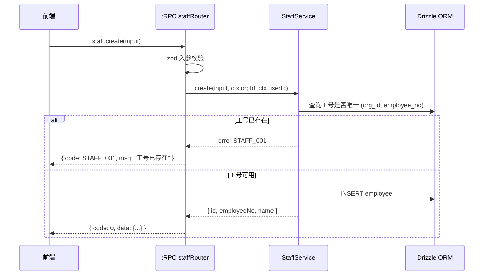

#### 5.1.5 业务规则表

| 规则编号 | 规则描述 | 触发场景 | 处理逻辑 |
|----------|----------|----------|----------|
| BR-S01 | 工号组织内唯一 | 创建/更新 | 校验 (org_id, employee_no) 不存在重复 |
| BR-S02 | 手机号脱敏展示 | 查询返回 | 手机号中间 4 位脱敏为 **** |
| BR-S03 | 身份证号加密存储 | 创建/更新 | 写入前加密，读取时解密 |
| BR-S04 | 删除前校验关联 | 删除 | 检查 cost_budget、whitelist 是否有未清理记录 |
| BR-S05 | 离职需填离职日期 | 更新状态为离职 | status=3 时 leaveDate 必填 |

#### 5.1.6 异常场景表

| 场景编号 | 场景描述 | 触发条件 | 处理方式 |
|----------|----------|----------|----------|
| EX-S01 | 工号重复 | 创建时工号已存在 | 返回 STAFF_001，提示用户修改工号 |
| EX-S02 | 员工不存在 | 更新/删除时 ID 无效 | 返回 STAFF_005 |
| EX-S03 | 存在关联记录 | 删除时有成本预算/白名单 | 返回 STAFF_007，提示先清理 |
| EX-S04 | 手机号格式错误 | 创建/更新手机号不合法 | 返回 STAFF_003 |
| EX-S05 | 数据库写入失败 | DB 异常 | 返回通用 500 错误，记录日志 |

#### 5.1.7 状态机：员工状态

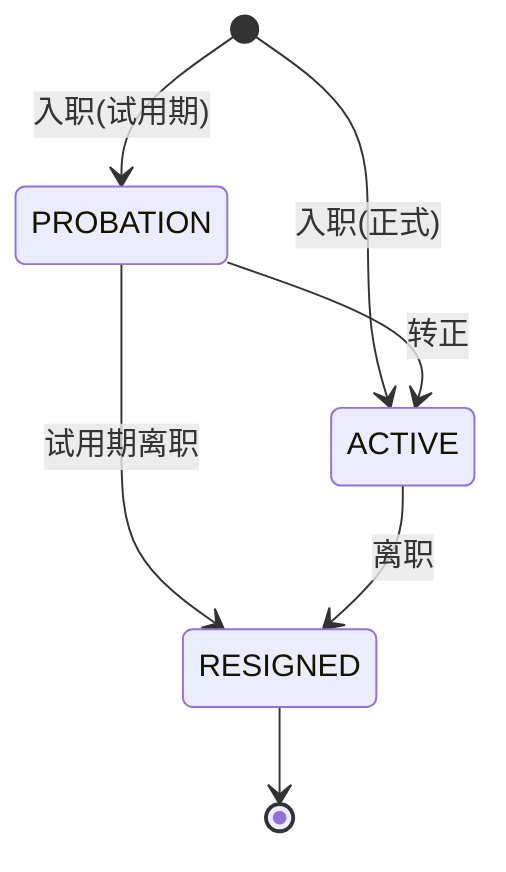

状态流转条件表：

| 源状态 | 目标状态 | 触发操作 | 附加要求 |
|--------|---------|----------|----------|
| (初始) | PROBATION(2) | 创建员工，status=2 | 填写 entryDate |
| (初始) | ACTIVE(1) | 创建员工，status=1 | 填写 entryDate |
| PROBATION(2) | ACTIVE(1) | 更新 status=1 | 无 |
| PROBATION(2) | RESIGNED(3) | 更新 status=3 | 填写 leaveDate |
| ACTIVE(1) | RESIGNED(3) | 更新 status=3 | 填写 leaveDate |

无孤岛状态：所有状态可达且有退出路径。不允许从 RESIGNED 回退到 ACTIVE/PROBATION（离职不可恢复，如需重新入职请新建记录）。

#### 5.1.8 并发控制策略

| 风险点 | 策略 |
|--------|------|
| 并发创建同工号 | 唯一索引 uk_employee_org_no 兜底，DB 层报冲突；Service 层先查后插 + 唯一约束双重保障 |
| 并发更新同一员工 | 乐观锁，基于 gmt_modified 版本号校验（更新时 WHERE 含 gmt_modified，受影响行数=0 即冲突） |

#### 5.1.9 模块自检

| 检查项 | 结果 |
|--------|------|
| F01-F04 功能点是否全覆盖 | ✅ 覆盖（I01-I04） |
| 表结构是否每字段定义 | ✅ |
| 枚举是否集中定义 | ✅ EmployeeStatus |
| 接口入参出参是否表格化 | ✅ |
| 时序图/业务规则/异常场景是否完整 | ✅ |
| 状态机是否有孤岛 | ✅ 无孤岛 |
| 是否过度设计 | ✅ 否，均为 CRUD 必要设计 |

### 5.2 成本预算模块

#### 5.2.1 表结构设计：cost_budget

| 字段名 | 类型 | 是否非空 | 默认值 | 注释 |
|--------|------|---------|--------|------|
| id | bigint unsigned | NOT NULL | AUTO_INCREMENT | 主键 |
| org_id | bigint unsigned | NOT NULL |  | 组织 ID |
| employee_id | bigint unsigned | NOT NULL |  | 员工 ID |
| budget_type | tinyint | NOT NULL | 1 | 预算类型：1人力成本 2项目预算 3其他 |
| period | varchar(16) | NOT NULL |  | 预算周期，如 2026-07 或 2026-Q3 |
| amount | decimal(14,2) | NOT NULL |  | 预算金额（元），禁用 float/double |
| currency | varchar(8) | NOT NULL | CNY | 币种 |
| remark | varchar(512) | NULL | NULL | 备注 |
| is_deleted | tinyint | NOT NULL | 0 | 是否删除 |
| gmt_create | datetime | NOT NULL | CURRENT_TIMESTAMP | 创建时间 |
| gmt_modified | datetime | NOT NULL | CURRENT_TIMESTAMP | 更新时间 |
| creator_id | bigint unsigned | NULL | NULL | 创建人 ID |
| modifier_id | bigint unsigned | NULL | NULL | 更新人 ID |

索引设计：

| 索引名 | 类型 | 字段 | 说明 |
|--------|------|------|------|
| pk_cost_budget_id | 主键 | id | 主键索引 |
| uk_budget_emp_period | 唯一索引 | (employee_id, budget_type, period) | 员工+类型+周期唯一，防重复录入 |
| idx_budget_org_period | 普通索引 | (org_id, period) | 按组织+周期汇总查询 |
| idx_budget_emp | 普通索引 | (employee_id, is_deleted) | 按员工查询预算 |

范式分析：满足第三范式。amount 使用 decimal 遵循 db.md 禁止 float/double 规范。

#### 5.2.2 枚举与常量定义

**BudgetType（预算类型）**

| 枚举值 | 名称 | 说明 |
|--------|------|------|
| 1 | LABOR_COST | 人力成本 |
| 2 | PROJECT_BUDGET | 项目预算 |
| 3 | OTHER | 其他 |

#### 5.2.3 接口详细设计

##### I08: costBudget.create — 创建成本预算

| 参数 | 类型 | 必填 | 说明 |
|------|------|------|------|
| employeeId | number | 是 | 员工 ID |
| budgetType | number | 是 | 预算类型 |
| period | string | 是 | 预算周期 |
| amount | number | 是 | 预算金额 |
| currency | string | 否 | 币种，默认 CNY |
| remark | string | 否 | 备注 |

| 出参字段 | 类型 | 说明 |
|----------|------|------|
| id | number | 预算记录 ID |

| 错误码 | 含义 |
|--------|------|
| BUDGET_001 | 员工不存在 |
| BUDGET_002 | 同员工+类型+周期已存在预算 |
| BUDGET_003 | 金额必须大于 0 |

##### I09: costBudget.list — 查询成本预算列表

| 参数 | 类型 | 必填 | 说明 |
|------|------|------|------|
| page | number | 否 | 页码，默认 1 |
| pageSize | number | 否 | 每页条数，默认 20 |
| employeeId | number | 否 | 按员工筛选 |
| budgetType | number | 否 | 按类型筛选 |
| period | string | 否 | 按周期筛选 |

| 出参字段 | 类型 | 说明 |
|----------|------|------|
| list | CostBudget[] | 预算列表 |
| total | number | 总数 |

##### I10: costBudget.update — 更新成本预算

| 参数 | 类型 | 必填 | 说明 |
|------|------|------|------|
| id | number | 是 | 预算记录 ID |
| amount | number | 否 | 预算金额 |
| remark | string | 否 | 备注 |

| 出参字段 | 类型 | 说明 |
|----------|------|------|
| id | number | 预算记录 ID |
| updatedAt | string | 更新时间 |

| 错误码 | 含义 |
|--------|------|
| BUDGET_004 | 预算记录不存在或已删除 |
| BUDGET_003 | 金额必须大于 0 |

##### I11: costBudget.delete — 删除成本预算

| 参数 | 类型 | 必填 | 说明 |
|------|------|------|------|
| id | number | 是 | 预算记录 ID |

| 出参字段 | 类型 | 说明 |
|----------|------|------|
| id | number | 预算记录 ID |
| deleted | boolean | 是否删除成功 |

| 错误码 | 含义 |
|--------|------|
| BUDGET_004 | 预算记录不存在或已删除 |

#### 5.2.4 子功能：创建成本预算时序图

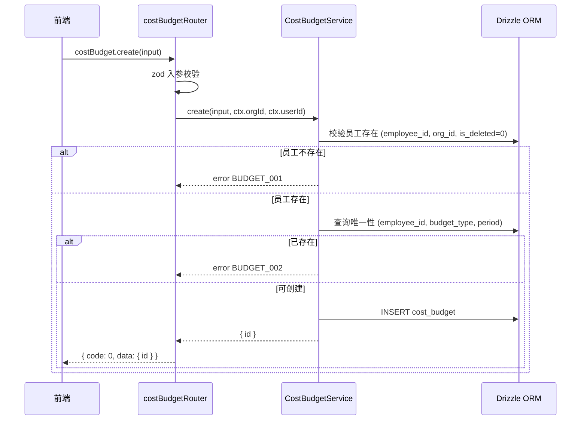

#### 5.2.5 业务规则表

| 规则编号 | 规则描述 | 触发场景 | 处理逻辑 |
|----------|----------|----------|----------|
| BR-B01 | 员工必须存在且未删除 | 创建预算 | 校验 employee 有效 |
| BR-B02 | 同员工+类型+周期唯一 | 创建 | 唯一索引兜底，先查后插 |
| BR-B03 | 金额必须 > 0 | 创建/更新 | 校验 amount > 0 |
| BR-B04 | 金额精度两位小数 | 创建/更新 | decimal(14,2) 存储 |

#### 5.2.6 异常场景表

| 场景编号 | 场景描述 | 触发条件 | 处理方式 |
|----------|----------|----------|----------|
| EX-B01 | 员工不存在 | 关联员工被删除 | 返回 BUDGET_001 |
| EX-B02 | 预算重复 | 同员工+类型+周期已存在 | 返回 BUDGET_002 |
| EX-B03 | 金额非法 | amount<=0 | 返回 BUDGET_003 |
| EX-B04 | 预算不存在 | 更新/删除 ID 无效 | 返回 BUDGET_004 |

#### 5.2.7 并发控制策略

| 风险点 | 策略 |
|--------|------|
| 并发创建同员工+类型+周期 | 唯一索引 uk_budget_emp_period 兜底 + Service 层先查后插 |
| 并发更新同预算 | 乐观锁，基于 gmt_modified 版本号校验 |

#### 5.2.8 模块自检

| 检查项 | 结果 |
|--------|------|
| F06 功能点是否覆盖 | ✅ 覆盖（I08-I11） |
| 表结构是否完整 | ✅ |
| 枚举是否集中 | ✅ BudgetType |
| 接口是否表格化 | ✅ |
| 时序图/规则/异常是否完整 | ✅ |
| 无状态字段需状态机 | ✅ 本项不适用，原因：cost_budget 无状态字段，仅 is_deleted 软删 |
| 是否过度设计 | ✅ 否 |

### 5.3 白名单模块

#### 5.3.1 表结构设计：whitelist

| 字段名 | 类型 | 是否非空 | 默认值 | 注释 |
|--------|------|---------|--------|------|
| id | bigint unsigned | NOT NULL | AUTO_INCREMENT | 主键 |
| org_id | bigint unsigned | NOT NULL |  | 组织 ID |
| employee_id | bigint unsigned | NOT NULL |  | 员工 ID |
| wl_type | tinyint | NOT NULL | 1 | 白名单类型：1准入 2权益 |
| status | tinyint | NOT NULL | 1 | 状态：1生效 2失效 |
| effective_date | date | NOT NULL |  | 生效日期 |
| expire_date | date | NULL | NULL | 失效日期，NULL 表示长期有效 |
| remark | varchar(512) | NULL | NULL | 备注 |
| is_deleted | tinyint | NOT NULL | 0 | 是否删除 |
| gmt_create | datetime | NOT NULL | CURRENT_TIMESTAMP | 创建时间 |
| gmt_modified | datetime | NOT NULL | CURRENT_TIMESTAMP | 更新时间 |
| creator_id | bigint unsigned | NULL | NULL | 创建人 ID |
| modifier_id | bigint unsigned | NULL | NULL | 更新人 ID |

索引设计：

| 索引名 | 类型 | 字段 | 说明 |
|--------|------|------|------|
| pk_whitelist_id | 主键 | id | 主键索引 |
| uk_wl_emp_type | 唯一索引 | (employee_id, wl_type, is_deleted) | 同员工同类型仅一条有效记录 |
| idx_wl_org_status | 普通索引 | (org_id, status) | 按组织+状态查询 |
| idx_wl_emp | 普通索引 | (employee_id, status) | 按员工查询白名单状态 |

#### 5.3.2 枚举与常量定义

**WhitelistType（白名单类型）**

| 枚举值 | 名称 | 说明 |
|--------|------|------|
| 1 | ACCESS | 准入 |
| 2 | BENEFIT | 权益 |

**WhitelistStatus（白名单状态）**

| 枚举值 | 名称 | 说明 |
|--------|------|------|
| 1 | ACTIVE | 生效 |
| 2 | EXPIRED | 失效 |

#### 5.3.3 接口详细设计

##### I12: whitelist.add — 添加白名单

| 参数 | 类型 | 必填 | 说明 |
|------|------|------|------|
| employeeId | number | 是 | 员工 ID |
| wlType | number | 是 | 白名单类型 |
| effectiveDate | string | 是 | 生效日期 |
| expireDate | string | 否 | 失效日期 |
| remark | string | 否 | 备注 |

| 出参字段 | 类型 | 说明 |
|----------|------|------|
| id | number | 白名单记录 ID |

| 错误码 | 含义 |
|--------|------|
| WL_001 | 员工不存在 |
| WL_002 | 同员工同类型已有生效记录 |
| WL_003 | 失效日期早于生效日期 |

##### I13: whitelist.list — 查询白名单列表

| 参数 | 类型 | 必填 | 说明 |
|------|------|------|------|
| page | number | 否 | 页码 |
| pageSize | number | 否 | 每页条数 |
| employeeId | number | 否 | 按员工筛选 |
| wlType | number | 否 | 按类型筛选 |
| status | number | 否 | 按状态筛选 |

| 出参字段 | 类型 | 说明 |
|----------|------|------|
| list | Whitelist[] | 白名单列表 |
| total | number | 总数 |

##### I14: whitelist.remove — 移除白名单

| 参数 | 类型 | 必填 | 说明 |
|------|------|------|------|
| id | number | 是 | 白名单记录 ID |

| 出参字段 | 类型 | 说明 |
|----------|------|------|
| id | number | 白名单记录 ID |
| deleted | boolean | 是否删除成功 |

| 错误码 | 含义 |
|--------|------|
| WL_004 | 白名单记录不存在或已删除 |

#### 5.3.4 子功能：添加白名单时序图

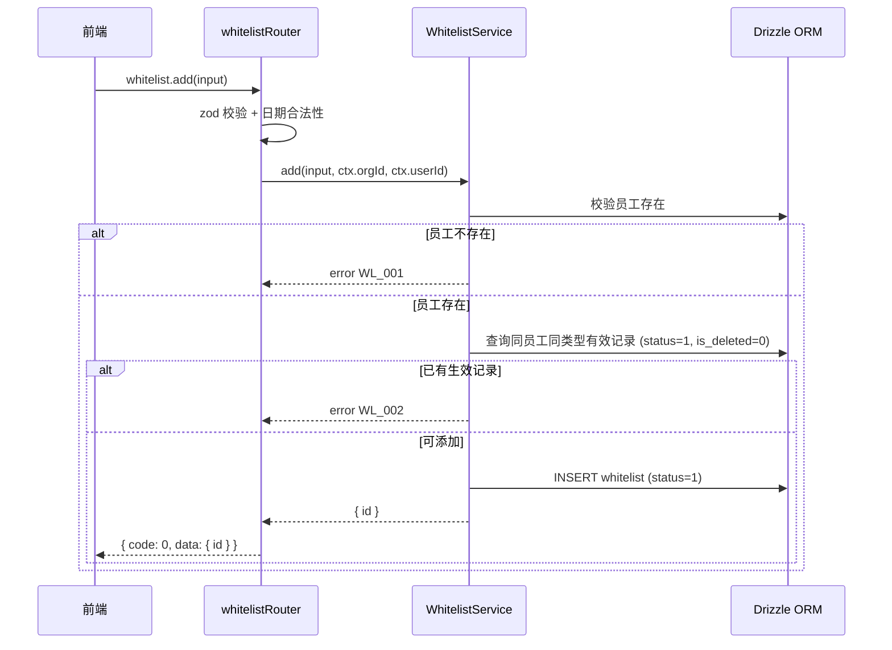

#### 5.3.5 业务规则表

| 规则编号 | 规则描述 | 触发场景 | 处理逻辑 |
|----------|----------|----------|----------|
| BR-W01 | 员工必须存在 | 添加白名单 | 校验 employee 有效 |
| BR-W02 | 同员工同类型仅一条生效 | 添加 | 查询唯一性，已存在返回 WL_002 |
| BR-W03 | 失效日期须晚于生效日期 | 添加 | 校验 expireDate > effectiveDate |
| BR-W04 | 到期自动失效 | 定时任务/查询时 | expire_date < 当前日期 则 status 置为 2（查询时计算或定时任务刷新） |

#### 5.3.6 异常场景表

| 场景编号 | 场景描述 | 触发条件 | 处理方式 |
|----------|----------|----------|----------|
| EX-W01 | 员工不存在 | 关联员工被删除 | 返回 WL_001 |
| EX-W02 | 重复添加 | 同员工同类型已有生效 | 返回 WL_002 |
| EX-W03 | 日期不合法 | expireDate<=effectiveDate | 返回 WL_003 |
| EX-W04 | 白名单不存在 | 移除时 ID 无效 | 返回 WL_004 |

#### 5.3.7 状态机：白名单状态

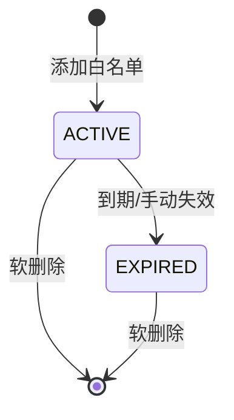

状态流转条件表：

| 源状态 | 目标状态 | 触发操作 | 附加要求 |
|--------|---------|----------|----------|
| (初始) | ACTIVE(1) | 添加白名单 | 填写 effectiveDate |
| ACTIVE(1) | EXPIRED(2) | 到期自动 / 手动失效 | 到期：expire_date<now；手动：更新 status=2 |

无孤岛状态。

#### 5.3.8 并发控制策略

| 风险点 | 策略 |
|--------|------|
| 并发添加同员工同类型 | 唯一索引 uk_wl_emp_type + Service 层先查后插 |

#### 5.3.9 模块自检

| 检查项 | 结果 |
|--------|------|
| F07 功能点是否覆盖 | ✅ 覆盖（I12-I14） |
| 表结构是否完整 | ✅ |
| 枚举是否集中 | ✅ WhitelistType, WhitelistStatus |
| 接口是否表格化 | ✅ |
| 时序图/规则/异常是否完整 | ✅ |
| 状态机是否有孤岛 | ✅ 无孤岛 |
| 是否过度设计 | ✅ 否 |

### 5.4 批量导入模块

#### 5.4.1 表结构设计：import_task

| 字段名 | 类型 | 是否非空 | 默认值 | 注释 |
|--------|------|---------|--------|------|
| id | bigint unsigned | NOT NULL | AUTO_INCREMENT | 主键 |
| org_id | bigint unsigned | NOT NULL |  | 组织 ID |
| task_type | tinyint | NOT NULL | 1 | 任务类型：1员工导入 2白名单导入 |
| file_name | varchar(256) | NOT NULL |  | 文件名 |
| total_count | int | NOT NULL | 0 | 总行数 |
| success_count | int | NOT NULL | 0 | 成功行数 |
| fail_count | int | NOT NULL | 0 | 失败行数 |
| status | tinyint | NOT NULL | 1 | 任务状态：1处理中 2成功 3部分失败 4失败 |
| fail_detail | text | NULL | NULL | 失败明细 JSON（行号+原因） |
| is_deleted | tinyint | NOT NULL | 0 | 是否删除 |
| gmt_create | datetime | NOT NULL | CURRENT_TIMESTAMP | 创建时间 |
| gmt_modified | datetime | NOT NULL | CURRENT_TIMESTAMP | 更新时间 |
| creator_id | bigint unsigned | NULL | NULL | 创建人 ID |

索引设计：

| 索引名 | 类型 | 字段 | 说明 |
|--------|------|------|------|
| pk_import_task_id | 主键 | id | 主键索引 |
| idx_import_org_create | 普通索引 | (org_id, gmt_create) | 按组织+时间查询导入历史 |

> 注：fail_detail 用 text 类型存储失败明细 JSON，因属日志类大字段，按 db.md 规范可接受；高频查询字段（total/success/fail_count）独立列存储，避免从 text 解析。

#### 5.4.2 枚举与常量定义

**ImportTaskType（任务类型）**

| 枚举值 | 名称 | 说明 |
|--------|------|------|
| 1 | STAFF_IMPORT | 员工导入 |
| 2 | WHITELIST_IMPORT | 白名单导入 |

**ImportTaskStatus（任务状态）**

| 枚举值 | 名称 | 说明 |
|--------|------|------|
| 1 | PROCESSING | 处理中 |
| 2 | SUCCESS | 成功 |
| 3 | PARTIAL_FAIL | 部分失败 |
| 4 | FAIL | 失败 |

#### 5.4.3 接口详细设计

##### I05: staff.importTemplate — 下载导入模板

| 参数 | 类型 | 必填 | 说明 |
|------|------|------|------|
| type | number | 否 | 模板类型：1员工 2白名单，默认 1 |

| 出参字段 | 类型 | 说明 |
|----------|------|------|
| downloadUrl | string | 模板文件下载地址 |
| columns | string[] | 模板列说明 |

> 模板列（员工）：工号*、姓名*、部门、岗位、手机号、邮箱、状态*、入职日期、备注

##### I06: staff.batchImport — 批量导入员工

| 参数 | 类型 | 必填 | 说明 |
|------|------|------|------|
| file | File/Blob | 是 | 上传的 Excel/CSV 文件 |
| type | number | 否 | 导入类型：1员工 2白名单，默认 1 |

| 出参字段 | 类型 | 说明 |
|----------|------|------|
| taskId | number | 导入任务 ID |
| totalCount | number | 总行数 |
| successCount | number | 成功数 |
| failCount | number | 失败数 |
| failDetail | FailItem[] | 失败明细（行号、原因） |

FailItem 结构：`{ row: number, reason: string, data: string }`

| 错误码 | 含义 |
|--------|------|
| IMPORT_001 | 文件格式不合法（仅支持 xlsx/csv） |
| IMPORT_002 | 文件为空 |
| IMPORT_003 | 超过最大导入行数（5000） |
| IMPORT_004 | 必填列缺失 |

##### I07: staff.importTasks — 查询导入任务列表

| 参数 | 类型 | 必填 | 说明 |
|------|------|------|------|
| page | number | 否 | 页码 |
| pageSize | number | 否 | 每页条数 |
| type | number | 否 | 按任务类型筛选 |

| 出参字段 | 类型 | 说明 |
|----------|------|------|
| list | ImportTask[] | 任务列表 |
| total | number | 总数 |

#### 5.4.4 子功能：批量导入时序图

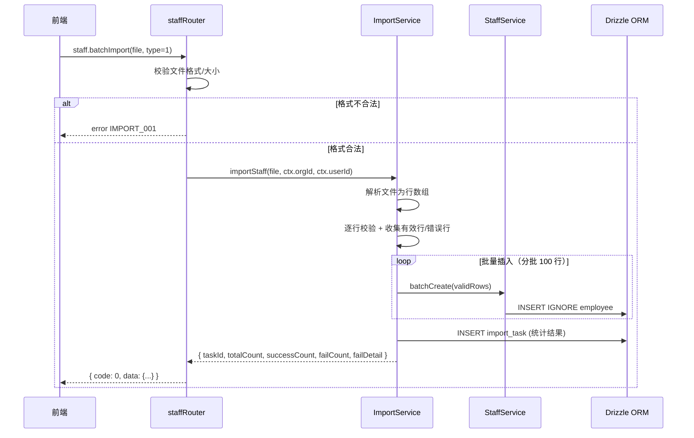

#### 5.4.5 业务规则表

| 规则编号 | 规则描述 | 触发场景 | 处理逻辑 |
|----------|----------|----------|----------|
| BR-I01 | 文件格式限制 | 上传 | 仅 .xlsx / .csv |
| BR-I02 | 单次最大 5000 行 | 上传 | 超过返回 IMPORT_003 |
| BR-I03 | 必填列校验 | 解析 | 工号、姓名为空跳过并记入失败明细 |
| BR-I04 | 工号重复处理 | 插入 | 同文件内重复取第一条；与 DB 冲突用 INSERT IGNORE 跳过 |
| BR-I05 | 分批插入 | 批量写入 | 每 100 行一批，避免单次 SQL 过大 |
| BR-I06 | 记录导入任务 | 完成后 | 写入 import_task 表 |

#### 5.4.6 异常场景表

| 场景编号 | 场景描述 | 触发条件 | 处理方式 |
|----------|----------|----------|----------|
| EX-I01 | 文件格式错误 | 非 xlsx/csv | 返回 IMPORT_001 |
| EX-I02 | 文件为空 | 0 行数据 | 返回 IMPORT_002 |
| EX-I03 | 超量 | >5000 行 | 返回 IMPORT_003 |
| EX-I04 | 部分行失败 | 校验不通过 | 跳过失败行，继续导入有效行，状态记 PARTIAL_FAIL |
| EX-I05 | DB 批量写入异常 | 批量插入失败 | 该批回退，记入 failDetail，继续后续批次 |

#### 5.4.7 状态机：导入任务状态

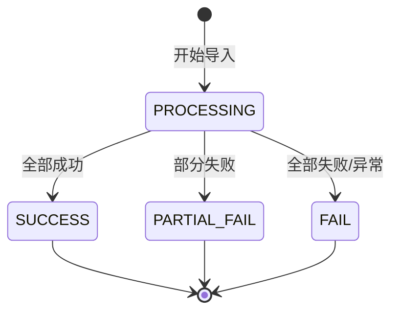

状态流转条件表：

| 源状态 | 目标状态 | 触发操作 | 附加要求 |
|--------|---------|----------|----------|
| (初始) | PROCESSING(1) | 上传文件开始 | 无 |
| PROCESSING(1) | SUCCESS(2) | failCount=0 | successCount>0 |
| PROCESSING(1) | PARTIAL_FAIL(3) | 0<failCount<totalCount | 有成功也有失败 |
| PROCESSING(1) | FAIL(4) | failCount=totalCount 或异常 | 无成功行 |

无孤岛状态。

#### 5.4.8 并发控制策略

| 风险点 | 策略 |
|--------|------|
| 并发导入同工号 | INSERT IGNORE + 唯一索引 uk_employee_org_no 兜底，重复跳过 |
| 同文件内工号重复 | 解析阶段去重，保留首次出现 |

#### 5.4.9 模块自检

| 检查项 | 结果 |
|--------|------|
| F05 功能点是否覆盖 | ✅ 覆盖（I05-I07） |
| 表结构是否完整 | ✅ |
| 枚举是否集中 | ✅ ImportTaskType, ImportTaskStatus |
| 接口是否表格化 | ✅ |
| 时序图/规则/异常是否完整 | ✅ |
| 状态机是否有孤岛 | ✅ 无孤岛 |
| 是否过度设计 | ✅ 否 |

### 5.5 看板统计模块

#### 5.5.1 接口详细设计

> 看板统计模块无独立表，基于 employee、cost_budget、whitelist 聚合查询。

##### I15: staffDashboard.summary — 看板汇总统计

| 参数 | 类型 | 必填 | 说明 |
|------|------|------|------|
| department | string | 否 | 按部门筛选 |

| 出参字段 | 类型 | 说明 |
|----------|------|------|
| totalEmployees | number | 员工总数 |
| activeCount | number | 在职人数 |
| probationCount | number | 试用期人数 |
| resignedCount | number | 离职人数 |
| whitelistCount | number | 白名单人数 |
| totalBudget | number | 成本预算总额（当前周期） |

| 错误码 | 含义 |
|--------|------|
| DASH_001 | 组织 ID 缺失 |

##### I16: staffDashboard.byDepartment — 看板部门维度统计

| 参数 | 类型 | 必填 | 说明 |
|------|------|------|------|
| period | string | 否 | 预算周期筛选 |

| 出参字段 | 类型 | 说明 |
|----------|------|------|
| list | DeptStat[] | 部门统计列表 |

DeptStat 结构：`{ department: string, employeeCount: number, budgetAmount: number, whitelistCount: number }`

#### 5.5.2 子功能：看板汇总时序图

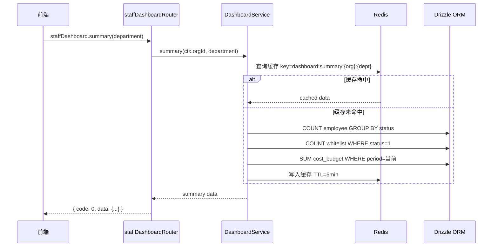

#### 5.5.3 业务规则表

| 规则编号 | 规则描述 | 触发场景 | 处理逻辑 |
|----------|----------|----------|----------|
| BR-D01 | 统计排除已删除 | 所有统计 | 过滤 is_deleted=0 |
| BR-D02 | 白名单仅统计生效 | 白名单计数 | status=1 |
| BR-D03 | 预算取当前周期 | 预算汇总 | period 匹配当前月 |
| BR-D04 | 缓存降级 | Redis 不可用 | 直接查 DB，记录告警 |

#### 5.5.4 异常场景表

| 场景编号 | 场景描述 | 触发条件 | 处理方式 |
|----------|----------|----------|----------|
| EX-D01 | Redis 不可用 | 缓存读写失败 | 降级直查 DB，不影响功能 |
| EX-D02 | org_id 缺失 | 上下文无组织 | 返回 DASH_001 |
| EX-D03 | 聚合查询超时 | DB 慢查询 | 返回部分数据 + 超时提示 |

#### 5.5.5 并发控制策略

| 风险点 | 策略 |
|--------|------|
| 统计缓存击穿 | 互斥锁重建缓存（单实例回源） |
| 缓存雪崩 | TTL 加随机扰动（5min ± 60s） |

#### 5.5.6 模块自检

| 检查项 | 结果 |
|--------|------|
| F08 功能点是否覆盖 | ✅ 覆盖（I15-I16） |
| 无独立表，基于已有表聚合 | ✅ 合理 |
| 接口是否表格化 | ✅ |
| 时序图/规则/异常是否完整 | ✅ |
| 缓存策略是否设计 | ✅ |
| 是否过度设计 | ✅ 否 |

### 5.6 跨模块调用时序图

**场景：创建员工后联动初始化白名单与预算（可选）**

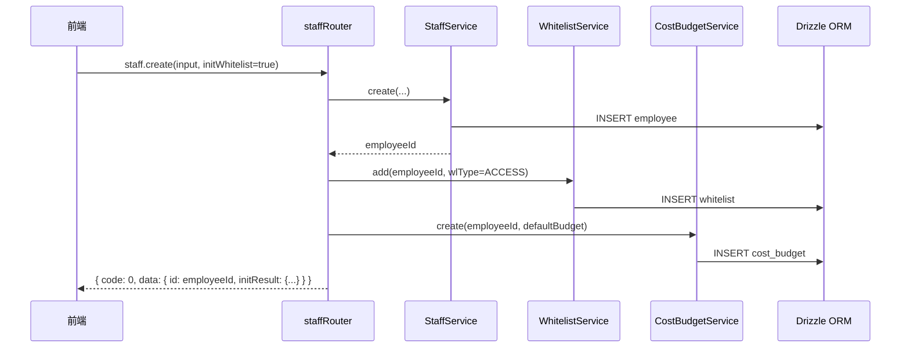

> 说明：联动初始化为可选能力，默认不联动，前端传 initWhitelist=true 时触发。跨模块通过 Service 层方法调用，非跨服务 RPC。

---

## 六、Step 6: 非功能性需求设计

### 6.1 稳定性

| 维度 | 设计 |
|------|------|
| 限流 | 批量导入接口限流，单租户 10 次/分钟；看板统计接口限流 60 次/分钟 |
| 降级 | 看板统计 Redis 缓存不可用时降级直查 DB；导入服务异常时返回友好错误，不阻塞员工管理主流程 |

### 6.2 高可用

| 维度 | 设计 |
|------|------|
| 服务多副本 | apps/web 为无状态部署，多副本横向扩展 |
| 第三方异常降级 | 依赖 org/user 内部 service 时设置超时（3s），超时降级返回默认值并告警 |

### 6.3 安全性

| 维度 | 设计 |
|------|------|
| 网络安全 | 所有接口走 HTTPS；tRPC procedure 经平台鉴权中间件 |
| 垂直权限 | 看板管理需"人员管理"权限点；批量导入需"导入"权限点；通过 RBAC 校验 |
| 水平权限 | 所有查询/操作均带 org_id 过滤，确保租户数据隔离；跨组织访问返回 STAFF_005 |
| SQL 注入防护 | 使用 Drizzle ORM 参数化查询，禁用原始 SQL 拼接 |
| 敏感数据加密 | 手机号查询脱敏展示；身份证号（如有）应用层加密存储（AES-256） |

### 6.4 性能

| 维度 | 设计 |
|------|------|
| 列表查询 | 分页查询 P99 < 500ms；联合索引优化 (org_id, status) |
| 批量导入 | 单次最大 5000 行；分批 100 行/次插入；总耗时 < 30s |
| 看板统计 | Redis 缓存 TTL 5min，命中率 > 90% |
| 缓存防护 | 互斥锁防击穿；TTL 随机扰动防雪崩 |

### 6.5 扩展性

| 维度 | 设计 |
|------|------|
| 横向扩展 | 无状态服务，随 apps/web 整体扩容 |
| 预留扩展 | employee 表 department 字段为字符串，未来可平滑升级为部门 ID 关联（增量设计） |
| 白名单类型可扩展 | wl_type 枚举可新增类型，不影响既有数据 |

---

## 七、Step 7: 变更三板斧

### 7.1 可监控

| 监控点 | 埋点内容 | 说明 |
|--------|----------|------|
| 员工 CRUD | 操作类型、org_id、operator_id、耗时、结果 | 每次增删改查记录 |
| 批量导入 | 任务 ID、总行数、成功/失败数、耗时 | 导入完成时记录 |
| 看板统计 | 缓存命中/未命中、聚合查询耗时 | 统计接口记录 |
| 异常告警 | 错误码出现频次、DB 超时、Redis 不可用 | 阈值告警 |

### 7.2 可灰度

| 方案 | 描述 | 推荐 |
|------|------|------|
| 方案 A：功能开关灰度 | 通过 feature flag 控制人员看板菜单入口可见性，按 org_id 白名单灰度 | ✅ 推荐 |
| 方案 B：租户尾号灰度 | 按 org_id 尾号灰度引流 | 备选 |

推荐方案 A：人员看板为新增功能，通过功能开关按组织白名单灰度，风险可控、回滚简单（关闭开关即隐藏入口）。

### 7.3 可应急

| 维度 | 方案 |
|------|------|
| 开关回滚 | feature flag 关闭，入口隐藏，既有功能不受影响（人员看板为新增模块，无旧逻辑依赖） |
| 发布包回滚 | 回滚至上一版本发布包，新增表（employee/cost_budget/whitelist/import_task）为新增不影响既有表 |
| 回滚依赖 | 人员看板为独立新模块，无对既有功能的侵入性改造，回滚不影响其他模块 |

> 应急方案从上下游角度：上游（前端入口）关闭开关即可；自身（后端）回滚发布包；下游（DB）新增表保留无副作用。越简单越好。

### 7.4 异常兜底方案

| 兜底场景 | 触发条件 | 兜底策略 | 用户感知 |
|----------|----------|----------|----------|
| DB 写入异常 | INSERT/UPDATE 失败 | 捕获异常返回通用错误码，记录告警日志，事务回滚不产生脏数据 | 友好提示"操作失败，请重试" |
| DB 查询超时 | 列表/统计 P99 超阈值 | 超时 3s 截断，返回已查到的部分数据 + 超时标记 | 列表展示已加载部分，提示缩小筛选条件 |
| 批量导入部分失败 | 校验/写入部分行失败 | 失败行跳过并记入 failDetail，有效行继续提交，任务状态记 PARTIAL_FAIL | 返回成功/失败计数 + 可展开失败明细 |
| Redis 不可用 | 缓存读写失败 | 看板统计降级直查 DB；导入/CRUD 不依赖缓存不受影响 | 看板加载稍慢，功能正常 |
| 唯一约束冲突 | 并发创建工号/预算/白名单重复 | DB 唯一索引兜底，捕获冲突转为业务错误码（STAFF_001/BUDGET_002/WL_002） | 提示"记录已存在" |
| 乐观锁冲突 | 并发更新同一记录 | 受影响行数=0 判定冲突，返回"数据已被他人修改，请刷新后重试" | 提示刷新重试 |

> 兜底原则：任何异常不向前端暴露技术细节；写操作失败必须可重试且不产生脏数据；读操作失败尽量返回部分结果而非全量报错。

---

## 八、Step 9: 方案检查

执行 19 项 checklist，逐项标注"通过/不通过/不适用"。不通过项已自动修复。

| 序号 | 检查项 | 结果 | 说明/修复 |
|------|--------|------|-----------|
| 1 | 模块划分合理性检查 | ✅ 通过 | 5 个模块单一职责，无循环依赖（依赖图 DAG），无功能点超 50% 的模块 |
| 2 | 依赖关系合理性 | ✅ 通过 | 集成架构依赖 org/user 内部 service，设置 3s 超时降级，下游异常时返回默认值保证可用 |
| 3 | 单点问题检查（部署层面） | ✅ 通过 | apps/web 无状态多副本部署，无单点 |
| 4 | 表模型设计范式检查 | ✅ 通过 | 满足第三范式；department 冗余字段已说明理由（无独立部门模块、修改频率低） |
| 5 | 隐私安全检查 | ✅ 通过 | 手机号脱敏、身份证号加密存储已标识；接口敏感信息已标注 |
| 6 | 兼容性检查（接口） | ✅ 通过 | 全部为新增接口，无修改既有接口，向后兼容 |
| 7 | 兼容性检查（表） | ✅ 通过 | 全部为新增表，无变更既有表，新旧版本均可运行 |
| 8 | 数据迁移检查 | ✅ 通过 | 新增表无初始化数据需求；无需迁移既有数据 |
| 9 | 一致性检查（功能点） | ✅ 通过 | F01-F08 均在 Step 5 有对应模块设计（F01-F04→5.1, F05→5.4, F06→5.2, F07→5.3, F08→5.5） |
| 10 | 一致性检查（表） | ✅ 通过 | Step 3 四个实体（employee/cost_budget/whitelist/import_task）均在 Step 5 有完整表结构定义 |
| 11 | 一致性检查（接口） | ✅ 通过 | Step 4 的 I01-I16 均在 Step 5 有详细定义 |
| 12 | 一致性检查（枚举） | ✅ 通过 | EmployeeStatus/BudgetType/WhitelistType/WhitelistStatus/ImportTaskType/ImportTaskStatus 与表结构字段说明一致 |
| 13 | 状态机完整性检查 | ✅ 通过 | employee(status)、whitelist(status)、import_task(status) 均有状态机图，无孤岛状态；cost_budget 无状态字段，已说明不适用 |
| 14 | 并发风险检查 | ✅ 通过 | 各模块并发风险已识别（工号重复/预算重复/白名单重复/缓存击穿），均有多方案对比+推荐策略（唯一索引兜底+先查后插+乐观锁+互斥锁） |
| 15 | 单点问题检查（定时任务层面） | ✅ 不适用 | 本设计无定时任务。白名单到期失效通过查询时计算实现，无独立定时任务 |
| 16 | 非功能性设计可行性检查 | ✅ 通过 | Step 6 设计可落地：分页索引已建、Redis 缓存平台已有、限流中间件已有 |
| 17 | 变更三板斧（可监控） | ✅ 通过 | 监控埋点设计可行，复用平台既有埋点框架 |
| 18 | 变更三板斧（可灰度） | ✅ 通过 | 方案 A（feature flag 按 org 灰度）推荐，简单可控 |
| 19 | 变更三板斧（可应急） | ✅ 通过 | 功能开关关闭+发布包回滚，无上下游依赖问题 |

### 检查结论

19 项全部通过，无需修复。设计文档完整、一致、可落地。

---

## 九、假设与待确认项汇总

| 编号 | 类型 | 内容 | 影响范围 |
|------|------|------|----------|
| A01 | 假设 | 员工数据按 org_id 组织隔离，复用现有 org 体系 | 全模块数据隔离 |
| A02 | 假设 | 成本预算粒度为"员工+预算周期"，部门汇总通过看板实现 | 成本预算模块 |
| A03 | 假设 | 白名单含生效/失效时间控制 | 白名单模块 |
| A04 | 假设 | 批量导入支持 .xlsx 和 .csv | 批量导入模块 |
| A05 | 已确认 | 需要身份证号字段（加密存储） | employee 表 |
| A06 | 已确认 | 成本预算直接记录，无审批流 | 成本预算模块 |

> 以上假设与待确认项已在 Step 1.6 记录，供用户审阅。如需调整，可在编码实现阶段据此修订设计。

---

✅ 系分设计完成，最终文档：`.agents/20260731-人员看板-openT2/design.md`


