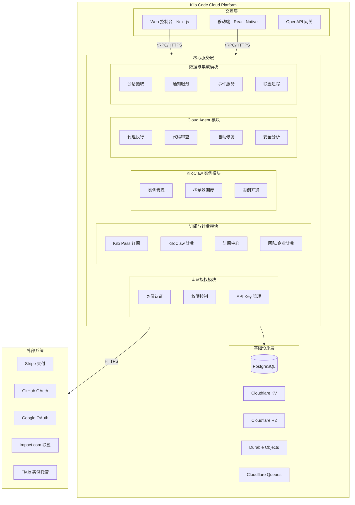
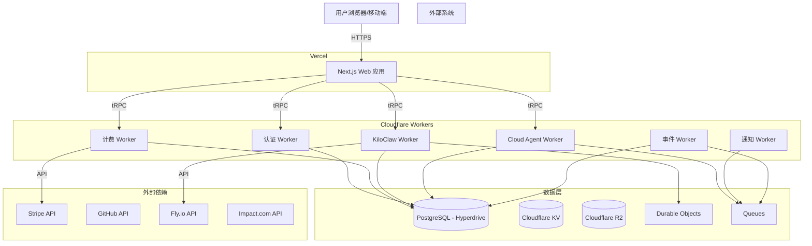
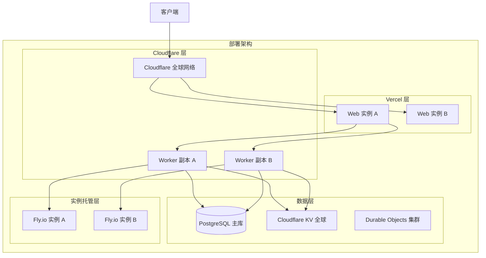
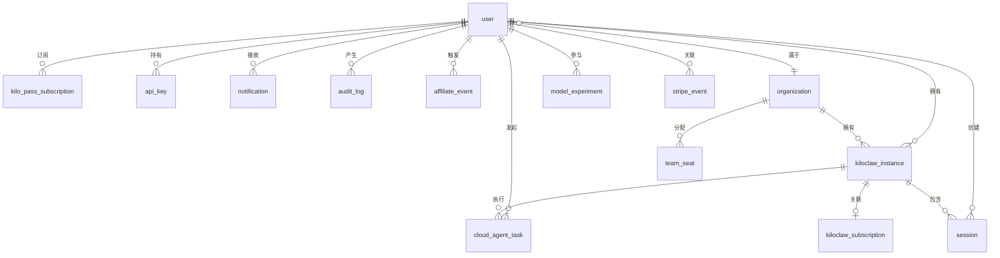
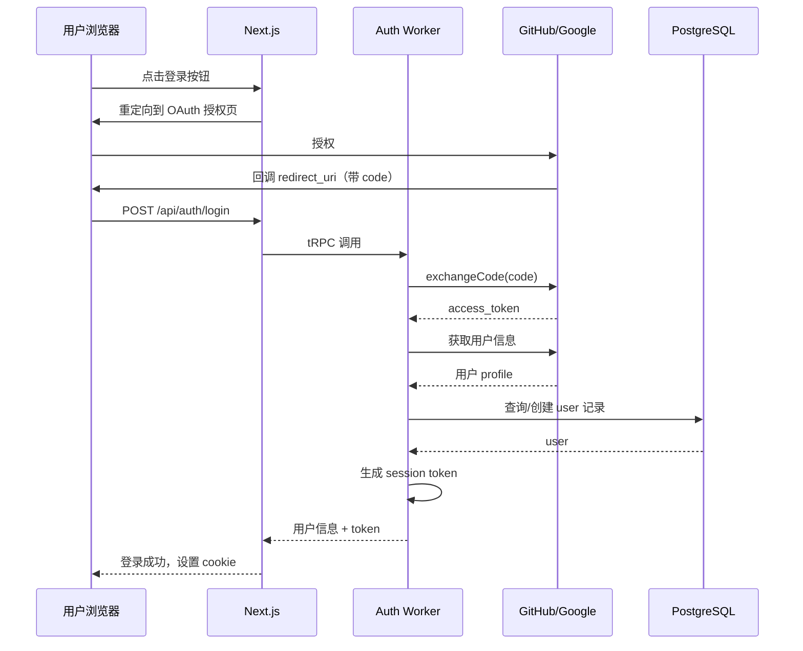
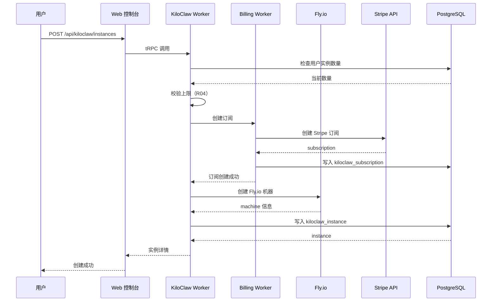
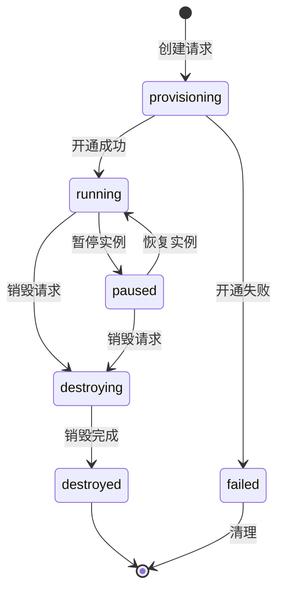
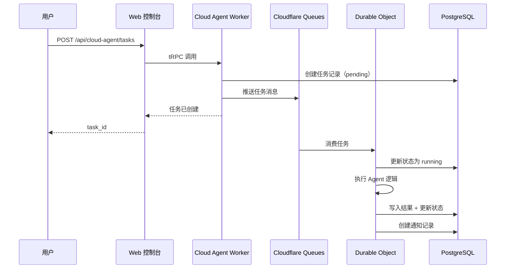
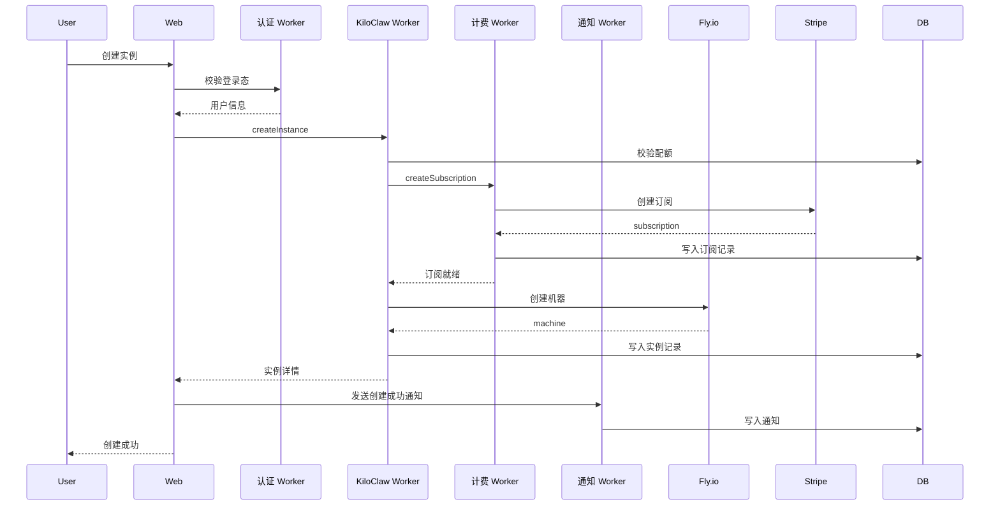

> **文档元信息**
>
> | 项目 | 内容 |
> |------|------|
> | 文档版本 | v1.0 |
> | 作者 | DTCoder |
> | 创建日期 | 2026-08-18 |
> | 需求来源 | 仓库架构推导（需求为占位符） |
> | 评审状态 | 待评审 |

# Kilo Code Cloud Platform 系分设计

## 1. 需求与范围

### 背景与目标

Kilo Code Cloud Platform 是一个面向开发者的 AI 编程助手云平台，提供基于 AI 的代码生成、审查、自动化修复等能力。平台采用 monorepo 架构，包含 Web 控制台、移动端、Cloudflare Worker 微服务、及共享库。

**假设**：需求为占位符文本，从仓库现有架构/.specs/服务结构推导功能范围。本次系分覆盖平台整体架构。

### 核心功能

1. **用户订阅与计费**：Kilo Pass 订阅计划、KiloClaw 实例订阅、团队/企业席位计费
2. **AI 编程实例（KiloClaw）**：AI 编码实例的创建、管理、生命周期控制
3. **Cloud Agent**：AI 代理执行引擎，支持代码分析、自动修复、安全审查
4. **订阅中心**：统一的订阅管理页面，支持个人和组织级别
5. **通知服务**：邮件、Webhook 等通知推送
6. **会话管理**：AI 对话会话的摄取、存储与分析
7. **安全与合规**：GDPR 数据删除、安全审计日志、敏感数据加密

### 约束与非功能要求

- 部署于 Vercel（Web）+ Cloudflare Workers（服务）
- 数据库：PostgreSQL（Drizzle ORM + Hyperdrive）
- 支付：Stripe 集成
- 多租户：tenant_id 隔离
- 安全性：敏感数据加密、水平权限检查、登录态校验

### 排除范围

- IDE 插件端（CLI/VS Code 扩展等客户端）
- 模型训练基础设施
- 第三方模型 API 适配层（作为外部依赖处理）

### 需求功能清单与优先级

| 编号 | 功能点 | 优先级 | PRD 原始描述/章节 | 备注 |
|------|--------|--------|-------------------|------|
| F01 | 用户认证与授权 | P0 | 仓库推导 | 全局拦截器、OAuth 集成 |
| F02 | Kilo Pass 订阅管理 | P0 | .specs/kilo-pass.md | 订阅计划、支付集成 |
| F03 | KiloClaw 实例生命周期 | P0 | .specs/kiloclaw-datamodel.md | 创建/销毁/暂停/恢复 |
| F04 | KiloClaw 计费与定价 | P0 | .specs/kiloclaw-billing.md | 用量计量、发票 |
| F05 | 订阅中心 | P0 | .specs/subscription-center.md | 统一订阅管理页面 |
| F06 | 团队/企业席位管理 | P1 | .specs/team-enterprise-seat-billing.md | 席位分配与计费 |
| F07 | Cloud Agent 执行 | P0 | services/cloud-agent-next/ | AI 代理任务执行 |
| F08 | 通知推送 | P1 | services/notifications/ | 邮件/Webhook 通知 |
| F09 | 会话数据摄取 | P1 | services/session-ingest/ | 对话记录存储 |
| F10 | 安全审计与 GDPR | P0 | docs/security-architecture-overview.md | 软删除、审计日志 |
| F11 | 联盟营销追踪 | P2 | .specs/impact-affiliate-tracking.md | Impact.com 集成 |
| F12 | 模型实验管理 | P1 | .specs/model-experiments.md | A/B 测试、路由 |

### 假设与待确认项

| 编号 | 假设/待确认内容 | 当前假设 | 确认状态 |
|------|-----------------|----------|----------|
| A01 | 需求范围 | 基于仓库现有架构推导的全平台系统分析 | 待确认 |
| A02 | 技术栈 | Next.js + Cloudflare Workers + PostgreSQL + Stripe | 从仓库推导 |
| A03 | 部署形态 | Vercel（Web）+ Cloudflare（Workers）+ Fly.io（KiloClaw 实例） | 从仓库推导 |
| A04 | 多租户模型 | tenant_id 字段隔离 | 从 .specs 推导 |
| A05 | 认证方案 | OAuth（Google/GitHub）+ API Key | 从仓库代码推导 |

## 2. 架构与模块

### 功能架构



**交互层说明**：Web 控制台（Next.js on Vercel）为管理员和用户提供图形化界面；移动端（React Native）提供移动访问；OpenAPI 网关对外提供 RESTful API。

**核心服务层说明**：Cloudflare Worker 微服务架构，按领域拆分为认证授权、订阅计费、实例管理、Cloud Agent、数据集成五个模块。

**基础设施层说明**：PostgreSQL 为主数据库（通过 Hyperdrive 连接）；Cloudflare KV/R2/Durable Objects/Queues 为 Worker 提供存储和异步能力。

### 模块清单

| 模块 | 职责 | 依赖 |
|------|------|------|
| 认证授权模块 | 用户身份认证、OAuth 集成、API Key 管理、权限校验 | PostgreSQL |
| 订阅与计费模块 | Kilo Pass/KiloClaw 订阅管理、Stripe 集成、发票、订阅中心 | Stripe, PostgreSQL, 认证模块 |
| KiloClaw 实例模块 | AI 编程实例的创建、销毁、暂停、恢复、状态管理 | Fly.io, PostgreSQL, Durable Objects |
| Cloud Agent 模块 | AI 代理任务执行、代码审查、自动修复、安全分析 | PostgreSQL, Queues, 实例模块 |
| 数据与集成模块 | 会话数据摄取、通知推送、事件总线、联盟营销追踪 | PostgreSQL, KV, Impact.com |

### 应用集成架构



**集成关系说明：**

| 调用方 | 被调用方 | 协议 | 接口类型 | 说明 |
|--------|----------|------|----------|------|
| Web 应用 | Cloudflare Workers | tRPC/HTTPS | Service Binding | 服务间调用 |
| 计费 Worker | Stripe | HTTPS | REST API | 支付处理 |
| KiloClaw Worker | Fly.io | HTTPS | REST API | 实例管理 |
| Cloud Agent Worker | Cloudflare Queues | 内部协议 | 消息队列 | 异步任务 |
| 各 Worker | PostgreSQL | Hyperdrive | SQL | 数据持久化 |
| 事件 Worker | Impact.com | HTTPS | REST API | 联盟转化追踪 |

### 部署架构



**部署说明：**
- **Vercel 层**：Next.js 应用部署于 Vercel，自动扩缩容，全球 CDN 加速
- **Cloudflare 层**：Workers 部署于 Cloudflare 全球网络，利用 Service Binding 实现服务间通信；Durable Objects 提供有状态计算
- **数据层**：PostgreSQL 通过 Hyperdrive 连接池访问；KV 全球分布式缓存；Durable Objects 提供强一致性存储
- **实例托管层**：KiloClaw 实例运行于 Fly.io，按需创建和销毁

## 3. 数据模型与存储

### 实体清单

| 实体名称 | 实体说明 | 所属模块 | 与其他实体的关系 |
|----------|----------|----------|-----------------|
| user | 平台用户 | 认证授权 | 一对多：kiloclaw_instance, subscription, api_key |
| organization | 组织/团队 | 认证授权 | 一对多：user（成员）, kiloclaw_instance |
| kiloclaw_instance | KiloClaw AI 编码实例 | KiloClaw 实例 | 多对一：user, organization；一对一：kiloclaw_subscription |
| kiloclaw_subscription | KiloClaw 实例订阅记录 | 订阅与计费 | 多对一：kiloclaw_instance |
| kilo_pass_subscription | Kilo Pass 订阅 | 订阅与计费 | 多对一：user |
| subscription_group | 订阅分组（订阅中心） | 订阅与计费 | 聚合根 |
| team_seat | 团队/企业席位 | 订阅与计费 | 多对一：organization |
| cloud_agent_task | Cloud Agent 执行任务 | Cloud Agent | 多对一：user, kiloclaw_instance |
| session | AI 对话会话 | 数据与集成 | 多对一：user, kiloclaw_instance |
| notification | 通知记录 | 数据与集成 | 多对一：user |
| api_key | API 密钥 | 认证授权 | 多对一：user |
| audit_log | 审计日志 | 安全 | 多对一：user |
| affiliate_event | 联盟营销事件 | 数据与集成 | 多对一：user |
| model_experiment | 模型实验配置 | 数据与集成 | 独立实体 |
| stripe_event | Stripe 事件记录 | 订阅与计费 | 多对一：user |

### 实体关系图



**模型说明：**
- **租户隔离**：所有核心实体通过 `user_id` 或 `organization_id` 关联用户/组织，实现租户级数据隔离
- **软删除**：用户相关数据支持 GDPR 软删除，通过 `softDeleteUser` 流程处理
- **实例-订阅**：KiloClaw 实例与订阅为一对一关系，订阅记录追踪计费生命周期
- **缓存策略**：Cloudflare KV 用于会话状态、API 限流计数器等热数据缓存
- **消息队列**：Cloudflare Queues 用于异步任务（通知推送、事件处理、Agent 任务调度）

## 4. 接口设计

### 4.1 oneapi（Web 控制台接口）

| 编号 | 接口名称 | 方法 | 路径 | 模块 |
|------|----------|------|------|------|
| W01 | 用户注册/登录 | POST | /api/auth/login | 认证授权 |
| W02 | 获取当前用户信息 | GET | /api/auth/me | 认证授权 |
| W03 | 创建 API Key | POST | /api/auth/api-keys | 认证授权 |
| W04 | 获取订阅列表 | GET | /api/subscriptions | 订阅与计费 |
| W05 | 创建 KiloClaw 实例 | POST | /api/kiloclaw/instances | KiloClaw 实例 |
| W06 | 获取实例详情 | GET | /api/kiloclaw/instances/:id | KiloClaw 实例 |
| W07 | 销毁实例 | DELETE | /api/kiloclaw/instances/:id | KiloClaw 实例 |
| W08 | 获取订阅中心数据 | GET | /api/subscription-center | 订阅与计费 |
| W09 | 创建 Cloud Agent 任务 | POST | /api/cloud-agent/tasks | Cloud Agent |
| W10 | 获取任务状态 | GET | /api/cloud-agent/tasks/:id | Cloud Agent |
| W11 | 获取会话列表 | GET | /api/sessions | 数据与集成 |
| W12 | 获取通知列表 | GET | /api/notifications | 数据与集成 |
| W13 | 管理团队成员 | POST | /api/teams/:id/members | 订阅与计费 |
| W14 | 获取计费历史 | GET | /api/billing/history | 订阅与计费 |

### 4.2 OpenAPI（对外接口）

| 编号 | 接口名称 | 方法 | 路径 | 模块 |
|------|----------|------|------|------|
| O01 | 外部创建实例 | POST | /openapi/instances | KiloClaw 实例 |
| O02 | 查询实例状态 | GET | /openapi/instances/:id | KiloClaw 实例 |
| O03 | Webhook 事件接收 | POST | /openapi/webhooks/:type | 数据与集成 |

### 4.3 内部接口（Service 层）

| 编号 | 接口名称 | 类 | 方法签名 |
|------|----------|------|----------|
| S01 | 创建实例 | KiloClawService | createInstance(userId, config): Instance |
| S02 | 销毁实例 | KiloClawService | destroyInstance(instanceId): void |
| S03 | 创建订阅 | BillingService | createSubscription(userId, plan): Subscription |
| S04 | 发送通知 | NotificationService | sendNotification(userId, template, params): void |
| S05 | 摄取会话 | SessionIngestService | ingestSession(sessionData): void |
| S06 | 执行 Agent 任务 | CloudAgentService | executeTask(taskConfig): TaskResult |
| S07 | 软删除用户 | UserService | softDeleteUser(userId): void |

### 4.4 集成接口（Integration 层）

| 编号 | 接口名称 | 类 | 方法签名 | 说明 |
|------|----------|------|----------|------|
| I01 | 创建 Stripe 客户 | StripeClient | createCustomer(user): Customer | Stripe 支付 |
| I02 | 创建 Stripe 订阅 | StripeClient | createSubscription(customerId, priceId): Subscription | Stripe 支付 |
| I03 | 创建 Fly.io 机器 | FlyClient | createMachine(config): Machine | 实例托管 |
| I04 | 销毁 Fly.io 机器 | FlyClient | destroyMachine(machineId): void | 实例托管 |
| I05 | 记录联盟转化 | ImpactClient | recordConversion(event): void | 联盟营销 |
| I06 | GitHub OAuth | GitHubClient | exchangeCode(code): Token | 认证 |
| I07 | Google OAuth | GoogleClient | exchangeCode(code): Token | 认证 |

## 5. 功能模块设计

> **全局约定**：错误码格式 `{MODULE}_{SEQ}`；通用出参结构 `{ code, msg, data }`；模块映射：AUTH=认证授权, BILL=订阅计费, KLAW=KiloClaw实例, CAGT=Cloud Agent, DATA=数据集成

### 5.1 认证授权模块

#### 5.1.1 表结构设计

##### 5.1.1.1 user

| 字段名 | 数据类型 | 约束 | 默认值 | 说明 |
|--------|----------|------|--------|------|
| id | bigint | PK, 自增 | - | 系统自增主键 |
| external_id | varchar(64) | UK, NOT NULL | - | 外部唯一标识 |
| email | varchar(255) | NOT NULL | - | 用户邮箱 |
| name | varchar(128) | - | - | 用户名称 |
| avatar_url | text | - | - | 头像 URL |
| auth_provider | varchar(32) | NOT NULL | - | 认证提供商（github/google） |
| is_deleted | boolean | NOT NULL | false | 软删除标记 |
| gmt_create | datetime | NOT NULL | CURRENT_TIMESTAMP | 创建时间 |
| gmt_modified | datetime | NOT NULL | CURRENT_TIMESTAMP | 修改时间 |

**索引：**
- UK: `uk_user_external_id` (external_id)
- IDX: `idx_user_email` (email)
- IDX: `idx_user_is_deleted` (is_deleted)

##### 5.1.1.2 api_key

| 字段名 | 数据类型 | 约束 | 默认值 | 说明 |
|--------|----------|------|--------|------|
| id | bigint | PK, 自增 | - | 系统自增主键 |
| user_id | bigint | FK, NOT NULL | - | 关联用户 |
| key_hash | varchar(128) | NOT NULL | - | API Key 哈希值 |
| name | varchar(128) | - | - | Key 名称 |
| last_used_at | datetime | - | - | 最后使用时间 |
| is_revoked | boolean | NOT NULL | false | 是否已吊销 |
| gmt_create | datetime | NOT NULL | CURRENT_TIMESTAMP | 创建时间 |
| gmt_modified | datetime | NOT NULL | CURRENT_TIMESTAMP | 修改时间 |

**索引：**
- IDX: `idx_api_key_user_id` (user_id)
- UK: `uk_api_key_hash` (key_hash)

##### 5.1.1.x 枚举与常量定义

| 枚举名称 | 取值 | 含义 | 关联字段 |
|----------|------|------|----------|
| AuthProvider | github, google | 认证提供商 | user.auth_provider |

#### 5.1.2 接口详细设计

##### W01 用户登录

- **URI**: POST /api/auth/login
- **描述**: 通过 OAuth 授权码完成登录
- **入参**:

| 参数名称 | 类型 | 是否必填 | 描述 |
|----------|------|----------|------|
| provider | string | 是 | 认证提供商（github/google） |
| code | string | 是 | OAuth 授权码 |
| redirect_uri | string | 是 | 回调地址 |

- **出参**:

| 参数名称 | 类型 | 描述 |
|----------|------|------|
| code | string | 结果码 |
| msg | string | 提示信息 |
| data | object | 用户信息与 token |

- **错误码**:

| 错误码 | 说明 |
|--------|------|
| AUTH_001 | 授权码无效或已过期 |
| AUTH_002 | 不支持的认证提供商 |
| AUTH_003 | 账号已被禁用 |

- **请求示例**:
```json
{
  "provider": "github",
  "code": "abc123def456",
  "redirect_uri": "https://app.kilocode.com/auth/callback"
}
```

- **响应示例**:
```json
{
  "code": "OK",
  "msg": "SUCCESS",
  "data": {
    "user": { "id": 1, "email": "dev@example.com", "name": "Dev" },
    "token": "session_xxx"
  }
}
```

#### 5.1.3 子功能详细设计

##### 5.1.3.1 OAuth 登录流程（F01）

- 处理时序图



**业务规则：**

| 规则编号 | 规则描述 | 校验时机 | 不满足时的处理 |
|----------|----------|----------|--------------|
| R01 | 授权码 5 分钟内有效 | 换取 token 时 | 返回 AUTH_001 |
| R02 | 同一邮箱只能关联一个认证提供商 | 创建用户时 | 返回 AUTH_004 提示账号已存在 |
| R03 | 已软删除用户不能登录 | 查询用户时 | 返回 AUTH_003 |

**异常场景：**

| 异常场景 | 处理方式 |
|----------|----------|
| OAuth 提供商不可用 | 返回 AUTH_005，提示稍后重试 |
| 用户取消授权 | 重定向到登录页，不显示错误 |
| 并发注册同一邮箱 | 数据库唯一约束兜底，幂等返回已有用户 |

**并发控制：**
- 并发场景：同一邮箱并发注册
- 控制策略：数据库唯一约束（uk_user_external_id）兜底 + 幂等设计（查询或创建）

---

### 5.2 订阅与计费模块

#### 5.2.1 表结构设计

##### 5.2.1.1 kilo_pass_subscription

| 字段名 | 数据类型 | 约束 | 默认值 | 说明 |
|--------|----------|------|--------|------|
| id | bigint | PK, 自增 | - | 系统自增主键 |
| user_id | bigint | FK, NOT NULL | - | 关联用户 |
| tier | varchar(32) | NOT NULL | - | 订阅等级 |
| cadence | varchar(16) | NOT NULL | - | 计费周期（monthly/annual） |
| status | varchar(32) | NOT NULL | - | 订阅状态 |
| stripe_subscription_id | varchar(128) | - | - | Stripe 订阅 ID |
| payment_provider | varchar(32) | NOT NULL | - | 支付提供商 |
| current_period_start | datetime | - | - | 当前周期开始 |
| current_period_end | datetime | - | - | 当前周期结束 |
| gmt_create | datetime | NOT NULL | CURRENT_TIMESTAMP | 创建时间 |
| gmt_modified | datetime | NOT NULL | CURRENT_TIMESTAMP | 修改时间 |

**索引：**
- IDX: `idx_kps_user_id` (user_id)
- IDX: `idx_kps_stripe_sub_id` (stripe_subscription_id)
- IDX: `idx_kps_status` (status)

##### 5.2.1.2 kiloclaw_subscription

| 字段名 | 数据类型 | 约束 | 默认值 | 说明 |
|--------|----------|------|--------|------|
| id | bigint | PK, 自增 | - | 系统自增主键 |
| kiloclaw_instance_id | bigint | FK, UK, NOT NULL | - | 关联实例 |
| plan | varchar(32) | NOT NULL | - | 计划类型 |
| status | varchar(32) | NOT NULL | - | 订阅状态 |
| kiloclaw_price_version | varchar(32) | NOT NULL | - | 定价版本 |
| payment_source | varchar(32) | NOT NULL | - | 支付来源 |
| stripe_subscription_id | varchar(128) | - | - | Stripe 订阅 ID |
| gmt_create | datetime | NOT NULL | CURRENT_TIMESTAMP | 创建时间 |
| gmt_modified | datetime | NOT NULL | CURRENT_TIMESTAMP | 修改时间 |

**索引：**
- UK: `uk_kcs_instance_id` (kiloclaw_instance_id)
- IDX: `idx_kcs_status` (status)

##### 5.2.1.x 枚举与常量定义

| 枚举名称 | 取值 | 含义 | 关联字段 |
|----------|------|------|----------|
| KiloPassTier | free, pro, team, enterprise | 订阅等级 | kilo_pass_subscription.tier |
| KiloPassCadence | monthly, annual | 计费周期 | kilo_pass_subscription.cadence |
| KiloPassPaymentProvider | stripe, credit | 支付提供商 | kilo_pass_subscription.payment_provider |
| KiloClawPlan | hobby, pro, team | 计划类型 | kiloclaw_subscription.plan |
| KiloClawSubscriptionStatus | active, paused, canceled, past_due | 订阅状态 | kiloclaw_subscription.status |

#### 5.2.2 接口详细设计

##### W05 创建 KiloClaw 实例

- **URI**: POST /api/kiloclaw/instances
- **描述**: 创建新的 KiloClaw AI 编码实例
- **入参**:

| 参数名称 | 类型 | 是否必填 | 描述 |
|----------|------|----------|------|
| plan | string | 是 | 计划类型（hobby/pro/team） |
| name | string | 否 | 实例名称 |
| organization_id | bigint | 否 | 组织 ID（团队实例时必填） |

- **出参**:

| 参数名称 | 类型 | 描述 |
|----------|------|------|
| code | string | 结果码 |
| msg | string | 提示信息 |
| data | object | 实例详情 |

- **错误码**:

| 错误码 | 说明 |
|--------|------|
| KLAW_001 | 实例数量已达上限 |
| KLAW_002 | 余额不足 |
| BILL_001 | Stripe 订阅创建失败 |

- **请求示例**:
```json
{
  "plan": "hobby",
  "name": "my-coding-agent"
}
```

- **响应示例**:
```json
{
  "code": "OK",
  "msg": "SUCCESS",
  "data": {
    "instance": { "id": 42, "name": "my-coding-agent", "status": "provisioning" }
  }
}
```

#### 5.2.3 子功能详细设计

##### 5.2.3.1 KiloClaw 实例创建流程（F03）

- 处理时序图



**业务规则：**

| 规则编号 | 规则描述 | 校验时机 | 不满足时的处理 |
|----------|----------|----------|--------------|
| R04 | 每用户 hobby 实例上限 1 个 | 创建前 | 返回 KLAW_001 |
| R05 | 订阅必须关联有效的支付方式 | 创建订阅时 | 返回 BILL_002 引导添加支付方式 |
| R06 | 实例名称不可重复（同用户下） | 创建前 | 返回 KLAW_003 |

**异常场景：**

| 异常场景 | 处理方式 |
|----------|----------|
| Fly.io 创建失败 | 回滚 Stripe 订阅，返回 KLAW_004 |
| Stripe 创建超时 | 异步重试，返回 KLAW_005 创建中状态 |
| 并发创建同一名称实例 | 数据库唯一约束兜底，返回 KLAW_003 |

**并发控制：**
- 并发场景：同一用户并发创建多实例
- 控制策略：乐观锁（version 字段）+ 分布式锁（用户级锁粒度）

**状态机设计（KiloClaw 实例）：**



**状态流转规则：**

| 当前状态 | 目标状态 | 流转条件 | 前置校验 | 触发动作 |
|----------|----------|----------|----------|----------|
| provisioning | running | Fly.io 机器就绪 | 机器状态健康检查通过 | 发送通知 |
| provisioning | failed | 开通超时或异常 | - | 回滚资源，通知用户 |
| running | paused | 用户暂停/欠费 | 无进行中的任务 | 暂停 Fly.io 机器 |
| paused | running | 用户恢复/续费 | 支付方式有效 | 恢复 Fly.io 机器 |
| running/paused | destroying | 用户销毁 | 确认销毁 | 清理 Fly.io 资源 |
| destroying | destroyed | 资源清理完成 | - | 保留实例记录 |

---

### 5.3 Cloud Agent 模块

#### 5.3.1 表结构设计

##### 5.3.1.1 cloud_agent_task

| 字段名 | 数据类型 | 约束 | 默认值 | 说明 |
|--------|----------|------|--------|------|
| id | bigint | PK, 自增 | - | 系统自增主键 |
| user_id | bigint | FK, NOT NULL | - | 发起用户 |
| instance_id | bigint | FK | - | 关联实例 |
| task_type | varchar(32) | NOT NULL | - | 任务类型 |
| status | varchar(32) | NOT NULL | pending | 任务状态 |
| input | jsonb | NOT NULL | - | 任务输入 |
| output | jsonb | - | - | 任务输出 |
| error_message | text | - | - | 错误信息 |
| started_at | datetime | - | - | 开始时间 |
| completed_at | datetime | - | - | 完成时间 |
| gmt_create | datetime | NOT NULL | CURRENT_TIMESTAMP | 创建时间 |
| gmt_modified | datetime | NOT NULL | CURRENT_TIMESTAMP | 修改时间 |

**索引：**
- IDX: `idx_cat_user_id` (user_id)
- IDX: `idx_cat_status` (status)
- IDX: `idx_cat_instance_id` (instance_id)

##### 5.3.1.x 枚举与常量定义

| 枚举名称 | 取值 | 含义 | 关联字段 |
|----------|------|------|----------|
| TaskType | code_review, auto_fix, security_scan, code_gen | 任务类型 | cloud_agent_task.task_type |
| TaskStatus | pending, running, completed, failed | 任务状态 | cloud_agent_task.status |

#### 5.3.2 子功能详细设计

##### 5.3.2.1 Cloud Agent 任务执行（F07）

- 处理时序图



**业务规则：**

| 规则编号 | 规则描述 | 校验时机 | 不满足时的处理 |
|----------|----------|----------|--------------|
| R07 | 任务超时时间 30 分钟 | 执行中 | 标记为 failed，返回 CAGT_001 |
| R08 | 同一实例并发任务上限 3 个 | 创建前 | 返回 CAGT_002 |

**异常场景：**

| 异常场景 | 处理方式 |
|----------|----------|
| Agent 执行超时 | 标记 failed，记录超时原因 |
| Durable Object 异常重启 | 从数据库恢复任务状态，幂等重试 |

**并发控制：**
- 并发场景：同一实例并发任务调度
- 控制策略：数据库 status 字段 + 分布式锁（实例级）

---

### 5.4 数据与集成模块

#### 5.4.1 表结构设计

##### 5.4.1.1 session

| 字段名 | 数据类型 | 约束 | 默认值 | 说明 |
|--------|----------|------|--------|------|
| id | bigint | PK, 自增 | - | 系统自增主键 |
| user_id | bigint | FK, NOT NULL | - | 关联用户 |
| instance_id | bigint | FK | - | 关联实例 |
| session_data | jsonb | NOT NULL | - | 会话数据 |
| gmt_create | datetime | NOT NULL | CURRENT_TIMESTAMP | 创建时间 |

**索引：**
- IDX: `idx_session_user_id` (user_id)
- IDX: `idx_session_instance_id` (instance_id)

##### 5.4.1.2 notification

| 字段名 | 数据类型 | 约束 | 默认值 | 说明 |
|--------|----------|------|--------|------|
| id | bigint | PK, 自增 | - | 系统自增主键 |
| user_id | bigint | FK, NOT NULL | - | 接收用户 |
| type | varchar(32) | NOT NULL | - | 通知类型 |
| title | varchar(256) | NOT NULL | - | 通知标题 |
| content | text | - | - | 通知内容 |
| is_read | boolean | NOT NULL | false | 是否已读 |
| gmt_create | datetime | NOT NULL | CURRENT_TIMESTAMP | 创建时间 |

**索引：**
- IDX: `idx_notif_user_id` (user_id)
- IDX: `idx_notif_is_read` (is_read)

##### 5.4.1.x 枚举与常量定义

| 枚举名称 | 取值 | 含义 | 关联字段 |
|----------|------|------|----------|
| NotificationType | billing, instance, agent, system | 通知类型 | notification.type |

---

### 5.5 跨模块时序图

#### 5.5.1 完整的实例创建→计费→通知流程



## 6. 非功能性需求设计

### 6.1 高可用性

- **服务多副本**：Cloudflare Workers 全球多副本部署，Vercel 自动扩缩容，无单点
- **降级策略**：Stripe 不可用时，订阅创建进入异步队列重试，用户界面提示"处理中"；Fly.io 不可用时，实例创建排队等待恢复
- **第三方异常降级**：OAuth 提供商不可用时，已登录用户不受影响，新登录用户提示"第三方服务暂时不可用"；Impact.com 不可用时，联盟事件本地队列缓存，恢复后重放
- **数据库连接**：Hyperdrive 连接池管理，自动重连

### 6.2 可扩展性

- **水平扩展**：Workers 按请求量自动扩缩，无需手动干预；Durable Objects 按实例 ID 分片
- **垂直扩展**：PostgreSQL 通过连接池和读写分离扩展
- **插件式服务依赖**：存储层可切换（R2 ↔ S3），支付提供商可扩展（Stripe ↔ 其他）
- **模块解耦**：通过 Cloudflare Queues 实现异步解耦，各 Worker 独立部署和扩展

### 6.3 稳定性/可靠性

- **突发流量**：Cloudflare 全球网络天然抗 DDoS；Workers 请求级别隔离，单请求异常不影响其他请求
- **限流降级**：API 级别限流（按用户/IP），超限返回 429；实例创建接口限流防止恶意开通
- **缓存防护**：使用 Cloudflare KV 缓存热点数据，设置合理的 TTL 防止缓存雪崩
- **幂等设计**：所有写操作支持幂等键，防止重复提交

### 6.4 安全性设计

#### 6.4.1 账户系统方案
- 使用 OAuth 2.0（GitHub/Google）进行身份认证，不自行实现密码存储
- API Key 使用哈希存储，不保存明文

#### 6.4.2 授权与访问控制

##### 6.4.2.1 水平权限检查
- 所有数据库查询通过 `user_id`/`organization_id` 过滤，确保用户只能访问自己的资源
- 实例操作前校验实例归属关系

##### 6.4.2.2 垂直权限检查
- 组织级别角色（Owner/Admin/Member），控制管理操作权限
- API Key 支持细粒度权限范围

##### 6.4.2.3 登录态检查
- 全局中间件校验登录态，白名单配置公开接口（如 OAuth 回调）
- Session token 具有过期时间，支持刷新

#### 6.4.3 数据防护方案

##### 6.4.3.1 敏感数据加密存储
- API Key 哈希存储（SHA-256）
- Stripe 密钥通过 Cloudflare Secrets 管理
- 不存储用户原始 OAuth token

##### 6.4.3.2 敏感数据脱敏
- 日志中脱敏 token、认证头、cookie（使用 `redactSensitiveHeaders`）
- Email 在通知中部分脱敏展示

### 6.5 监控/统计/日志/告警

- **服务埋点**：所有 Worker 接口记录调用耗时、成功/失败状态
- **三方服务埋点**：Stripe、Fly.io、GitHub API 调用记录耗时和错误率
- **错误追踪**：Sentry 集成（禁用 `sendDefaultPii` 和 `attachRpcInput`）
- **关键告警**：实例创建失败率 > 5%、Stripe 支付失败率 > 3%、Worker 错误率 > 1%

## 7. 变更三板斧

### 7.1 可监控

- **实例生命周期埋点**：
  - 创建实例：记录 user_id、plan、耗时、结果（成功/失败/错误码）
  - 销毁实例：记录 instance_id、耗时、结果
  - 状态变更：记录 instance_id、from_status、to_status、触发原因
- **计费埋点**：
  - 订阅创建：记录 user_id、plan、stripe_subscription_id、耗时
  - 支付成功/失败：记录金额、失败原因码
- **Agent 任务埋点**：
  - 任务创建：记录 task_type、user_id
  - 任务完成/失败：记录耗时、结果状态、错误信息
- **三方服务埋点**：
  - Stripe API 调用：记录接口路径、耗时、HTTP 状态码
  - Fly.io API 调用：记录操作类型、耗时、结果
  - OAuth 调用：记录 provider、耗时、结果

### 7.2 可灰度

- **按租户尾号灰度**：新功能按 user_id 尾号逐步放量（5% → 20% → 50% → 100%）
- **功能开关**：通过 Cloudflare KV 存储功能开关，支持动态切换，无需重新部署
- **不可灰度场景**：基础设施变更（数据库迁移、Worker 路由变更）无法按租户灰度，采用蓝绿部署策略

**灰度方案对比**：

| 方案 | 优势 | 劣势 | 推荐 |
|------|------|------|------|
| 租户尾号灰度 | 精细控制，可快速回滚 | 需维护灰度配置 | ✅ 推荐（默认） |
| 全量发布 | 实现简单 | 无风险控制 | 仅低风险变更 |
| 蓝绿部署 | 零停机 | 资源成本高，不适合多租户场景 | 基础设施变更专用 |

### 7.3 可应急

- **功能开关**：关键功能通过 KV 开关控制，异常时一键关闭新逻辑切回旧逻辑
  - 实例创建流程：新计费逻辑开关
  - Agent 任务调度：新调度策略开关
- **回滚策略**：
  - Worker 发布：支持 Wrangler 回滚到上一版本
  - Web 应用：Vercel 即时回滚到上一部署
  - 数据库迁移：确保迁移脚本可回滚（down 脚本）
- **上下游兼容性**：
  - 回滚时关注 Stripe 订阅状态同步，避免数据不一致
  - Webhook 事件处理保持向后兼容，新增字段使用可选类型
- **应急优先级**：开关切换 > 版本回滚 > 数据修复（越简单快速越好）