> **文档元信息**
>
> | 项目 | 内容 |
> |------|------|
> | 文档版本 | v1.0 |
> | 作者 | DTCoder |
> | 创建日期 | 2026-08-24 |
> | 需求来源 | 任务节点: 系分生成 — 新增算法演示页面 |
> | 评审状态 | 待评审 |

# 算法演示页面 系分设计

## 1. 需求与范围

### 背景与目标

在 Kilo Cloud 控制台（`apps/web`）中新增一个算法演示页面（路由 `/algorithm-demo`），面向平台使用者展示常见算法的执行效果，同时提供调用统计可视化能力。该页面作为独立功能模块嵌入现有 (app) 布局组，不改变现有侧边栏/顶栏结构。

### 核心功能

1. **算法演示 Tab 区**：使用 TypeTabs 组件实现三个 Tab 页切换 —— Helloworld、哈希算法、冒泡排序
2. **后端算法调用**：每个 Tab 调用后端 `antchain/dtcoder-agentic-dev` 的对应 REST API，展示执行结果
3. **导出功能**：导出按钮调用 `POST /api/dtcoder/export` 下载文件，支持 excel/csv 格式，以 blob 方式下载
4. **调用统计图表**：InvocationStats 组件使用 `@ant-design/charts` 展示折线图/饼图/柱状图，支持按人员类型/层级/部门维度筛选
5. **项目组件遵循**：使用 TextIconButton、TypeTabs、OneSegmented 等项目组件，遵循 AGENTS.md 和 DESIGN.md 规范

### 约束与非功能要求

- 路由：`/algorithm-demo`，挂载在 `(app)` 布局组下
- 图表库：`@ant-design/charts`（新增依赖，与现有 `recharts` 并存）
- 组件风格：遵循 Kilo Design 暗色主题（`#121212` 背景、`#2B2B2B` 卡片、`#EDFF00` 主色）
- 后端 API 前缀：`/api/dtcoder/`（通过 Next.js API Route 代理或直接调用）
- 浏览器兼容：现代浏览器（Chrome/Firefox/Safari/Edge 最新两版）
- 导出格式：excel (.xlsx) / csv (.csv)，blob 下载

### 排除范围

- 不修改现有侧边栏（AppSidebar）导航结构（本次不添加侧边栏入口，通过 URL 直接访问）
- 不涉及后端算法实现（后端 API 由 `antchain/dtcoder-agentic-dev` 服务提供）
- 不涉及用户权限/登录态变更（复用现有 (app) 布局的认证体系）
- 不涉及数据库表变更（本功能为纯前端展示 + 后端 API 代理）

### 需求功能清单与优先级

| 编号 | 功能点 | 优先级 | PRD 原始描述/章节 | 备注 |
|------|--------|--------|-------------------|------|
| F01 | TypeTabs 三 Tab 切换（Helloworld/哈希算法/冒泡排序） | P0 | 使用 TypeTabs 实现三个 Tab | 组件不存在需新建 |
| F02 | Helloworld Tab 调用后端 API 并展示结果 | P0 | 调用 antchain/dtcoder-agentic-dev REST API | GET/POST 待后端确认 |
| F03 | 哈希算法 Tab 调用后端 API 并展示结果 | P0 | 同上 | 同上 |
| F04 | 冒泡排序 Tab 调用后端 API 并展示结果 | P0 | 同上 | 同上 |
| F05 | 导出按钮（POST /api/dtcoder/export）blob 下载 | P0 | 支持 excel/csv 格式 | 需格式选择器 |
| F06 | InvocationStats 折线图（@ant-design/charts） | P0 | 调用统计图表 | 按维度筛选 |
| F07 | InvocationStats 饼图（@ant-design/charts） | P0 | 同上 | 同上 |
| F08 | InvocationStats 柱状图（@ant-design/charts） | P0 | 同上 | 同上 |
| F09 | 按人员类型/层级/部门维度筛选 | P0 | 支持按维度筛选 | OneSegmented 组件 |
| F10 | TextIconButton 导出按钮 | P1 | 使用 TextIconButton | 组件不存在需新建 |
| F11 | 页面布局遵循 AGENTS.md/DESIGN.md 规范 | P1 | 遵循 AGENTS.md 规范 | Kilo Design 暗色主题 |

### 假设与待确认项

| 编号 | 假设/待确认内容 | 当前假设 | 确认状态 |
|------|-----------------|----------|----------|
| A01 | 后端 API 具体契约（路径、方法、入参、出参） | GET /api/dtcoder/helloworld → {result, data}；GET /api/dtcoder/hash?input=xxx → {result, data}；POST /api/dtcoder/bubblesort {input: number[]} → {result, data} | 待确认 |
| A02 | 调用统计后端 API 契约 | GET /api/dtcoder/invocation-stats?type=xxx&level=xxx&dept=xxx → {timeseries, breakdown} | 待确认 |
| A03 | 导出后端 API 契约 | POST /api/dtcoder/export {format: "excel"|"csv"} → blob | 待确认 |
| A04 | 后端 API 是否通过 Next.js API Route 代理 | 直接通过 Next.js rewrites 代理到后端服务，避免跨域 | 待确认 |
| A05 | 侧边栏是否需要导航入口 | 本次不添加侧边栏入口，仅通过 URL 直接访问 | 待确认 |
| A06 | 页面是否需要登录态保护 | 复用 (app) 布局组认证，需登录 | 假设 |
| A07 | TypeTabs/TextIconButton/OneSegmented 组件规格 | 基于 Radix Tabs / Lucide Icon + Button 封装，遵循 Kilo Design 暗色规范 | 假设 |

---

## 2. 架构与模块

### 功能架构

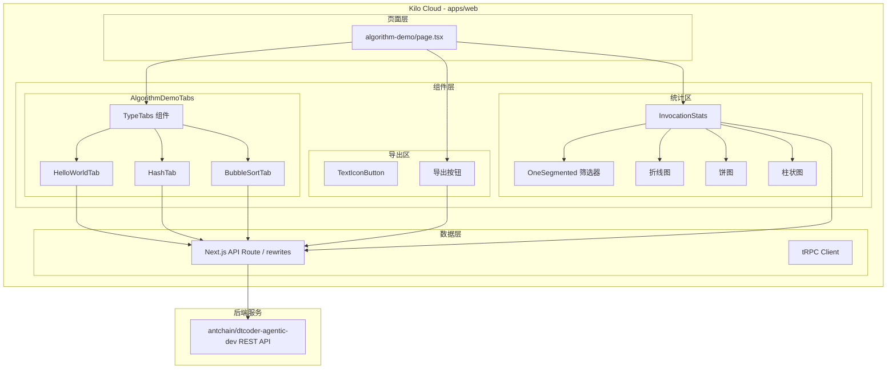

- **页面层**：`algorithm-demo/page.tsx`，Next.js App Router 页面，挂载在 `(app)` 布局组下
- **组件层**：按功能拆分为算法演示 Tab 区、导出区、调用统计区三个子模块
- **数据层**：通过 Next.js API Route 代理或 rewrites 转发到后端 `antchain/dtcoder-agentic-dev` 服务

**模块清单**

| 模块 | 职责 | 依赖 |
|------|------|------|
| AlgorithmDemoPage | 页面入口，组合各子模块 | (app) layout, TypeTabs, InvocationStats |
| AlgorithmDemoTabs | 管理三个算法 Tab 的切换与内容渲染 | TypeTabs, 后端 API |
| HelloWorldTab | 调用 helloworld API 并展示结果 | /api/dtcoder/helloworld |
| HashTab | 调用哈希算法 API 并展示结果 | /api/dtcoder/hash |
| BubbleSortTab | 调用冒泡排序 API 并展示结果 | /api/dtcoder/bubblesort |
| ExportSection | 导出按钮，格式选择，触发 blob 下载 | TextIconButton, /api/dtcoder/export |
| InvocationStats | 调用统计图表展示，维度筛选 | OneSegmented, @ant-design/charts, /api/dtcoder/invocation-stats |
| TypeTabs | 通用 Tab 切换组件（新建） | @radix-ui/react-tabs |
| TextIconButton | 图标+文字按钮组件（新建） | Button, Lucide |
| OneSegmented | 分段筛选器组件（新建） | 无 |

### 应用集成架构

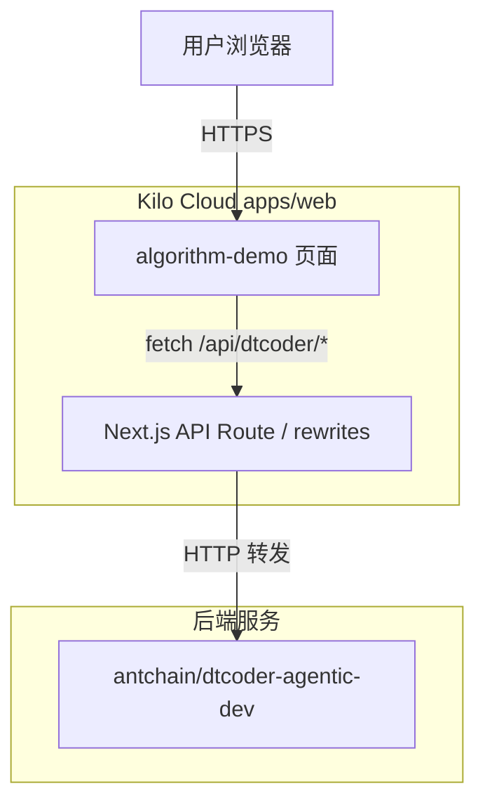

**集成关系说明：**

| 调用方 | 被调用方 | 协议 | 接口类型 | 说明 |
|--------|----------|------|----------|------|
| 用户浏览器 | Kilo Cloud 页面 | HTTPS | Next.js SSR/CSR | 页面渲染与交互 |
| 前端组件 | Next.js API Route | HTTPS | fetch | 通过 Next.js 代理转发到后端 |
| Next.js API Route | antchain/dtcoder-agentic-dev | HTTP | REST | 后端算法服务 |

### 部署架构

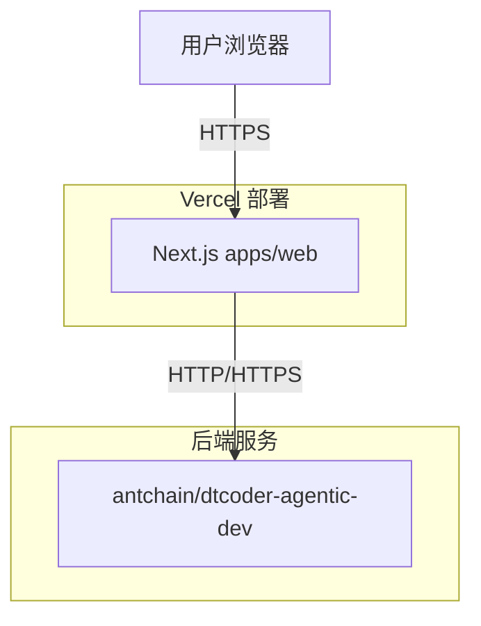

**部署说明：**
- **前端**：部署在 Vercel（现有 apps/web 部署方式），无需额外配置
- **后端**：`antchain/dtcoder-agentic-dev` 为独立部署的后端服务，需在 Next.js 中配置 rewrites 或环境变量指向该服务地址
- **新增依赖**：`@ant-design/charts` 作为 npm 依赖在构建时打包

---

## 3. 数据模型与存储

本功能为纯前端展示 + 后端 API 代理，不涉及数据库表变更。

### 实体清单

| 实体名称 | 实体说明 | 所属模块 | 与其他实体的关系 |
|----------|----------|----------|-----------------|
| 本项不适用 | 原因：本功能不涉及新增数据库实体，所有数据由后端 API 实时返回，前端不持久化 | — | — |

### 实体关系图

本项不适用，原因：无新增数据库实体。

**模型说明：**
- 前端状态管理：使用 React `useState` / `useReducer` 管理 Tab 切换状态、API 调用结果、筛选条件、图表数据等临时状态
- 不涉及持久化存储；导出功能通过 blob 下载到用户本地

---

## 4. 接口设计

### 4.1 oneapi（Web 控制台接口 — Next.js API Route 代理）

| 编号 | 接口名称 | 方法 | 路径 | 模块 |
|------|----------|------|------|------|
| W01 | 算法演示-Helloworld | GET | /api/dtcoder/helloworld | AlgorithmDemoTabs |
| W02 | 算法演示-哈希算法 | POST | /api/dtcoder/hash | AlgorithmDemoTabs |
| W03 | 算法演示-冒泡排序 | POST | /api/dtcoder/bubblesort | AlgorithmDemoTabs |
| W04 | 导出文件 | POST | /api/dtcoder/export | ExportSection |
| W05 | 调用统计 | GET | /api/dtcoder/invocation-stats | InvocationStats |

### 4.2 OpenAPI（对外接口）

本项不适用，原因：本功能为内部控制台页面，不对外暴露 OpenAPI。

### 4.3 内部接口（Service 层）

| 编号 | 接口名称 | 类 | 方法签名 |
|------|----------|------|----------|
| S01 | 算法 API 调用服务 | DtcoderService | `callAlgorithm(type: AlgorithmType, input?: unknown): Promise<AlgorithmResult>` |
| S02 | 导出服务 | DtcoderService | `exportFile(format: 'excel'|'csv'): Promise<Blob>` |
| S03 | 调用统计查询 | DtcoderService | `fetchInvocationStats(filters: StatsFilters): Promise<StatsData>` |

### 4.4 集成接口（Integration 层）

| 编号 | 接口名称 | 类 | 方法签名 | 说明 |
|------|----------|------|----------|------|
| I01 | 后端算法服务 | DtcoderClient | 通过 Next.js rewrites 代理 | 后端 antchain/dtcoder-agentic-dev |

---

## 5. 功能模块设计

### 5.1 AlgorithmDemoPage（页面入口）

#### 5.1.1 表结构设计

本模块不涉及数据库表。

#### 5.1.2 接口详细设计

本模块为页面入口组件，不直接暴露接口。

#### 5.1.3 子功能详细设计

##### 5.1.3.1 页面整体渲染（F01/F05/F06/F07/F08/F09/F10/F11）

- 处理时序图

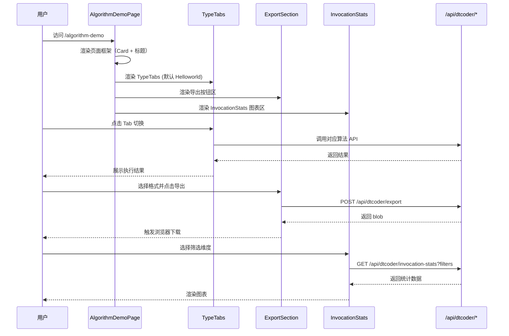

**业务规则：**

| 规则编号 | 规则描述 | 校验时机 | 不满足时的处理 |
|----------|----------|----------|--------------|
| R01 | 页面必须在 (app) 布局组内渲染，需登录态 | 页面加载时 | 重定向到登录页 |
| R02 | Tab 切换时重置上一个 Tab 的结果展示 | Tab 切换时 | 清空结果区 |
| R03 | 导出格式只能是 excel 或 csv | 点击导出前 | 格式选择器限定选项 |
| R04 | 调用统计默认展示全部维度（不筛选） | 页面初始加载 | 默认查询全部数据 |

**异常场景：**

| 异常场景 | 处理方式 |
|----------|----------|
| 后端 API 不可达（网络错误/超时） | 展示 ErrorCard 提示"算法服务暂时不可用"，提供重试按钮 |
| 后端 API 返回错误 | 展示错误信息（code + msg），不展示结果区 |
| 导出请求失败 | Toast 提示"导出失败，请重试" |
| 图表数据为空 | 展示 "No data" 空状态占位 |
| 图表数据量过大 | 前端限制展示 Top 10 系列，其余归入 "Other" |

**并发控制：**
- 无并发风险，原因：本功能为只读展示 + 文件下载，不涉及数据写入。

---

### 5.2 TypeTabs（通用 Tab 切换组件）

#### 5.2.1 表结构设计

本模块不涉及数据库表。

#### 5.2.2 接口详细设计

本模块为纯 UI 组件，不涉及后端接口。

##### 组件 Props 设计

| 参数名称 | 类型 | 是否必填 | 描述 |
|----------|------|----------|------|
| tabs | `TabDef[]` | 是 | Tab 定义数组，每项包含 key/label/icon/content |
| defaultTab | `string` | 否 | 默认激活的 Tab key |
| onTabChange | `(key: string) => void` | 否 | Tab 切换回调 |
| className | `string` | 否 | 外层容器样式 |

**异常场景：**

| 异常场景 | 处理方式 |
|----------|----------|
| tabs 数组为空 | 不渲染任何内容 |
| defaultTab 不在 tabs 中 | 默认激活第一个 Tab |

#### 5.2.3 子功能详细设计

##### 5.2.3.1 Tab 切换与内容渲染（F01）

- 处理时序图

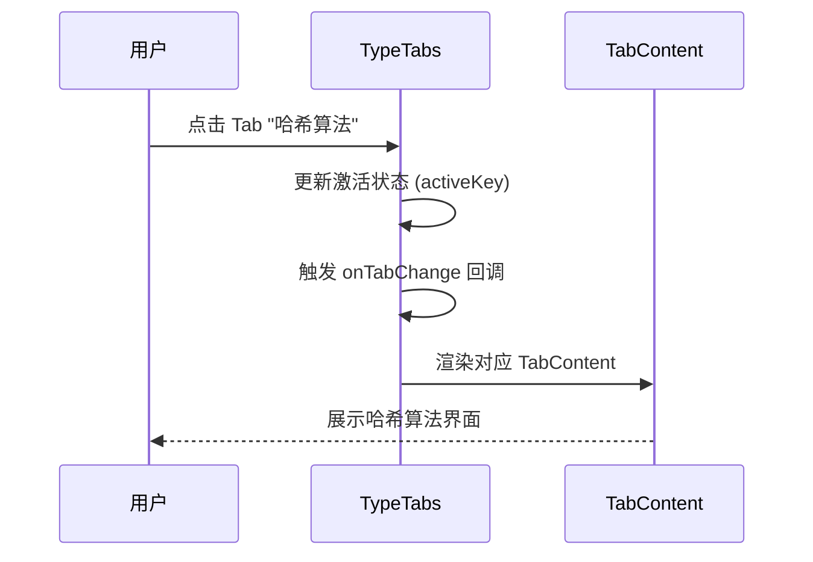

**业务规则：**

| 规则编号 | 规则描述 | 校验时机 | 不满足时的处理 |
|----------|----------|----------|--------------|
| R05 | 同一时间只有一个 Tab 处于激活状态 | Tab 切换时 | 其他 Tab 内容隐藏 |
| R06 | Tab 切换时保留各 Tab 的独立状态（结果、输入等） | 始终 | 使用 React key 或条件渲染保持 |

**状态机设计：**

本组件无状态字段，不适用状态机。

---

### 5.3 AlgorithmDemoTabs（算法演示内容区）

#### 5.3.1 表结构设计

本模块不涉及数据库表。

#### 5.3.2 接口详细设计

本模块为组合组件，封装三个子 Tab 的 API 调用逻辑。

##### 子 Tab 状态管理

| 参数名称 | 类型 | 描述 |
|----------|------|------|
| activeTab | `'helloworld'\|'hash'\|'bubblesort'` | 当前激活的 Tab |
| result | `AlgorithmResult \| null` | API 调用结果 |
| loading | `boolean` | 加载状态 |
| error | `string \| null` | 错误信息 |

#### 5.3.3 子功能详细设计

##### 5.3.3.1 Helloworld Tab（F02）

- 处理时序图

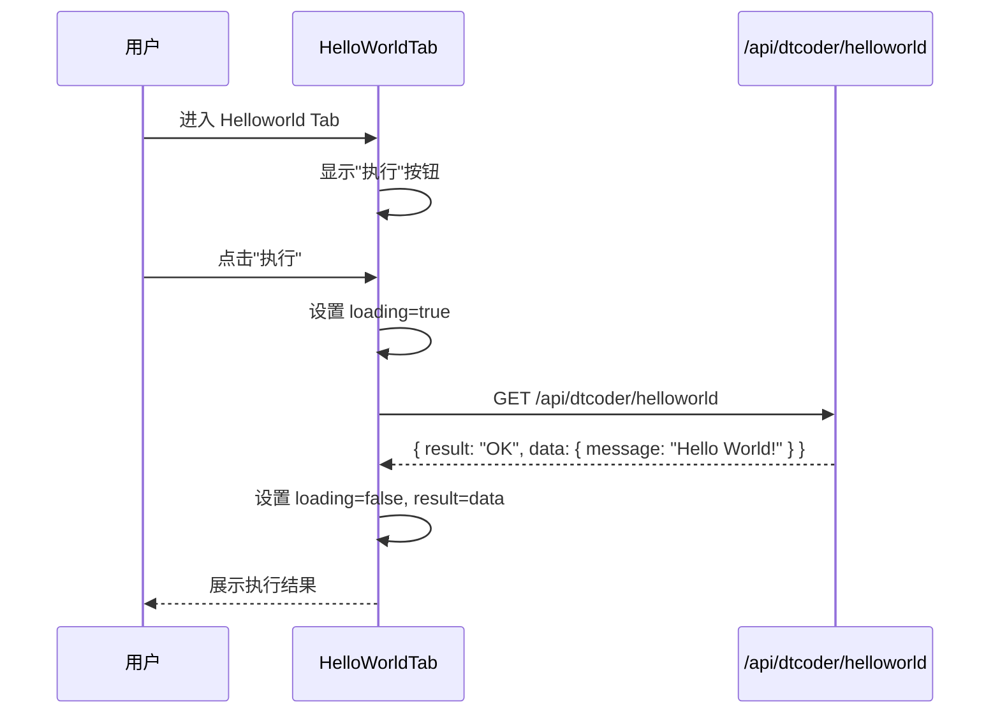

**业务规则：**

| 规则编号 | 规则描述 | 校验时机 | 不满足时的处理 |
|----------|----------|----------|--------------|
| R07 | Helloworld 无需输入参数，直接调用 | 点击执行时 | — |
| R08 | 结果显示在代码块中，使用等宽字体 | 结果展示 | Roboto Mono 字体渲染 |

##### 5.3.3.2 哈希算法 Tab（F03）

- 处理时序图

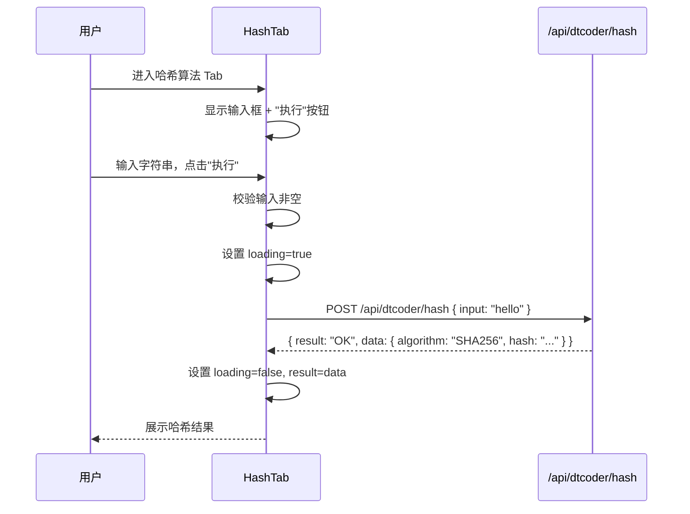

**业务规则：**

| 规则编号 | 规则描述 | 校验时机 | 不满足时的处理 |
|----------|----------|----------|--------------|
| R09 | 输入不能为空 | 点击执行时 | 提示"请输入待哈希的字符串" |
| R10 | 输入长度限制 10000 字符 | 输入时 | 超出截断或提示 |

##### 5.3.3.3 冒泡排序 Tab（F04）

- 处理时序图

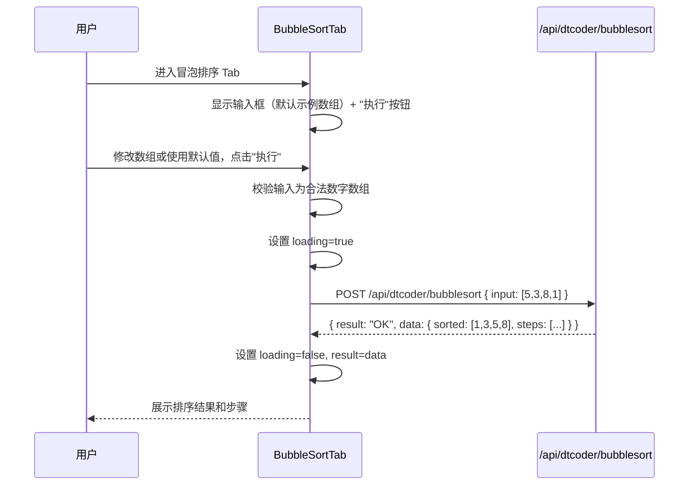

**业务规则：**

| 规则编号 | 规则描述 | 校验时机 | 不满足时的处理 |
|----------|----------|----------|--------------|
| R11 | 输入必须为逗号分隔的数字数组 | 点击执行时 | 提示"请输入合法的数字数组，如 5,3,8,1" |
| R12 | 数组长度限制 1000 | 输入时 | 超出提示"数组长度不能超过 1000" |

---

### 5.4 ExportSection（导出功能）

#### 5.4.1 表结构设计

本模块不涉及数据库表。

#### 5.4.2 接口详细设计

##### （W04）导出文件

- **URI**: POST /api/dtcoder/export
- **描述**: 导出算法调用记录为文件并触发浏览器下载
- **入参**:

| 参数名称 | 类型 | 是否必填 | 描述 |
|----------|------|----------|------|
| format | `string` | 是 | 导出格式：`"excel"` 或 `"csv"` |

- **出参**:

| 参数名称 | 类型 | 描述 |
|----------|------|------|
| — | Blob | 文件二进制流（Content-Type: application/octet-stream 或 text/csv） |

- **错误码**:

| 错误码 | 说明 |
|--------|------|
| DTC_001 | 不支持的导出格式 |
| DTC_002 | 导出服务异常 |

- **业务规则**: 前端接收 blob 后通过 `URL.createObjectURL` + `<a>` 标签触发下载，文件名格式 `algorithm-export-{yyyyMMddHHmmss}.{xlsx|csv}`

- **请求示例**:
```json
{
  "format": "excel"
}
```

- **响应**: Blob 二进制流

#### 5.4.3 子功能详细设计

##### 5.4.3.1 导出流程（F05/F10）

- 处理时序图

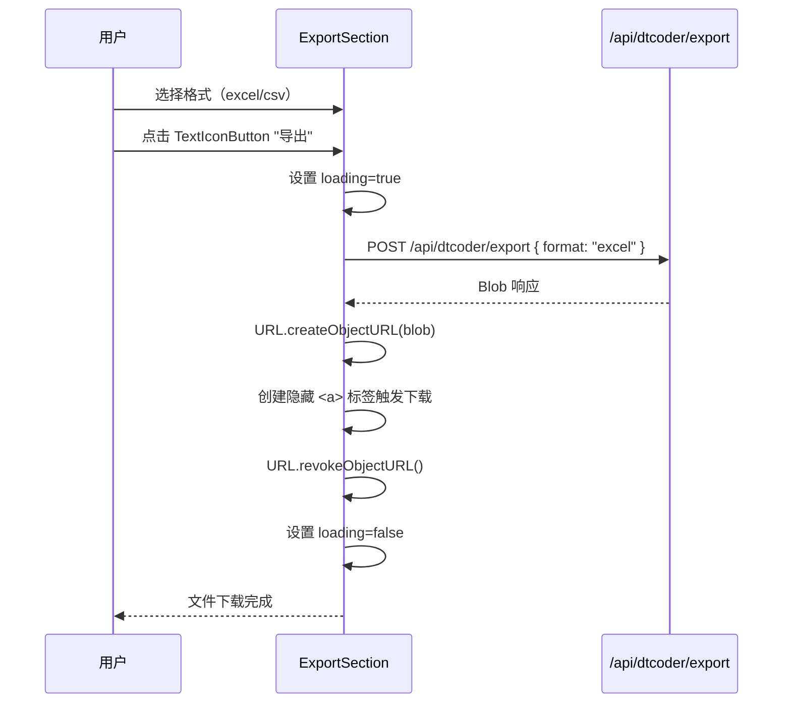

**业务规则：**

| 规则编号 | 规则描述 | 校验时机 | 不满足时的处理 |
|----------|----------|----------|--------------|
| R13 | 导出前必须选择格式 | 点击导出时 | 提示"请选择导出格式" |
| R14 | 导出过程中按钮置灰，防止重复点击 | 导出中 | loading 状态禁用 |

**异常场景：**

| 异常场景 | 处理方式 |
|----------|----------|
| 导出 API 返回非 blob 响应（错误 JSON） | 解析 JSON 错误信息并 Toast 提示 |
| 浏览器阻止下载 | Toast 提示"下载被浏览器阻止，请检查弹窗设置" |

**并发控制：**
- 无并发风险，原因：导出为一次性操作，loading 状态防止重复触发。

---

### 5.5 InvocationStats（调用统计图表）

#### 5.5.1 表结构设计

本模块不涉及数据库表。

##### 5.5.1.x 枚举与常量定义

| 枚举名称 | 取值 | 含义 | 关联字段 |
|----------|------|------|----------|
| PersonType | `internal` / `external` | 人员类型（内部/外部） | 筛选维度 |
| PersonLevel | `junior` / `mid` / `senior` / `lead` | 人员层级 | 筛选维度 |
| Department | `engineering` / `product` / `design` / `ops` | 部门 | 筛选维度 |
| ChartType | `line` / `pie` / `bar` | 图表类型 | 图表切换 |

#### 5.5.2 接口详细设计

##### （W05）调用统计

- **URI**: GET /api/dtcoder/invocation-stats
- **描述**: 获取算法调用统计数据
- **入参**:

| 参数名称 | 类型 | 是否必填 | 描述 |
|----------|------|----------|------|
| personType | `string` | 否 | 人员类型筛选：`internal` / `external` |
| personLevel | `string` | 否 | 人员层级筛选 |
| department | `string` | 否 | 部门筛选 |
| startDate | `string` | 否 | 起始日期 ISO 格式 |
| endDate | `string` | 否 | 结束日期 ISO 格式 |

- **出参**:

| 参数名称 | 类型 | 描述 |
|----------|------|------|
| result | String | 结果 code |
| msg | String | 提示信息 |
| data | Object | 业务数据 |
| data.timeseries | Array | 时间序列数据（折线图） |
| data.breakdown | Array | 分类汇总数据（饼图/柱状图） |

- **错误码**:

| 错误码 | 说明 |
|--------|------|
| DTC_003 | 统计查询失败 |

- **请求示例**:
```json
{
  "personType": "internal",
  "department": "engineering"
}
```

- **响应示例**:
```json
{
  "result": "OK",
  "msg": "SUCCESS",
  "data": {
    "timeseries": [
      { "datetime": "2026-08-24T00:00:00Z", "value": 42, "label": "helloworld" },
      { "datetime": "2026-08-24T01:00:00Z", "value": 18, "label": "hash" }
    ],
    "breakdown": [
      { "key": "helloworld", "label": "Helloworld", "value": 420, "percentage": 50.0 },
      { "key": "hash", "label": "哈希算法", "value": 300, "percentage": 35.7 },
      { "key": "bubblesort", "label": "冒泡排序", "value": 120, "percentage": 14.3 }
    ]
  }
}
```

#### 5.5.3 子功能详细设计

##### 5.5.3.1 折线图展示（F06）

- 处理时序图

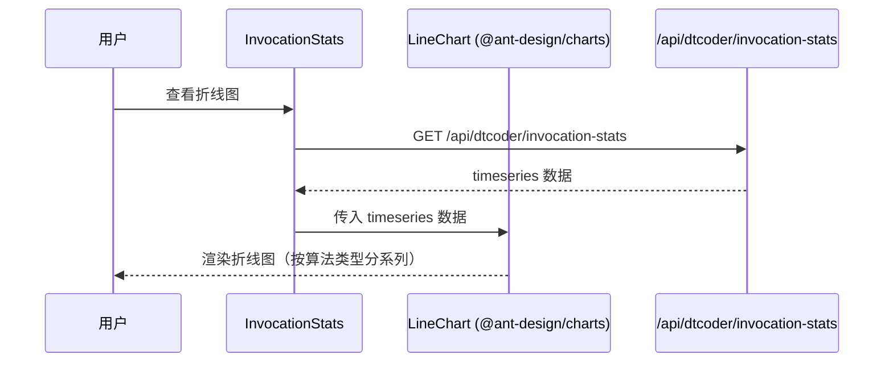

**业务规则：**

| 规则编号 | 规则描述 | 校验时机 | 不满足时的处理 |
|----------|----------|----------|--------------|
| R15 | 折线图 X 轴为时间，Y 轴为调用次数 | 渲染时 | 数据格式校验 |
| R16 | 多系列时按算法类型着色，最多展示 10 条系列 | 渲染时 | 超出部分归入 "Other" |

##### 5.5.3.2 饼图展示（F07）

- 处理时序图

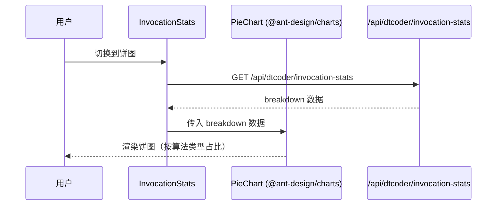

**业务规则：**

| 规则编号 | 规则描述 | 校验时机 | 不满足时的处理 |
|----------|----------|----------|--------------|
| R17 | 饼图按算法类型展示调用占比 | 渲染时 | 数据为空时展示 "No data" |
| R18 | 饼图最多展示 8 个扇区，其余归入 "Other" | 渲染时 | 自动合并 |

##### 5.5.3.3 柱状图展示（F08）

- 处理时序图

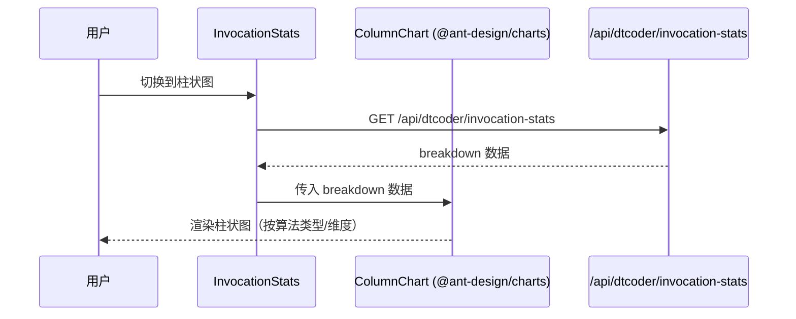

**业务规则：**

| 规则编号 | 规则描述 | 校验时机 | 不满足时的处理 |
|----------|----------|----------|--------------|
| R19 | 柱状图按筛选维度分组展示 | 渲染时 | 默认按算法类型分组 |

##### 5.5.3.4 维度筛选（F09）

- 处理时序图

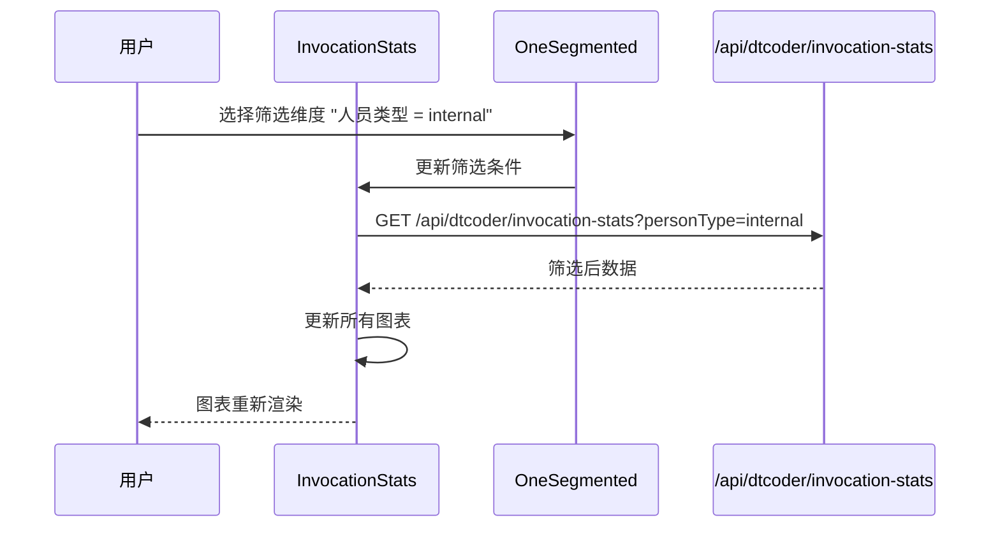

**业务规则：**

| 规则编号 | 规则描述 | 校验时机 | 不满足时的处理 |
|----------|----------|----------|--------------|
| R20 | 三个筛选维度可组合使用（AND 逻辑） | 筛选条件变更时 | 重新请求 API |
| R21 | 筛选条件变更后三个图表同步更新 | 筛选条件变更时 | 共享同一数据源 |

**异常场景：**

| 异常场景 | 处理方式 |
|----------|----------|
| 筛选后数据为空 | 图表展示 "No data for the selected filters" 空状态 |
| 图表渲染失败（@ant-design/charts 异常） | ErrorBoundary 捕获，展示降级 UI |

**并发控制：**
- 无并发风险，原因：统计数据为只读查询，筛选条件变更触发重新请求，前端 debounce 300ms 防止频繁请求。

---

### 5.6 TextIconButton（图标文字按钮组件）

#### 5.6.1 表结构设计

本模块不涉及数据库表。

#### 5.6.2 接口详细设计

本模块为纯 UI 组件。

##### 组件 Props 设计

| 参数名称 | 类型 | 是否必填 | 描述 |
|----------|------|----------|------|
| icon | `LucideIcon` | 是 | Lucide 图标组件 |
| label | `string` | 是 | 按钮文字 |
| onClick | `() => void` | 是 | 点击回调 |
| loading | `boolean` | 否 | 加载状态 |
| disabled | `boolean` | 否 | 禁用状态 |
| variant | `'primary'\|'secondary'\|'ghost'` | 否 | 按钮样式变体，默认 `secondary` |

#### 5.6.3 子功能详细设计

本组件为简单 UI 封装，遵循 Kilo Design 按钮规范：
- 样式：`inline-flex items-center gap-1.5`，文字 `body-strong`（14px/500）
- 图标尺寸：`size-4`（16px）
- 状态：default / hover / focus-visible / active / disabled / loading
- 遵循 DESIGN.md 按钮规范（primary=黄色, secondary=暗灰, ghost=下划线白字）

---

### 5.7 OneSegmented（分段筛选器组件）

#### 5.7.1 表结构设计

本模块不涉及数据库表。

#### 5.7.2 接口详细设计

本模块为纯 UI 组件。

##### 组件 Props 设计

| 参数名称 | 类型 | 是否必填 | 描述 |
|----------|------|----------|------|
| options | `SegmentedOption[]` | 是 | 选项列表 |
| value | `string` | 否 | 当前选中值 |
| onChange | `(value: string) => void` | 是 | 选中变更回调 |
| multiple | `boolean` | 否 | 是否支持多选，默认 false |

#### 5.7.3 子功能详细设计

- 样式：`inline-flex rounded-md bg-muted p-0.5`，选中项高亮
- 遵循 Kilo Design 暗色规范，选中态使用 `bg-background` 或 `primary` 色
- 交互：点击切换，支持单选/多选模式

---

## 6. 非功能性需求设计

### 6.1 高可用性

- 后端 API 不可用时，前端展示降级 UI（ErrorCard + 重试按钮），不影响页面其他部分渲染
- 图表组件渲染失败时，ErrorBoundary 捕获并展示降级 UI，不导致页面白屏
- 导出功能超时（30s）自动终止并提示用户

### 6.2 可扩展性

- 算法 Tab 通过配置数组驱动，新增算法只需添加 Tab 配置项
- 筛选维度通过配置驱动，新增维度只需扩展 options 和 API 参数
- 图表类型可扩展（当前三种，后续可新增散点图、雷达图等）

### 6.3 稳定性/可靠性

- 前端对 API 返回数据进行 basic schema 校验（使用 zod 或手动校验），防止后端数据格式变更导致渲染崩溃
- 导出大文件时使用流式下载，避免内存溢出
- 图表数据量大时自动聚合（Top N + Other）

### 6.4 安全性设计

#### 6.4.1 账户系统方案
复用现有 (app) 布局组的认证体系（全局统一拦截器），不单独实现登录。

#### 6.4.2 授权&访问控制

##### 6.4.2.1 是否实现水平权限检查
不涉及，本页面为公共数据查询，不涉及用户私有数据。

##### 6.4.2.2 是否实现垂直权限检查
不涉及，本页面为公共功能页面，所有登录用户均可访问。

##### 6.4.2.3 是否检查登录态
是，复用 (app) 布局组全局拦截器。

#### 6.4.3 数据防护方案

##### 6.4.3.1 是否对敏感数据加密存储
不涉及，本功能不存储数据。

##### 6.4.3.2 是否对敏感数据展示进行脱敏
不涉及，算法演示不涉及用户敏感数据。

### 6.5 监控/统计/日志/告警

- 前端埋点：Tab 切换事件、API 调用成功/失败、导出操作、筛选条件变更
- 复用现有 Sentry 配置进行错误监控
- 后端 API 调用异常由 Next.js API Route 层统一记录日志

---

## 7. 变更三板斧

### 7.1 可监控

- 页面 PV/UV 埋点（通过现有 PostHog 或 Analytics）
- API 调用成功率、耗时监控（通过 Sentry Performance）
- 图表渲染异常监控（ErrorBoundary → Sentry）
- 导出操作埋点（格式、文件大小、成功/失败）

### 7.2 可灰度

本功能为新增独立页面，不修改现有功能，无需灰度。可通过以下方式控制发布：
- 功能开关：在 Next.js 配置中通过环境变量 `ENABLE_ALGORITHM_DEMO` 控制路由是否可访问
- 如果不可灰度，原因：新页面不影响现有功能，直接全量发布即可

### 7.3 可应急

- **开关控制**：通过环境变量 `ENABLE_ALGORITHM_DEMO=false` 关闭路由（返回 404）
- **回滚**：直接回滚前端部署包，无数据库变更，无上下游依赖
- **后端异常**：后端 API 不可用时前端自动降级展示错误提示，不影响其他页面

---

## 附录：技术选型方案对比

### A. 图表库选型

| 维度 | 方案A: 仅使用 recharts（现有） | 方案B: 引入 @ant-design/charts（推荐） |
|------|-------------------------------|---------------------------------------|
| 学习成本 | 低（已有使用经验） | 中（需学习 G2 语法） |
| 开箱即用度 | 需手动组合图表与筛选器 | 内置统计图表 + 筛选器联动 |
| 包体积 | 约 300KB | 约 500KB（含 @antv/g2） |
| 与需求匹配度 | 需自行封装饼图/柱状图/折线图组合 | 直接提供对应图表类型 |
| 社区活跃度 | 高（22k+ stars） | 高（2k+ stars，蚂蚁集团维护） |

**推荐方案**：方案B — 引入 `@ant-design/charts`。理由：需求明确要求使用 @ant-design/charts，且其内置的统计图表组件可减少开发量。

### B. 组件实现方式

| 维度 | 方案A: 基于 Radix 封装 | 方案B: 从零构建（推荐） |
|------|------------------------|------------------------|
| TypeTabs | 基于 @radix-ui/react-tabs | 完全自定义 |
| TextIconButton | 基于 Button 组件 + Lucide | 完全自定义 |
| OneSegmented | 基于 Radix ToggleGroup | 完全自定义 |
| 开发成本 | 低 | 高 |
| 设计一致性 | 继承 shadcn 风格 | 需自行对齐 Kilo Design |

**推荐方案**：TypeTabs 和 OneSegmented 基于 Radix 封装（方案A），TextIconButton 基于现有 Button 组件封装（方案A）。理由：减少重复造轮子，与现有 shadcn/Radix 组件体系一致。

---

## 方案检查

| 检查项 | 结果 | 备注 |
|------|------|------|
| 模块划分合理性检查 | 通过 | 7 个模块，职责单一，无循环依赖 |
| 依赖关系合理性 | 通过 | 前端 → API Route → 后端，单向依赖 |
| 单点问题检查（部署层面） | 通过 | 前端部署在 Vercel，无单点 |
| 表模型设计范式检查 | 不适用 | 无数据库变更 |
| 隐私安全检查 | 通过 | 不涉及敏感数据 |
| 兼容性检查（接口） | 通过 | 新增接口，无兼容性问题 |
| 兼容性检查（表） | 不适用 | 无表变更 |
| 数据迁移检查 | 不适用 | 无数据迁移 |
| 一致性检查（功能点） | 通过 | 11 个功能点全部有对应设计 |
| 一致性检查（表） | 不适用 | 无实体定义 |
| 一致性检查（接口） | 通过 | 5 个 API 接口全部有详细定义 |
| 一致性检查（枚举） | 通过 | 枚举定义与筛选维度一致 |
| 状态机完整性检查 | 不适用 | 无状态字段 |
| 并发风险检查 | 通过 | 只读操作，无并发风险 |
| 单点问题检查（定时任务层面） | 不适用 | 无定时任务 |
| 非功能性设计可行性检查 | 通过 | 降级/监控/安全设计合理 |
| 变更三板斧设计可行性检查（可监控） | 通过 | 埋点方案可行 |
| 变更三板斧设计可行性检查（可灰度） | 通过 | 环境变量开关可行 |
| 变更三板斧设计可行性检查（可应急） | 通过 | 一键回滚 + 开关关闭 |