> **文档元信息**
>
> | 项目 | 内容 |
> |------|------|
> | 文档版本 | v1.0 |
> | 作者 | DTCoder (AI 辅助生成) |
> | 创建日期 | 2026-08-24 |
> | 需求来源 | 任务需求：新增算法演示页面（路由 /algorithm-demo） |
> | 评审状态 | 待评审 |

# 算法演示页面（Algorithm Demo）系分设计

## 1. 需求与范围

### 背景与目标

在现有 cloud-main monorepo（Kilo Code 云平台）中新增一个算法演示页面，路由为 `/algorithm-demo`。该页面用于演示三种经典算法（Helloworld、哈希算法、冒泡排序）的后端执行结果，并提供数据导出和调用统计可视化功能。页面面向内部开发者和演示场景，帮助用户直观了解后端算法服务的运行效果。

### 核心功能

1. **算法演示 Tab 切换**：使用 TypeTabs 组件实现三个 Tab 页（Helloworld / 哈希算法 / 冒泡排序），每个 Tab 调用后端 `antchain/dtcoder-agentic-dev` 对应的 REST API 并展示执行结果。
2. **数据导出**：提供导出按钮，调用 `POST /api/dtcoder/export` 下载文件，支持 excel/csv 两种格式，使用 blob 下载方式。
3. **调用统计图表（InvocationStats）**：使用 `@ant-design/charts` 展示折线图、饼图、柱状图，支持按人员类型、层级、部门维度筛选。
4. **项目组件复用**：页面遵循 AGENTS.md 规范，使用 TextIconButton、TypeTabs、OneSegmented 等项目组件。

### 约束与非功能要求

- 页面需在 Next.js App Router 框架下实现（与现有 `apps/web` 一致）
- 新增 `@ant-design/charts` 依赖（当前仓库未引入）
- 需新建 TextIconButton、TypeTabs、OneSegmented 三个项目组件（当前仓库不存在）
- 后端服务 `antchain/dtcoder-agentic-dev` 为外部 REST API，需处理跨域、超时、降级
- 页面应支持响应式布局

### 排除范围

- 后端算法服务 `antchain/dtcoder-agentic-dev` 的内部实现不在本次设计范围
- 不涉及数据库 schema 变更（调用统计数据由后端服务存储和提供）
- 不涉及用户认证/鉴权体系变更（复用现有登录态）

### 需求功能清单与优先级

| 编号 | 功能点 | 优先级 | PRD 原始描述/章节 | 备注 |
|------|--------|--------|-------------------|------|
| F01 | TypeTabs 三 Tab 切换（Helloworld/哈希算法/冒泡排序） | P0 | "使用 TypeTabs 实现三个 Tab" | 需新建 TypeTabs 组件 |
| F02 | Helloworld 算法调用与结果展示 | P0 | "每个 Tab 调用后端对应 REST API 并展示执行结果" | 调用后端 Helloworld API |
| F03 | 哈希算法调用与结果展示 | P0 | 同上 | 调用后端哈希算法 API |
| F04 | 冒泡排序算法调用与结果展示 | P0 | 同上 | 调用后端冒泡排序 API |
| F05 | 数据导出（excel/csv，blob 下载） | P0 | "实现导出按钮调用 POST /api/dtcoder/export 下载文件" | 支持格式切换 |
| F06 | InvocationStats 折线图展示 | P1 | "使用 @ant-design/charts 展示折线图" | 需引入 @ant-design/charts |
| F07 | InvocationStats 饼图展示 | P1 | 同上 | 按维度展示占比 |
| F08 | InvocationStats 柱状图展示 | P1 | 同上 | 按维度展示对比 |
| F09 | 统计图表维度筛选（人员类型/层级/部门） | P1 | "支持按人员类型/层级/部门维度筛选" | 使用 OneSegmented 或 Select |
| F10 | TextIconButton 组件 | P1 | "使用 TextIconButton" | 需新建 |
| F11 | OneSegmented 组件 | P1 | "使用 OneSegmented" | 需新建 |

### 假设与待确认项

| 编号 | 假设/待确认内容 | 当前假设 | 确认状态 |
|------|-----------------|----------|----------|
| A01 | 后端 API 基础路径 | 假设后端服务基础路径为 `/api/dtcoder/`（如 `/api/dtcoder/helloworld`、`/api/dtcoder/hash`、`/api/dtcoder/bubble-sort`） | 待确认 |
| A02 | 后端 API 鉴权方式 | 假设复用现有登录态（Cookie/Session），后端接口通过前端 Next.js API Route 代理转发 | 待确认 |
| A03 | 算法演示入参 | 假设各算法 API 无需用户输入参数（或使用默认演示参数），由后端返回固定演示结果 | 待确认 |
| A04 | 导出文件格式切换 UI | 假设使用 OneSegmented 组件在 excel/csv 之间切换 | 待确认 |
| A05 | @ant-design/charts 版本兼容性 | 假设使用最新稳定版 @ant-design/charts，与现有 Next.js 版本兼容 | 待确认 |
| A06 | 调用统计数据 API | 假设后端提供 `/api/dtcoder/invocation-stats` 接口返回统计数据 | 待确认 |
| A07 | 页面权限 | 假设页面需要登录态，复用现有全局认证中间件 | 待确认 |
| A08 | library-frontend 仓库角色 | 假设 library-frontend 仓库（图书管理系统前端）与本次需求无关，不涉及变更 | 待确认 |

---

## 2. 架构与模块

### 功能架构

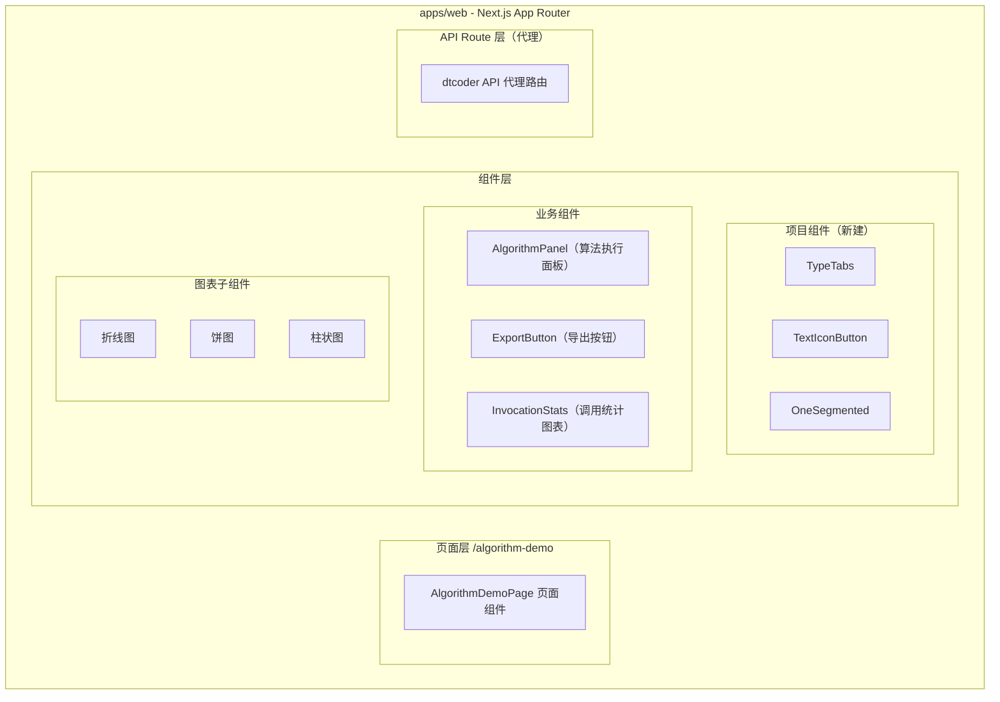

**层级说明：**

- **页面层**：`/algorithm-demo` 路由页面，负责整体布局和数据编排
- **组件层**：
  - 项目组件（TypeTabs、TextIconButton、OneSegmented）：可复用的通用 UI 组件
  - 业务组件（AlgorithmPanel、ExportButton、InvocationStats）：算法演示页面的功能组件
  - 图表子组件：基于 @ant-design/charts 封装的折线图/饼图/柱状图
- **API Route 层**：Next.js Route Handler 代理转发请求到后端 `antchain/dtcoder-agentic-dev` 服务

**模块清单**

| 模块 | 职责 | 依赖 |
|------|------|------|
| 页面路由模块 | 注册 `/algorithm-demo` 路由，页面布局与数据编排 | 业务组件模块 |
| 项目组件模块 | 提供 TypeTabs、TextIconButton、OneSegmented 通用组件 | Ant Design / 项目样式系统 |
| 算法演示模块 | 三个 Tab 的算法调用与结果展示 | 后端 API 代理模块 |
| 数据导出模块 | 文件导出（excel/csv），blob 下载 | 后端 API 代理模块 |
| 调用统计模块 | 统计图表展示与维度筛选 | @ant-design/charts、后端 API 代理模块 |
| 后端 API 代理模块 | Next.js Route Handler 转发请求到后端服务 | antchain/dtcoder-agentic-dev REST API |

### 应用集成架构

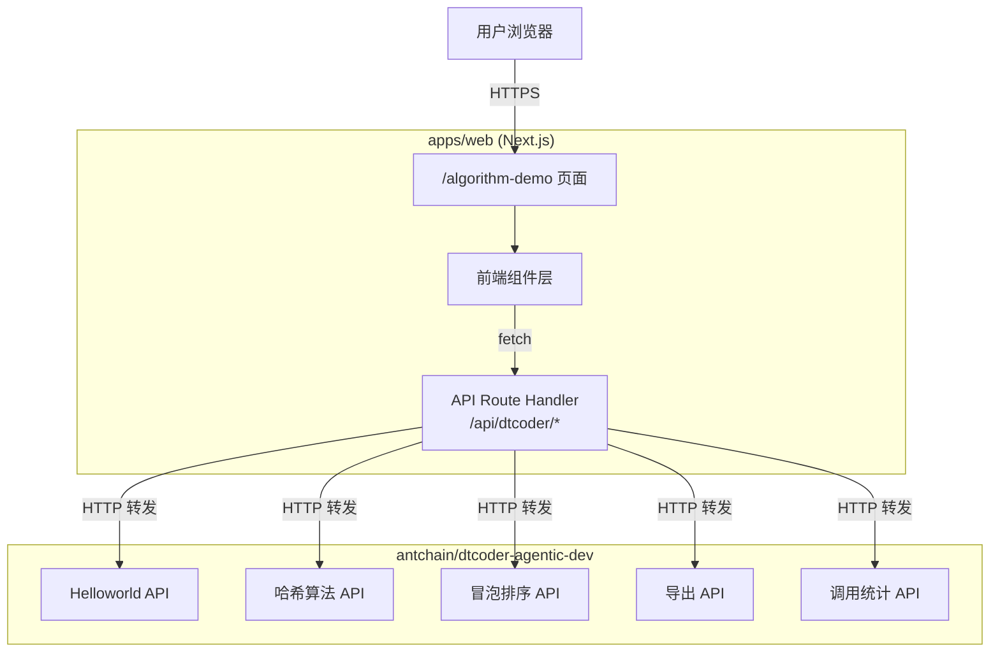

**集成关系说明：**

| 调用方 | 被调用方 | 协议 | 接口类型 | 说明 |
|--------|----------|------|----------|------|
| 用户浏览器 | Next.js 页面 | HTTPS | SSR/RSC | 页面渲染 |
| 前端组件 | Next.js API Route | HTTPS | REST (fetch) | 前端发起请求到本地代理 |
| Next.js API Route | dtcoder-agentic-dev | HTTP | REST | 代理转发到后端服务 |

### 部署架构

本项不适用，原因：算法演示页面作为 `apps/web` 的一部分，随现有 Next.js 应用统一部署至 Vercel/Cloudflare，复用现有部署架构，无独立部署需求。

---

## 3. 数据模型与存储

### 实体清单

| 实体名称 | 实体说明 | 所属模块 | 与其他实体的关系 |
|----------|----------|----------|-----------------|
| AlgorithmResult | 算法执行结果（瞬态，不持久化） | 算法演示模块 | 无 |
| ExportFile | 导出的文件（瞬态 blob，不持久化） | 数据导出模块 | 无 |
| InvocationStat | 调用统计记录（后端存储） | 调用统计模块 | 关联人员、部门、层级维度 |

**模型说明：**
- 本次前端需求不涉及新建数据库表。AlgorithmResult 和 ExportFile 为前端瞬态数据，不持久化。
- InvocationStat 数据由后端 `antchain/dtcoder-agentic-dev` 服务管理和存储，前端仅做查询和展示。
- 假设：后端 InvocationStat 实体包含人员类型（person_type）、层级（level）、部门（department）三个筛选维度。

### 实体关系图

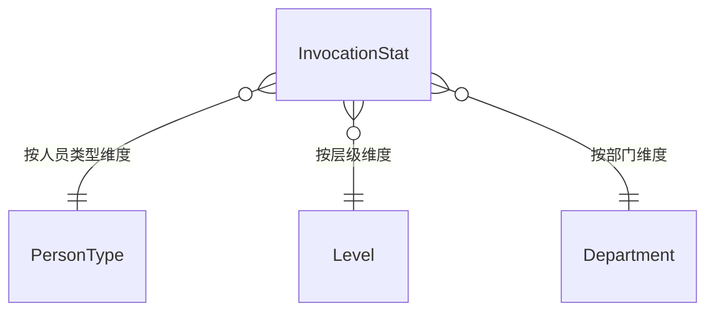

**说明：** 上述实体和关系仅描述前端消费的数据模型，实际存储设计在后端服务中。

---

## 4. 接口设计

### 4.1 oneapi（Web 控制台接口 — 前端调用的 API Route）

| 编号 | 接口名称 | 方法 | 路径 | 模块 |
|------|----------|------|------|------|
| W01 | Helloworld 算法执行 | GET | /api/dtcoder/helloworld | 算法演示模块 |
| W02 | 哈希算法执行 | GET | /api/dtcoder/hash | 算法演示模块 |
| W03 | 冒泡排序算法执行 | GET | /api/dtcoder/bubble-sort | 算法演示模块 |
| W04 | 数据导出 | POST | /api/dtcoder/export | 数据导出模块 |
| W05 | 调用统计查询 | GET | /api/dtcoder/invocation-stats | 调用统计模块 |

### 4.2 OpenAPI（对外接口）

本项不适用，原因：本次需求为内部演示页面，不对外提供 OpenAPI。

### 4.3 内部接口（Service 层）

本项不适用，原因：前端项目无 Java Service 层，使用 Next.js Route Handler + TypeScript 函数。

### 4.4 集成接口（Integration 层 — 调用外部后端服务）

| 编号 | 接口名称 | 调用方式 | 目标路径 | 说明 |
|------|----------|----------|----------|------|
| I01 | Helloworld 后端调用 | HTTP GET | antchain/dtcoder-agentic-dev 对应端点 | 获取 Helloworld 执行结果 |
| I02 | 哈希算法后端调用 | HTTP GET | antchain/dtcoder-agentic-dev 对应端点 | 获取哈希算法执行结果 |
| I03 | 冒泡排序后端调用 | HTTP GET | antchain/dtcoder-agentic-dev 对应端点 | 获取冒泡排序执行结果 |
| I04 | 导出后端调用 | HTTP POST | antchain/dtcoder-agentic-dev /api/dtcoder/export | 获取导出文件 blob |
| I05 | 统计数据后端调用 | HTTP GET | antchain/dtcoder-agentic-dev 对应端点 | 获取调用统计数据 |

---

## 5. 功能模块设计

### 全局约定

- **错误码格式**：`DEMO_{SEQ}`（如 DEMO_001、DEMO_002）
- **通用出参结构**：`{ code: string, msg: string, data: T }`
- **错误码映射表**：

| 错误码 | 说明 |
|--------|------|
| DEMO_001 | 后端算法服务调用超时 |
| DEMO_002 | 后端算法服务返回错误 |
| DEMO_003 | 导出文件格式不支持 |
| DEMO_004 | 统计数据查询失败 |
| DEMO_005 | 参数校验失败 |

### 5.1 页面路由模块

#### 5.1.1 表结构设计

本模块无数据库表，原因：页面路由模块仅负责前端页面渲染，不涉及数据持久化。

#### 5.1.2 接口详细设计

本模块无独立接口，原因：页面路由模块不包含 API Route。

#### 5.1.3 子功能详细设计

##### 5.1.3.1 页面布局（F01）

- 处理时序图

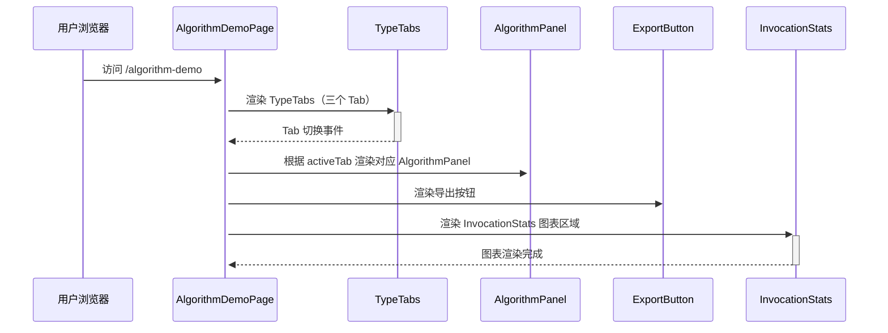

**页面布局结构：**

| 区域 | 组件 | 说明 |
|------|------|------|
| 页面标题区 | 标题文本 | "算法演示" |
| Tab 切换区 | TypeTabs | Helloworld / 哈希算法 / 冒泡排序 |
| 算法结果区 | AlgorithmPanel | 根据当前 Tab 展示对应算法结果 |
| 操作区 | ExportButton + OneSegmented | 格式选择 + 导出按钮 |
| 统计图表区 | InvocationStats | 折线图 / 饼图 / 柱状图 + 维度筛选 |

**业务规则：**

| 规则编号 | 规则描述 | 校验时机 | 不满足时的处理 |
|----------|----------|----------|--------------|
| R01 | 页面加载时默认选中第一个 Tab（Helloworld） | 页面初始化 | 默认选中 Helloworld |
| R02 | Tab 切换时自动触发对应算法 API 调用 | Tab 切换时 | 展示 loading 状态 |
| R03 | API 调用失败时展示错误提示 | API 返回错误时 | 展示错误信息，提供重试按钮 |

**异常场景：**

| 异常场景 | 处理方式 |
|----------|----------|
| 页面初始化失败 | 展示全局错误提示 |
| 网络超时 | 展示超时提示 + 重试按钮 |

**并发控制：**
- 无并发风险，原因：页面为只读展示，不涉及数据写入

---

### 5.2 项目组件模块

#### 5.2.1 表结构设计

本模块无数据库表，原因：项目组件为纯前端 UI 组件。

#### 5.2.2 接口详细设计

本模块无后端接口，原因：项目组件为纯前端组件。

#### 5.2.3 子功能详细设计

##### 5.2.3.1 TypeTabs 组件（F01）

- **职责**：封装 Tab 切换逻辑，提供类型安全的 Tab 项配置
- **Props 设计**：

| 参数名称 | 类型 | 是否必填 | 描述 |
|----------|------|----------|------|
| items | TabItem[] | 是 | Tab 项配置数组 |
| activeKey | string | 否 | 当前激活的 Tab key |
| onChange | (key: string) => void | 否 | Tab 切换回调 |
| defaultActiveKey | string | 否 | 默认激活的 Tab key |

- **TabItem 结构**：

| 参数名称 | 类型 | 描述 |
|----------|------|------|
| key | string | Tab 唯一标识 |
| label | string | Tab 显示文本 |
| icon | ReactNode | Tab 图标（可选） |

##### 5.2.3.2 TextIconButton 组件（F10）

- **职责**：带文本的图标按钮，常用于操作区
- **Props 设计**：

| 参数名称 | 类型 | 是否必填 | 描述 |
|----------|------|----------|------|
| icon | ReactNode | 是 | 按钮图标 |
| text | string | 是 | 按钮文本 |
| onClick | () => void | 否 | 点击回调 |
| loading | boolean | 否 | 加载状态 |
| disabled | boolean | 否 | 禁用状态 |
| variant | 'primary' / 'secondary' / 'ghost' | 否 | 按钮样式变体 |

##### 5.2.3.3 OneSegmented 组件（F11）

- **职责**：分段选择器，用于在有限选项间切换（如导出格式、图表类型）
- **Props 设计**：

| 参数名称 | 类型 | 是否必填 | 描述 |
|----------|------|----------|------|
| options | SegmentedOption[] | 是 | 选项数组 |
| value | string | 否 | 当前选中值 |
| onChange | (value: string) => void | 否 | 切换回调 |
| block | boolean | 否 | 是否撑满父容器 |

- **SegmentedOption 结构**：

| 参数名称 | 类型 | 描述 |
|----------|------|------|
| label | string | 选项显示文本 |
| value | string | 选项值 |
| disabled | boolean | 是否禁用（可选） |

---

### 5.3 算法演示模块

#### 5.3.1 表结构设计

本模块无数据库表，原因：算法执行结果为瞬态数据，不持久化。

#### 5.3.2 接口详细设计

##### W01 Helloworld 算法执行

- **URI**: GET /api/dtcoder/helloworld
- **描述**: 调用后端 Helloworld 算法，返回执行结果
- **入参**:

| 参数名称 | 类型 | 是否必填 | 描述 |
|----------|------|----------|------|
| 无 | - | - | 无需入参（使用默认演示参数） |

- **出参**:

| 参数名称 | 类型 | 描述 |
|----------|------|------|
| code | string | 结果码 |
| msg | string | 提示信息 |
| data | Object | 算法执行结果 |
| data.output | string | Helloworld 输出内容 |
| data.executionTime | number | 执行耗时（ms） |

- **错误码**:

| 错误码 | 说明 |
|--------|------|
| DEMO_001 | 后端算法服务调用超时 |
| DEMO_002 | 后端算法服务返回错误 |

- **请求示例**:
```
GET /api/dtcoder/helloworld
```

- **响应示例**:
```json
{
  "code": "OK",
  "msg": "SUCCESS",
  "data": {
    "output": "Hello, World!",
    "executionTime": 12
  }
}
```

##### W02 哈希算法执行

- **URI**: GET /api/dtcoder/hash
- **描述**: 调用后端哈希算法，返回执行结果
- **入参**:

| 参数名称 | 类型 | 是否必填 | 描述 |
|----------|------|----------|------|
| input | string | 否 | 待哈希的输入文本（默认使用演示数据） |

- **出参**:

| 参数名称 | 类型 | 描述 |
|----------|------|------|
| code | string | 结果码 |
| msg | string | 提示信息 |
| data | Object | 算法执行结果 |
| data.input | string | 输入文本 |
| data.hashValue | string | 哈希值 |
| data.algorithm | string | 使用的哈希算法名称 |
| data.executionTime | number | 执行耗时（ms） |

- **错误码**:

| 错误码 | 说明 |
|--------|------|
| DEMO_001 | 后端算法服务调用超时 |
| DEMO_002 | 后端算法服务返回错误 |

- **请求示例**:
```
GET /api/dtcoder/hash?input=hello
```

- **响应示例**:
```json
{
  "code": "OK",
  "msg": "SUCCESS",
  "data": {
    "input": "hello",
    "hashValue": "2cf24dba5fb0a30e26e83b2ac5b9e29e1b161e5c1fa7425e73043362938b9824",
    "algorithm": "SHA-256",
    "executionTime": 3
  }
}
```

##### W03 冒泡排序算法执行

- **URI**: GET /api/dtcoder/bubble-sort
- **描述**: 调用后端冒泡排序算法，返回执行结果
- **入参**:

| 参数名称 | 类型 | 是否必填 | 描述 |
|----------|------|----------|------|
| array | string | 否 | 逗号分隔的数字数组（默认使用演示数据） |

- **出参**:

| 参数名称 | 类型 | 描述 |
|----------|------|------|
| code | string | 结果码 |
| msg | string | 提示信息 |
| data | Object | 算法执行结果 |
| data.original | number[] | 原始数组 |
| data.sorted | number[] | 排序后数组 |
| data.steps | number | 排序步数 |
| data.executionTime | number | 执行耗时（ms） |

- **错误码**:

| 错误码 | 说明 |
|--------|------|
| DEMO_001 | 后端算法服务调用超时 |
| DEMO_002 | 后端算法服务返回错误 |

- **请求示例**:
```
GET /api/dtcoder/bubble-sort?array=5,3,8,1,2
```

- **响应示例**:
```json
{
  "code": "OK",
  "msg": "SUCCESS",
  "data": {
    "original": [5, 3, 8, 1, 2],
    "sorted": [1, 2, 3, 5, 8],
    "steps": 10,
    "executionTime": 2
  }
}
```

#### 5.3.3 子功能详细设计

##### 5.3.3.1 Helloworld 算法展示（F02）

- 处理时序图

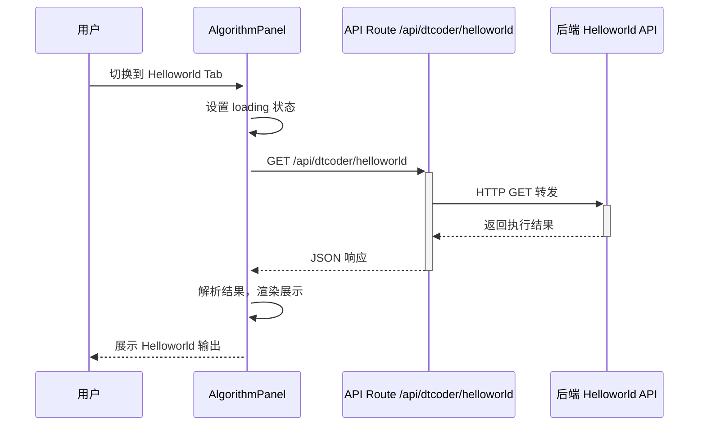

**业务规则：**

| 规则编号 | 规则描述 | 校验时机 | 不满足时的处理 |
|----------|----------|----------|--------------|
| R01 | Tab 激活时自动触发 API 调用 | Tab 切换时 | 展示 loading |
| R02 | 结果展示区域显示输出文本和执行耗时 | API 成功返回时 | 格式化展示 |
| R03 | API 错误时展示错误信息和重试按钮 | API 返回错误时 | 展示 ErrorCard + 重试 |

**异常场景：**

| 异常场景 | 处理方式 |
|----------|----------|
| 后端服务不可用 | 展示错误提示 + 重试按钮 |
| 请求超时（>10s） | 展示超时提示 + 重试按钮 |
| 返回数据格式异常 | 展示原始 JSON + 警告提示 |

##### 5.3.3.2 哈希算法展示（F03）

- 处理时序图

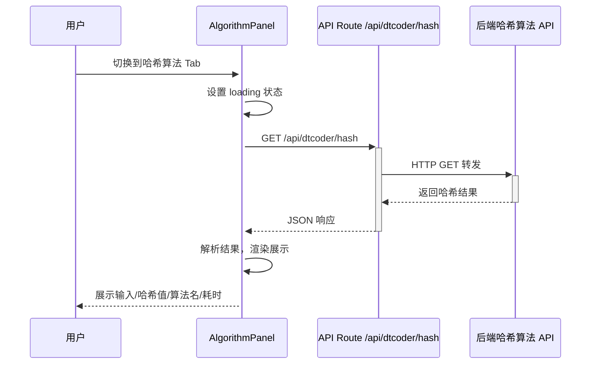

**业务规则：**

| 规则编号 | 规则描述 | 校验时机 | 不满足时的处理 |
|----------|----------|----------|--------------|
| R01 | Tab 激活时自动触发 API 调用 | Tab 切换时 | 展示 loading |
| R02 | 展示输入文本、哈希值、算法名称和执行耗时 | API 成功返回时 | 格式化展示 |
| R03 | 哈希值过长时自动换行或提供复制按钮 | 渲染时 | 使用 CopyableCommand 或文本截断 |

**异常场景：**

| 异常场景 | 处理方式 |
|----------|----------|
| 后端服务不可用 | 展示错误提示 + 重试按钮 |
| 请求超时 | 展示超时提示 + 重试按钮 |

##### 5.3.3.3 冒泡排序展示（F04）

- 处理时序图

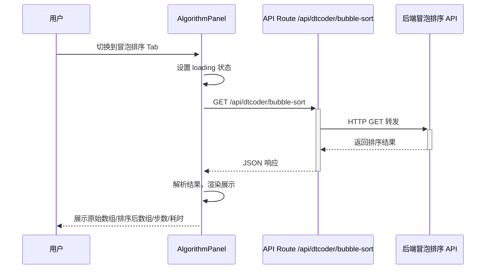

**业务规则：**

| 规则编号 | 规则描述 | 校验时机 | 不满足时的处理 |
|----------|----------|----------|--------------|
| R01 | Tab 激活时自动触发 API 调用 | Tab 切换时 | 展示 loading |
| R02 | 展示原始数组、排序后数组、排序步数和执行耗时 | API 成功返回时 | 格式化展示（表格或列表） |
| R03 | 数组元素过多时自动折叠展示 | 渲染时 | 超过 20 个元素时折叠 |

**异常场景：**

| 异常场景 | 处理方式 |
|----------|----------|
| 后端服务不可用 | 展示错误提示 + 重试按钮 |
| 请求超时 | 展示超时提示 + 重试按钮 |

---

### 5.4 数据导出模块

#### 5.4.1 表结构设计

本模块无数据库表，原因：导出文件为瞬态 blob 数据，不在前端持久化。

#### 5.4.2 接口详细设计

##### W04 数据导出

- **URI**: POST /api/dtcoder/export
- **描述**: 调用后端导出接口，获取文件 blob 并触发浏览器下载
- **入参**:

| 参数名称 | 类型 | 是否必填 | 描述 |
|----------|------|----------|------|
| format | string | 是 | 导出格式：excel 或 csv |

- **出参**:

| 参数名称 | 类型 | 描述 |
|----------|------|------|
| Blob | binary | 文件二进制流 |
| Content-Disposition | header | 包含文件名信息 |

- **错误码**:

| 错误码 | 说明 |
|--------|------|
| DEMO_003 | 导出文件格式不支持（仅支持 excel/csv） |
| DEMO_001 | 后端服务调用超时 |

- **请求示例**:
```json
{
  "format": "excel"
}
```

- **响应示例**: 二进制文件流（Content-Type: application/octet-stream 或对应 MIME）

#### 5.4.3 子功能详细设计

##### 5.4.3.1 文件导出（F05）

- 处理时序图

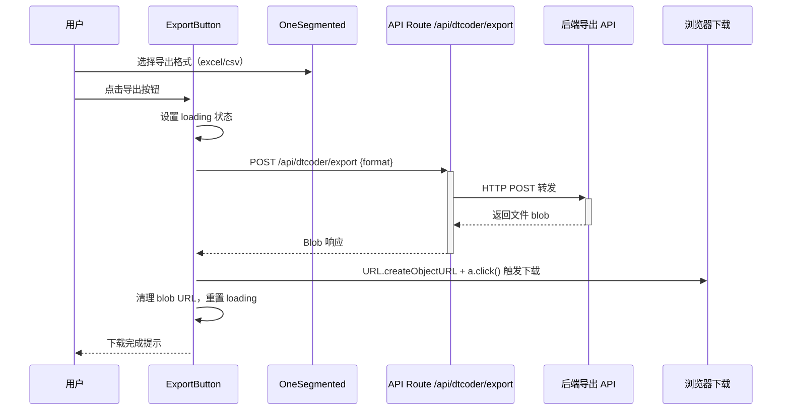

**业务规则：**

| 规则编号 | 规则描述 | 校验时机 | 不满足时的处理 |
|----------|----------|----------|--------------|
| R01 | 导出前必须选择格式（excel 或 csv） | 点击导出时 | 使用默认值 excel |
| R02 | 下载文件名从 Content-Disposition 提取 | 响应处理时 | 默认文件名 `algorithm-demo-export.{ext}` |
| R03 | 导出过程中按钮禁用，防止重复点击 | 导出进行时 | 按钮 loading + disabled |
| R04 | 导出完成后自动清理 blob URL | 下载触发后 | 防止内存泄漏 |

**异常场景：**

| 异常场景 | 处理方式 |
|----------|----------|
| 后端返回非 blob 数据 | 提示导出失败 |
| 网络超时 | 展示超时提示，重置按钮状态 |
| 浏览器不支持 blob 下载 | 降级提示用户 |

**并发控制：**
- 并发场景：用户快速连续点击导出按钮
- 控制策略：导出进行时按钮 disabled + loading 状态，防止重复请求

---

### 5.5 调用统计模块

#### 5.5.1 表结构设计

本模块无前端数据库表，原因：统计数据由后端存储，前端仅查询和展示。

#### 5.5.2 接口详细设计

##### W05 调用统计查询

- **URI**: GET /api/dtcoder/invocation-stats
- **描述**: 查询调用统计数据，支持多维度筛选
- **入参**:

| 参数名称 | 类型 | 是否必填 | 描述 |
|----------|------|----------|------|
| dimension | string | 否 | 筛选维度：person_type / level / department（默认 person_type） |
| startDate | string | 否 | 起始日期（ISO 格式） |
| endDate | string | 否 | 结束日期（ISO 格式） |

- **出参**:

| 参数名称 | 类型 | 描述 |
|----------|------|------|
| code | string | 结果码 |
| msg | string | 提示信息 |
| data | Object | 统计数据 |
| data.lineData | Array | 折线图数据（时间序列） |
| data.pieData | Array | 饼图数据（维度占比） |
| data.barData | Array | 柱状图数据（维度对比） |

- **错误码**:

| 错误码 | 说明 |
|--------|------|
| DEMO_004 | 统计数据查询失败 |
| DEMO_005 | 参数校验失败 |

- **请求示例**:
```
GET /api/dtcoder/invocation-stats?dimension=department
```

- **响应示例**:
```json
{
  "code": "OK",
  "msg": "SUCCESS",
  "data": {
    "lineData": [
      { "date": "2026-08-01", "count": 120 },
      { "date": "2026-08-02", "count": 150 }
    ],
    "pieData": [
      { "category": "技术部", "value": 320 },
      { "category": "产品部", "value": 180 },
      { "category": "运营部", "value": 95 }
    ],
    "barData": [
      { "category": "技术部", "count": 320 },
      { "category": "产品部", "count": 180 },
      { "category": "运营部", "count": 95 }
    ]
  }
}
```

#### 5.5.3 子功能详细设计

##### 5.5.3.1 调用统计图表展示（F06/F07/F08）

- 处理时序图

```mermaid
sequenceDiagram
    participant U as 用户
    participant IS as InvocationStats
    participant Chart as ChartSelector(OneSegmented)
    participant API as API Route
    participant BE as 后端统计 API
    participant AC as @ant-design/charts

    U->>+IS: 页面加载
    IS->>+API: GET /api/dtcoder/invocation-stats
    API->>+BE: 转发请求
    BE-->>-API: 返回统计数据
    API-->>-IS: JSON 响应
    IS->>+AC: 渲染折线图（默认）
    AC-->>-IS: 图表渲染完成
    IS-->>-U: 展示图表

    U->>Chart: 切换图表类型（折线/饼图/柱状）
    Chart->>IS: onChange 回调
    IS->>+AC: 重新渲染对应图表类型
    AC-->>-IS: 图表更新
    IS-->>-U: 展示新图表
```

**业务规则：**

| 规则编号 | 规则描述 | 校验时机 | 不满足时的处理 |
|----------|----------|----------|--------------|
| R01 | 默认展示折线图 | 页面初始化 | 默认折线图 |
| R02 | 图表类型切换使用 OneSegmented（折线/饼图/柱状） | 用户切换时 | 平滑切换动画 |
| R03 | 图表数据随维度筛选实时更新 | 筛选条件变化时 | 展示 loading 后刷新 |
| R04 | 图表区域无数据时展示空状态 | 数据为空时 | 空状态占位图 |

**异常场景：**

| 异常场景 | 处理方式 |
|----------|----------|
| 统计数据加载失败 | 展示错误占位 + 重试 |
| 图表渲染异常 | 降级展示数据表格 |
| 数据量过大导致图表卡顿 | 限制最大数据点数（如 100 个） |

##### 5.5.3.2 维度筛选（F09）

- 处理时序图

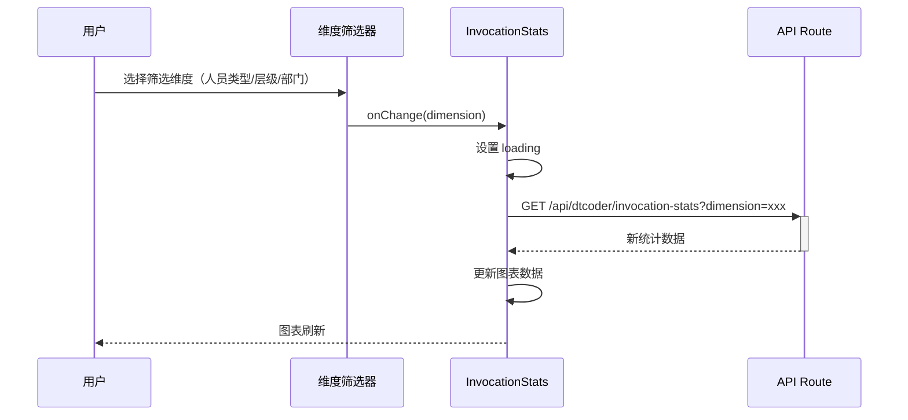

**业务规则：**

| 规则编号 | 规则描述 | 校验时机 | 不满足时的处理 |
|----------|----------|----------|--------------|
| R01 | 默认维度为"人员类型" | 页面初始化 | 默认 person_type |
| R02 | 维度切换后自动重新请求数据 | 维度变化时 | loading + 刷新 |
| R03 | 维度选项：人员类型、层级、部门 | 渲染时 | 三个固定选项 |

**异常场景：**

| 异常场景 | 处理方式 |
|----------|----------|
| 某维度下无数据 | 展示空状态提示 |
| 切换维度时请求失败 | 保持上一维度数据 + 错误提示 |

---

### 5.6 后端 API 代理模块

#### 5.6.1 表结构设计

本模块无数据库表，原因：代理模块仅做请求转发。

#### 5.6.2 接口详细设计

代理模块为上述 W01~W05 提供统一的请求转发逻辑：

- **通用代理逻辑**：

| 参数名称 | 类型 | 描述 |
|----------|------|------|
| targetUrl | string | 后端服务地址（从环境变量读取） |
| timeout | number | 请求超时时间（默认 10000ms） |
| headers | object | 透传认证头信息 |

- **错误处理**：

| 错误码 | 说明 |
|--------|------|
| DEMO_001 | 后端服务超时 |
| DEMO_002 | 后端服务返回非 2xx 响应 |

#### 5.6.3 子功能详细设计

##### 5.6.3.1 请求代理转发

- 处理时序图

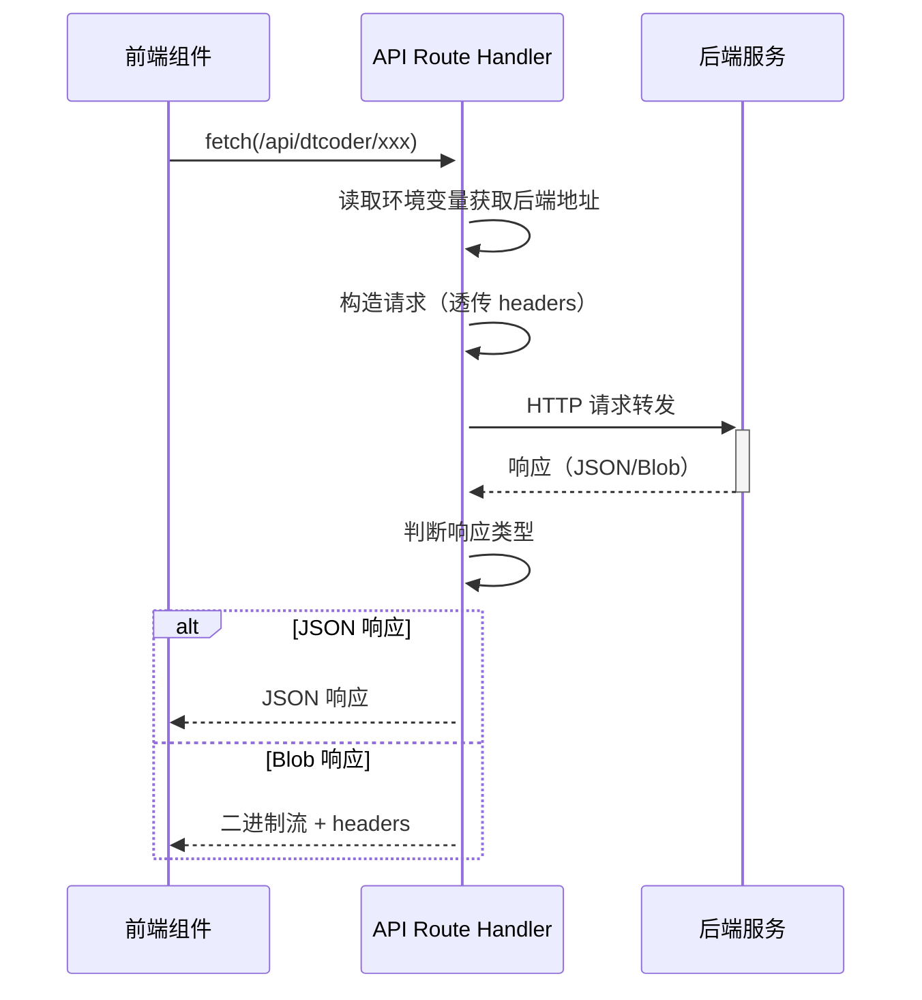

**业务规则：**

| 规则编号 | 规则描述 | 校验时机 | 不满足时的处理 |
|----------|----------|----------|--------------|
| R01 | 后端地址从环境变量 DTCODER_API_URL 读取 | 请求发起时 | 环境变量缺失返回 DEMO_002 |
| R02 | 请求超时 10 秒 | 每次请求 | 返回 DEMO_001 |
| R03 | 透传用户认证信息 | 每次请求 | 认证失败返回 401 |
| R04 | 导出接口透传 Content-Disposition header | 导出响应时 | 使用默认文件名 |

**异常场景：**

| 异常场景 | 处理方式 |
|----------|----------|
| 环境变量未配置 | 返回 500 + 错误提示 |
| 后端服务不可达 | 返回 DEMO_001 超时 |
| 后端返回非预期格式 | 包装为统一错误格式返回 |

---

### 跨模块调用链时序图

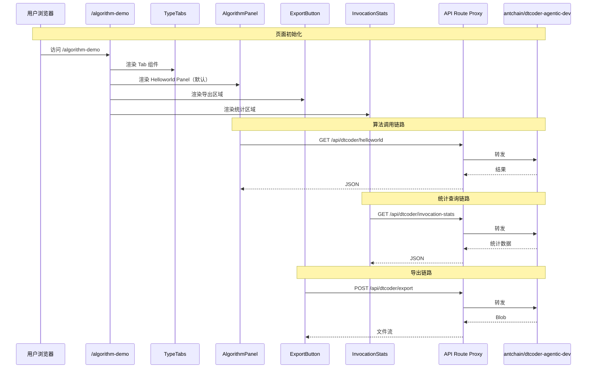

---

## 6. 非功能性需求设计

### 6.1 高可用性

- **后端服务降级**：当 `antchain/dtcoder-agentic-dev` 服务不可用时，页面不崩溃，各功能区域独立展示错误状态 + 重试按钮。
- **图表渲染降级**：当 `@ant-design/charts` 渲染失败时，降级为数据表格展示原始数据。
- **组件加载失败**：项目组件（TypeTabs 等）加载异常时，降级为基础 HTML 元素。

### 6.2 可扩展性

- **新增算法 Tab**：TypeTabs 组件支持动态配置，新增算法只需添加 Tab 配置项 + 对应 API Route + AlgorithmPanel 子组件。
- **新增图表类型**：InvocationStats 组件采用策略模式，新增图表类型只需添加渲染函数。
- **新增导出格式**：导出格式通过 OneSegmented 配置扩展，后端支持即可。

### 6.3 稳定性/可靠性

- **API 请求超时控制**：所有后端请求设置 10 秒超时，避免页面长时间无响应。
- **请求去重**：快速连续 Tab 切换时，取消前一个未完成的请求（AbortController）。
- **Blob URL 清理**：导出完成后自动 revokeObjectURL，防止内存泄漏。

### 6.4 安全性设计

#### 6.4.1 账户系统方案
复用现有 Kilo Cloud 平台的认证体系，不新增账户系统。

#### 6.4.2 授权&访问控制

##### 6.4.2.1 是否实现水平权限检查
不涉及，原因：算法演示页面展示的是公共演示数据，不涉及用户私有资源。

##### 6.4.2.2 是否实现垂直权限检查
假设：复用现有全局登录态检查，已登录用户均可访问。如需限制角色，可通过现有中间件扩展。

##### 6.4.2.3 是否检查登录态
是，复用全局认证中间件。`/algorithm-demo` 路由和 `/api/dtcoder/*` API Route 均在登录态保护范围内。

#### 6.4.3 数据防护方案

##### 6.4.3.1 是否对敏感数据加密存储
不涉及，原因：前端不存储敏感数据。

##### 6.4.3.2 是否对敏感数据展示进行脱敏
不涉及，原因：算法演示结果不包含敏感信息。若调用统计中包含人员信息，后端应在返回前脱敏。

### 6.5 监控/统计/日志/告警

- **前端埋点**：
  - 页面 PV/UV 统计（复用现有 PostHog 埋点）
  - Tab 切换事件记录
  - 导出按钮点击事件
  - 图表类型切换事件
- **API 调用监控**：
  - 各 API Route 的请求量、响应时间、错误率（通过现有 o11y 服务）
  - 后端服务超时/不可用告警

---

## 7. 变更三板斧

### 7.1 可监控

- **服务埋点**：
  - `/api/dtcoder/helloworld`、`/api/dtcoder/hash`、`/api/dtcoder/bubble-sort` 接口：监控调用次数、成功率、平均耗时
  - `/api/dtcoder/export` 接口：监控导出次数、成功率、文件大小
  - `/api/dtcoder/invocation-stats` 接口：监控查询次数、响应时间
- **前端埋点**：页面访问量、Tab 切换频率、导出使用率、图表类型偏好
- **告警规则**：API 错误率 > 5% 时告警；P99 延迟 > 5s 时告警

### 7.2 可灰度

- **灰度方案对比**：

| 方案 | 优势 | 劣势 |
|------|------|------|
| Feature Flag 控制页面入口 | 实现简单，可精确控制 | 需集成 Feature Flag 服务 |
| 路由级灰度（白名单用户） | 无需额外服务 | 维护成本高 |
| 全量上线（推荐） | 演示页面风险低 | 无灰度保护 |

- **推荐方案**：全量上线。原因：算法演示页面为只读展示页面，不涉及数据写入，对核心业务无影响，风险可控。如需灰度，可在导航菜单入口添加 Feature Flag 控制可见性。

### 7.3 可应急

- **页面级应急**：
  - 通过 Feature Flag 隐藏 `/algorithm-demo` 导航入口（如有）
  - 紧急情况下可通过 Vercel/部署平台回滚到上一版本
- **API 代理级应急**：
  - API Route 中设置开关环境变量 `DTCODER_DEMO_ENABLED`，关闭时返回 503
  - 后端服务不可用时，前端自动降级展示错误提示，不影响其他页面
- **回滚兼容性**：
  - 本次变更为纯前端新增页面 + API Route，不涉及数据库变更
  - 回滚时仅需回滚前端代码，无上下游兼容性问题
  - 新增的 `@ant-design/charts` 依赖不影响其他模块

---

## 附录：变更影响范围汇总

| 仓库 | 变更范围 | 说明 |
|------|----------|------|
| cloud-main | `apps/web/src/app/algorithm-demo/` | 新增路由页面（新建） |
| cloud-main | `apps/web/src/components/ui/TypeTabs.tsx` | 新增 TypeTabs 组件 |
| cloud-main | `apps/web/src/components/ui/TextIconButton.tsx` | 新增 TextIconButton 组件 |
| cloud-main | `apps/web/src/components/ui/OneSegmented.tsx` | 新增 OneSegmented 组件 |
| cloud-main | `apps/web/src/app/api/dtcoder/` | 新增 API Route 代理（5 个端点） |
| cloud-main | `apps/web/src/components/algorithm-demo/` | 新增业务组件目录 |
| cloud-main | `apps/web/package.json` | 新增 @ant-design/charts 依赖 |
| library-frontend | 无变更 | 不涉及图书管理系统前端 |
