> **文档元信息**
>
> | 项目 | 内容 |
> |------|------|
> | 文档版本 | v1.0 |
> | 作者 | DTCoder |
> | 创建日期 | 2026-08-11 |
> | 需求来源 | 用户直接需求 |
> | 评审状态 | 待评审 |

# 购物商城（含订单、支付、秒杀、消息队列）系分设计

## 1. 需求与范围

### 背景与目标

构建一个完整的购物商城，支持用户浏览商品、下单、支付、退款、秒杀等业务流程。系统需具备高并发、高可用、可扩展的特性，通过 RocketMQ 消息队列实现流量削峰与业务解耦，确保订单状态可恢复、可追溯。

### 核心功能

- **商品模块**：商品浏览、分类、搜索、详情展示
- **订单模块**：购物车、下单、订单管理、订单查询
- **支付模块**：支付（支付宝/微信）、退款、支付状态回调
- **秒杀模块**：秒杀活动创建、秒杀抢购、库存扣减、防超卖
- **消息队列**：基于 RocketMQ 的异步消息处理、削峰填谷、事件驱动
- **流量管控**：限流、降级、熔断
- **订单可追溯**：订单全链路状态流转、操作日志、异常恢复

### 约束与非功能要求

- 支付模块需支持环境变量注入支付宝/微信支付账号配置
- 使用 RocketMQ 作为消息中间件
- 需做好流量管控，削峰解耦
- 订单状态可恢复可追溯

### 排除范围

- 用户注册/登录（假设已有统一身份认证体系）
- 物流跟踪系统
- 商家后台管理（仅涉及买家端）
- 多语言国际化

### 需求功能清单与优先级

| 编号 | 功能点 | 优先级 | PRD 原始描述/章节 | 备注 |
|------|--------|--------|-------------------|------|
| F01 | 商品浏览与搜索 | P1 | 用户可浏览商品列表和详情 | |
| F02 | 购物车管理 | P1 | 添加/删除商品、修改数量 | |
| F03 | 订单创建与提交 | P0 | 从购物车或立即购买生成订单 | |
| F04 | 订单状态管理 | P0 | 订单状态流转：待支付、已支付、已发货、已完成、已取消 | |
| F05 | 支付宝支付 | P0 | 支持支付宝付款（环境变量注入配置） | |
| F06 | 微信支付 | P0 | 支持微信付款（环境变量注入配置） | |
| F07 | 退款处理 | P0 | 支持订单退款，原路退回 | |
| F08 | 秒杀活动 | P0 | 限时秒杀，库存扣减，防超卖 | |
| F09 | RocketMQ 消息队列 | P0 | 异步处理、削峰填谷、事件驱动 | 支付回调、订单超时取消、库存回退 |
| F10 | 流量管控 | P0 | 限流、降级、熔断 | 秒杀场景尤为关键 |
| F11 | 订单可追溯 | P1 | 订单全链路状态日志、操作记录 | |

### 假设与待确认项

| 编号 | 假设/待确认内容 | 当前假设 | 确认状态 |
|------|-----------------|----------|----------|
| A01 | 用户认证体系已存在 | 假设已有统一认证，通过 Token 传递用户身份 | 待确认 |
| A02 | 支付宝/微信支付沙箱/生产环境 | 通过环境变量 ALIPAY_APPID、WECHAT_APPID 等注入 | 待确认 |
| A03 | RocketMQ 集群部署模式 | 假设使用主从同步复制，NameServer 集群 | 待确认 |
| A04 | 秒杀库存扣减策略 | 采用 Redis 预减 + MySQL 异步落库 | 待确认 |
| A05 | 订单超时时间 | 默认 30 分钟未支付自动取消 | 待确认 |

---

## 2. 架构与模块

### 功能架构

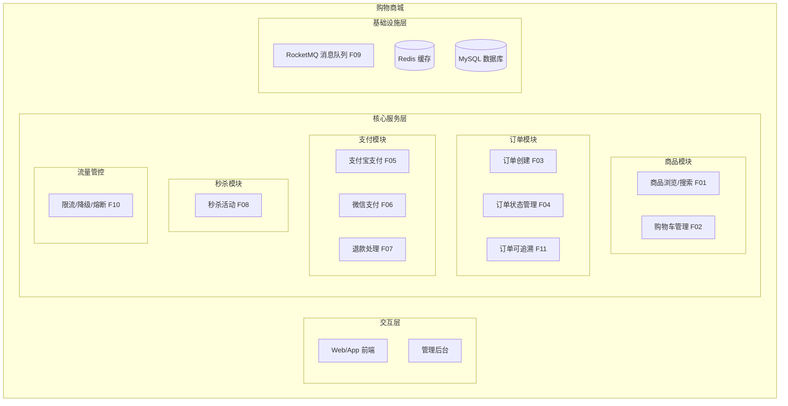

- **交互层说明**：Web/App 前端提供用户交互界面；管理后台用于运营配置
- **核心服务层说明**：商品模块负责商品信息和购物车；订单模块负责订单全生命周期；支付模块独立封装支付宝/微信支付能力；秒杀模块处理高并发抢购；流量管控保障系统稳定性
- **基础设施层说明**：RocketMQ 负责异步消息和事件驱动；Redis 用于缓存和秒杀库存；MySQL 作为持久化存储

**模块清单**

| 模块 | 职责 | 依赖 |
|------|------|------|
| 商品模块 | 商品信息管理、分类、搜索、购物车 | 无 |
| 订单模块 | 订单创建、状态管理、超时处理、可追溯 | 商品模块、支付模块、消息队列 |
| 支付模块 | 支付宝/微信支付、退款、回调处理 | 订单模块、消息队列 |
| 秒杀模块 | 秒杀活动管理、库存扣减、防超卖 | 商品模块、订单模块、Redis、消息队列 |
| 流量管控 | 限流、降级、熔断、防刷 | 所有模块 |

### 应用集成架构

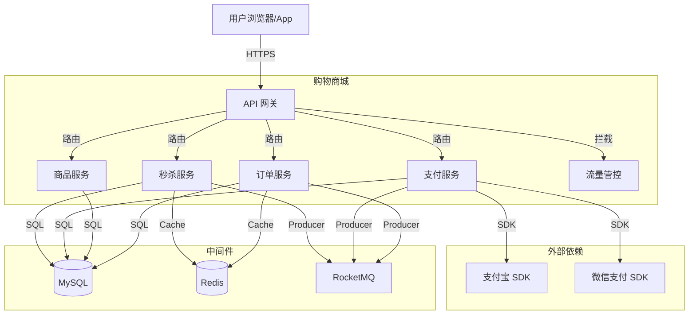

**集成关系说明：**

| 调用方 | 被调用方 | 协议 | 接口类型 | 说明 |
|--------|----------|------|----------|------|
| 用户浏览器/App | API 网关 | HTTPS | RESTful | 统一入口，负载均衡 |
| API 网关 | 各业务服务 | HTTP | gRPC/HTTP | 内部服务路由 |
| 订单服务 | MySQL | JDBC | SQL | 订单数据持久化 |
| 支付服务 | 支付宝 SDK | HTTPS | SDK API | 支付/退款请求 |
| 支付服务 | 微信支付 SDK | HTTPS | SDK API | 支付/退款请求 |
| 秒杀服务 | Redis | TCP | Redis 协议 | 秒杀库存预扣 |
| 订单/支付/秒杀 | RocketMQ | TCP | MQ 协议 | 异步消息、事件发布 |

### 部署架构

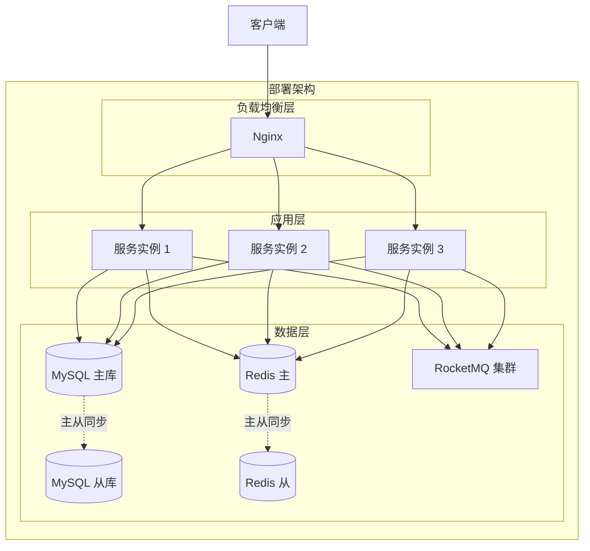

**部署说明：**
- **负载均衡层**：Nginx 反向代理，支持轮询/最少连接策略
- **应用层**：多实例部署，支持水平扩容，无状态设计
- **数据层**：MySQL 主从架构读写分离；Redis 主从支持高可用；RocketMQ 集群模式（2m-2s-sync）

---

## 3. 数据模型与存储

### 实体清单

| 实体名称 | 实体说明 | 所属模块 | 与其他实体的关系 |
|----------|----------|----------|-----------------|
| product | 商品 | 商品模块 | 一对多关联 sku |
| sku | 商品 SKU | 商品模块 | 多对一关联 product，一对多关联 order_item |
| cart | 购物车 | 商品模块 | 多对一关联 user，多对一关联 sku |
| order | 订单 | 订单模块 | 一对多关联 order_item，多对一关联 user，多对一关联 payment |
| order_item | 订单项 | 订单模块 | 多对一关联 order，多对一关联 sku |
| payment | 支付记录 | 支付模块 | 多对一关联 order，多对一关联 refund |
| refund | 退款记录 | 支付模块 | 多对一关联 payment |
| seckill_activity | 秒杀活动 | 秒杀模块 | 一对多关联 seckill_order |
| seckill_order | 秒杀订单 | 秒杀模块 | 多对一关联 seckill_activity，多对一关联 order |
| order_status_log | 订单状态日志 | 订单模块 | 多对一关联 order |

### 实体关系图

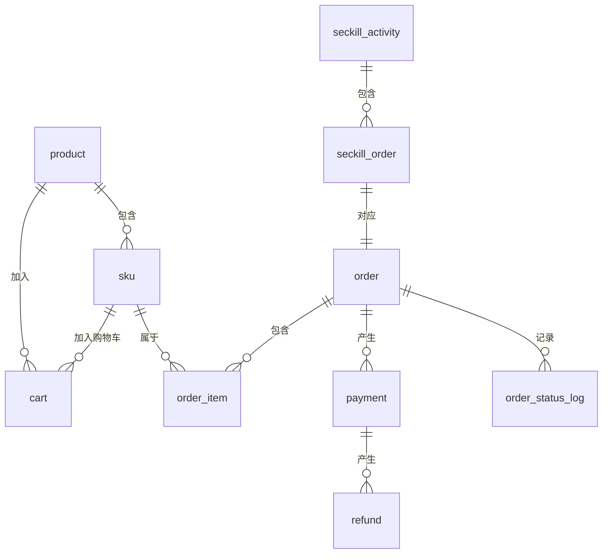

**模型说明：**
- 商品与 SKU 为一对多关系，SKU 为最小库存单位
- 订单与订单项为一对多关系，订单项记录购买的 SKU 信息
- 支付记录与订单为多对一关系，一个订单可能有多笔支付记录（支付失败重试等）
- 退款记录与支付记录为多对一关系
- 秒杀订单与订单为一对一关系，秒杀订单为订单的扩展
- 订单状态日志记录订单全生命周期状态变更，用于可追溯

---

## 4. 接口设计

### 4.1 oneapi（Web 控制台接口）

| 编号 | 接口名称 | 方法 | 路径 | 模块 |
|------|----------|------|------|------|
| W01 | 商品列表查询 | GET | /api/products | 商品模块 |
| W02 | 商品详情查询 | GET | /api/products/{id} | 商品模块 |
| W03 | 添加购物车 | POST | /api/cart | 商品模块 |
| W04 | 购物车列表查询 | GET | /api/cart | 商品模块 |
| W05 | 创建订单 | POST | /api/orders | 订单模块 |
| W06 | 订单详情查询 | GET | /api/orders/{id} | 订单模块 |
| W07 | 订单列表查询 | GET | /api/orders | 订单模块 |
| W08 | 发起支付 | POST | /api/payments | 支付模块 |
| W09 | 支付回调通知 | POST | /api/payments/callback | 支付模块 |
| W10 | 申请退款 | POST | /api/refunds | 支付模块 |
| W11 | 秒杀活动查询 | GET | /api/seckill/activities | 秒杀模块 |
| W12 | 秒杀下单 | POST | /api/seckill/orders | 秒杀模块 |

### 4.2 OpenAPI（对外接口）

| 编号 | 接口名称 | 方法 | 路径 | 模块 |
|------|----------|------|------|------|
| O01 | 商品信息同步 | GET | /openapi/products | 商品模块 |
| O02 | 订单状态查询 | GET | /openapi/orders/{id}/status | 订单模块 |
| O03 | 支付结果查询 | GET | /openapi/payments/{id} | 支付模块 |

### 4.3 内部接口（Service 层）

| 编号 | 接口名称 | 类 | 方法签名 |
|------|----------|------|----------|
| S01 | 创建订单 | OrderService | createOrder(CreateOrderRequest): Order |
| S02 | 支付订单 | PaymentService | pay(PaymentRequest): PaymentResult |
| S03 | 退款处理 | RefundService | refund(RefundRequest): RefundResult |
| S04 | 扣减库存 | InventoryService | deductStock(SkuId, quantity): boolean |
| S05 | 回退库存 | InventoryService | rollbackStock(SkuId, quantity): boolean |
| S06 | 秒杀下单 | SeckillService | seckillOrder(SeckillRequest): SeckillResult |

### 4.4 集成接口（Integration 层）

| 编号 | 接口名称 | 类 | 方法签名 | 说明 |
|------|----------|------|----------|------|
| I01 | 支付宝预下单 | AlipayClient | tradePreCreate(AlipayRequest): AlipayResponse | 支付宝预创建订单 |
| I02 | 支付宝查询 | AlipayClient | tradeQuery(AlipayRequest): AlipayResponse | 查询支付状态 |
| I03 | 支付宝退款 | AlipayClient | tradeRefund(AlipayRefundRequest): AlipayResponse | 发起退款 |
| I04 | 微信统一下单 | WechatPayClient | unifiedOrder(WechatRequest): WechatResponse | 微信统一下单 |
| I05 | 微信查询 | WechatPayClient | orderQuery(WechatRequest): WechatResponse | 查询支付状态 |
| I06 | 微信退款 | WechatPayClient | refund(WechatRefundRequest): WechatResponse | 发起退款 |
| I07 | 发送 MQ 消息 | RocketMQProducer | sendMessage(topic, message): SendResult | 发送异步消息 |

---

## 5. 功能模块设计

### 5.1 商品模块

#### 5.1.1 表结构设计

##### 5.1.1.1 product（商品表）

| 字段名 | 数据类型 | 约束 | 默认值 | 说明 |
|--------|----------|------|--------|------|
| id | bigint | PK, 自增 | - | 系统自增主键 |
| product_code | varchar(64) | NOT NULL, UK | - | 商品编码 |
| product_name | varchar(255) | NOT NULL | - | 商品名称 |
| category_id | bigint | NOT NULL | - | 分类 ID |
| brand | varchar(100) | - | - | 品牌 |
| description | text | - | - | 商品描述 |
| main_image | varchar(500) | - | - | 主图 URL |
| status | tinyint | NOT NULL | 1 | 1-上架 0-下架 |
| gmt_create | datetime | NOT NULL | CURRENT_TIMESTAMP | 创建时间 |
| gmt_modified | datetime | NOT NULL | CURRENT_TIMESTAMP | 修改时间 |

**索引：**
- UK: `product_code`
- IDX: `idx_product_category` (category_id)
- IDX: `idx_product_status` (status)

##### 5.1.1.2 sku（SKU 表）

| 字段名 | 数据类型 | 约束 | 默认值 | 说明 |
|--------|----------|------|--------|------|
| id | bigint | PK, 自增 | - | 系统自增主键 |
| product_id | bigint | NOT NULL, FK | - | 商品 ID |
| sku_code | varchar(64) | NOT NULL, UK | - | SKU 编码 |
| sku_name | varchar(255) | NOT NULL | - | SKU 名称 |
| price | decimal(10,2) | NOT NULL | 0.00 | 售价 |
| stock | int | NOT NULL | 0 | 库存数量 |
| spec_json | varchar(500) | - | - | 规格 JSON |
| gmt_create | datetime | NOT NULL | CURRENT_TIMESTAMP | 创建时间 |
| gmt_modified | datetime | NOT NULL | CURRENT_TIMESTAMP | 修改时间 |

**索引：**
- UK: `sku_code`
- IDX: `idx_sku_product` (product_id)

##### 5.1.1.3 cart（购物车表）

| 字段名 | 数据类型 | 约束 | 默认值 | 说明 |
|--------|----------|------|--------|------|
| id | bigint | PK, 自增 | - | 系统自增主键 |
| user_id | bigint | NOT NULL | - | 用户 ID |
| sku_id | bigint | NOT NULL, FK | - | SKU ID |
| quantity | int | NOT NULL | 1 | 数量 |
| gmt_create | datetime | NOT NULL | CURRENT_TIMESTAMP | 创建时间 |
| gmt_modified | datetime | NOT NULL | CURRENT_TIMESTAMP | 修改时间 |

**索引：**
- UK: `cart_user_sku` (user_id, sku_id)
- IDX: `idx_cart_user` (user_id)

##### 5.1.1.4 枚举与常量定义

| 枚举名称 | 取值 | 含义 | 关联字段 |
|----------|------|------|----------|
| product_status | 1 | 上架 | product.status |
| product_status | 0 | 下架 | product.status |

#### 5.1.2 接口详细设计

##### W01 商品列表查询

- **URI**: GET /api/products
- **描述**: 分页查询商品列表
- **入参**:

| 参数名称 | 类型 | 是否必填 | 描述 |
|----------|------|----------|------|
| categoryId | Long | 否 | 分类 ID |
| keyword | String | 否 | 搜索关键词 |
| pageNum | Integer | 否 | 页码，默认 1 |
| pageSize | Integer | 否 | 每页大小，默认 20 |

- **出参**:

| 参数名称 | 类型 | 描述 |
|----------|------|------|
| result | String | 结果 code |
| msg | String | 提示信息 |
| data | Object | 分页商品数据 |

- **错误码**:

| 错误码 | 说明 |
|--------|------|
| PROD_001 | 参数非法 |
| PROD_002 | 分类不存在 |

- **业务规则**: 仅查询 status=1 的上架商品；支持商品名称模糊搜索

##### W03 添加购物车

- **URI**: POST /api/cart
- **描述**: 添加商品到购物车
- **入参**:

| 参数名称 | 类型 | 是否必填 | 描述 |
|----------|------|----------|------|
| skuId | Long | 是 | SKU ID |
| quantity | Integer | 是 | 数量 |

- **出参**:

| 参数名称 | 类型 | 描述 |
|----------|------|------|
| result | String | 结果 code |
| msg | String | 提示信息 |
| data | Object | 购物车数据 |

- **错误码**:

| 错误码 | 说明 |
|--------|------|
| CART_001 | 库存不足 |
| CART_002 | SKU 不存在 |

#### 5.1.3 子功能详细设计

##### 5.1.3.1 商品搜索（F01）

- 处理时序图
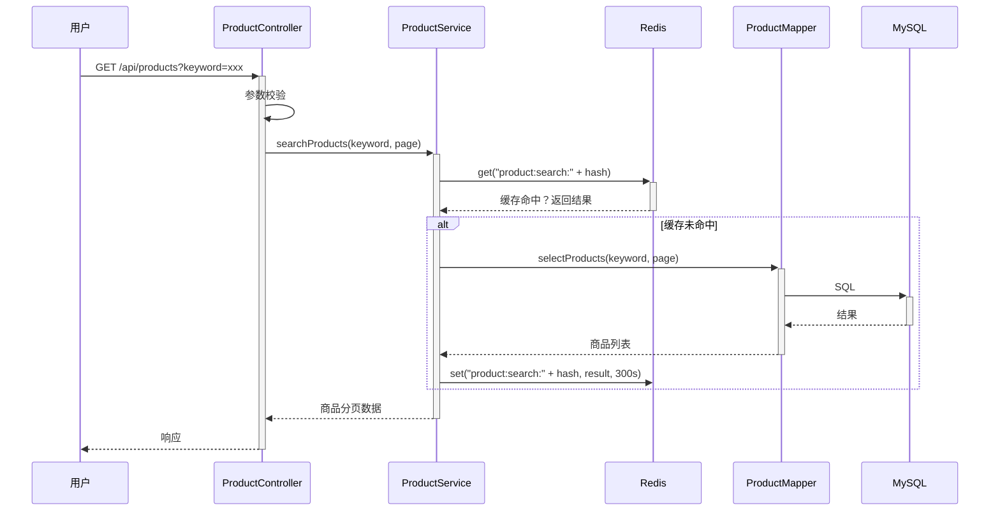

**业务规则：**
| 规则编号 | 规则描述 | 校验时机 | 不满足时的处理 |
|----------|----------|----------|--------------|
| R01 | 仅查询 status=1 的上架商品 | 查询时 | 自动过滤 |
| R02 | 商品名称支持模糊匹配 | 查询时 | - |
| R03 | 搜索结果缓存 5 分钟 | 查询后 | - |

**异常场景：**
| 异常场景 | 处理方式 |
|----------|----------|
| Redis 故障 | 降级直查数据库，记录告警 |
| 数据库连接超时 | 返回服务繁忙，提示重试 |

**并发控制：**
- 并发场景：大量用户同时搜索热门关键词
- 控制策略：Redis 缓存 + 本地 Caffeine 二级缓存，热点数据本地缓存命中率 > 90%

---

### 5.2 订单模块

#### 5.2.1 表结构设计

##### 5.2.1.1 order（订单表）

| 字段名 | 数据类型 | 约束 | 默认值 | 说明 |
|--------|----------|------|--------|------|
| id | bigint | PK, 自增 | - | 系统自增主键 |
| order_no | varchar(64) | NOT NULL, UK | - | 订单编号 |
| user_id | bigint | NOT NULL | - | 用户 ID |
| total_amount | decimal(10,2) | NOT NULL | 0.00 | 订单总金额 |
| status | tinyint | NOT NULL | 0 | 订单状态 |
| pay_status | tinyint | NOT NULL | 0 | 支付状态 |
| pay_time | datetime | - | - | 支付时间 |
| expire_time | datetime | NOT NULL | - | 订单过期时间 |
| remark | varchar(500) | - | - | 备注 |
| gmt_create | datetime | NOT NULL | CURRENT_TIMESTAMP | 创建时间 |
| gmt_modified | datetime | NOT NULL | CURRENT_TIMESTAMP | 修改时间 |

**索引：**
- UK: `order_no`
- IDX: `idx_order_user` (user_id)
- IDX: `idx_order_status` (status)
- IDX: `idx_order_expire` (expire_time)

##### 5.2.1.2 order_item（订单项表）

| 字段名 | 数据类型 | 约束 | 默认值 | 说明 |
|--------|----------|------|--------|------|
| id | bigint | PK, 自增 | - | 系统自增主键 |
| order_id | bigint | NOT NULL, FK | - | 订单 ID |
| sku_id | bigint | NOT NULL | - | SKU ID |
| product_name | varchar(255) | NOT NULL | - | 商品名称 |
| sku_name | varchar(255) | NOT NULL | - | SKU 名称 |
| price | decimal(10,2) | NOT NULL | 0.00 | 单价 |
| quantity | int | NOT NULL | 1 | 数量 |
| total_price | decimal(10,2) | NOT NULL | 0.00 | 小计金额 |
| gmt_create | datetime | NOT NULL | CURRENT_TIMESTAMP | 创建时间 |

**索引：**
- IDX: `idx_item_order` (order_id)
- IDX: `idx_item_sku` (sku_id)

##### 5.2.1.3 order_status_log（订单状态日志表）

| 字段名 | 数据类型 | 约束 | 默认值 | 说明 |
|--------|----------|------|--------|------|
| id | bigint | PK, 自增 | - | 系统自增主键 |
| order_id | bigint | NOT NULL, FK | - | 订单 ID |
| pre_status | tinyint | - | - | 变更前状态 |
| cur_status | tinyint | NOT NULL | - | 变更后状态 |
| operator | varchar(50) | - | - | 操作人 |
| remark | varchar(500) | - | - | 备注 |
| gmt_create | datetime | NOT NULL | CURRENT_TIMESTAMP | 创建时间 |

**索引：**
- IDX: `idx_status_log_order` (order_id)

##### 5.2.1.4 枚举与常量定义

| 枚举名称 | 取值 | 含义 | 关联字段 |
|----------|------|------|----------|
| order_status | 0 | 待支付 | order.status |
| order_status | 1 | 已支付 | order.status |
| order_status | 2 | 已发货 | order.status |
| order_status | 3 | 已完成 | order.status |
| order_status | 4 | 已取消 | order.status |
| order_status | 5 | 退款中 | order.status |
| order_status | 6 | 已退款 | order.status |
| pay_status | 0 | 未支付 | order.pay_status |
| pay_status | 1 | 支付成功 | order.pay_status |
| pay_status | 2 | 支付失败 | order.pay_status |
| pay_status | 3 | 已退款 | order.pay_status |

#### 5.2.2 接口详细设计

##### W05 创建订单

- **URI**: POST /api/orders
- **描述**: 从购物车或立即购买创建订单
- **入参**:

| 参数名称 | 类型 | 是否必填 | 描述 |
|----------|------|----------|------|
| skuItems | List | 是 | SKU 列表 [{skuId, quantity}] |
| addressId | Long | 是 | 收货地址 ID |
| remark | String | 否 | 备注 |

- **出参**:

| 参数名称 | 类型 | 描述 |
|----------|------|------|
| result | String | 结果 code |
| msg | String | 提示信息 |
| data | Object | 订单信息 |

- **错误码**:

| 错误码 | 说明 |
|--------|------|
| ORDER_001 | 库存不足 |
| ORDER_002 | SKU 不存在 |
| ORDER_003 | 参数非法 |

##### W06 订单详情查询

- **URI**: GET /api/orders/{id}
- **描述**: 查询订单详情
- **入参**:

| 参数名称 | 类型 | 是否必填 | 描述 |
|----------|------|----------|------|
| id | Long | 是 | 订单 ID |

- **出参**:

| 参数名称 | 类型 | 描述 |
|----------|------|------|
| result | String | 结果 code |
| msg | String | 提示信息 |
| data | Object | 订单详情 |

#### 5.2.3 子功能详细设计

##### 5.2.3.1 订单创建（F03）

- 处理时序图
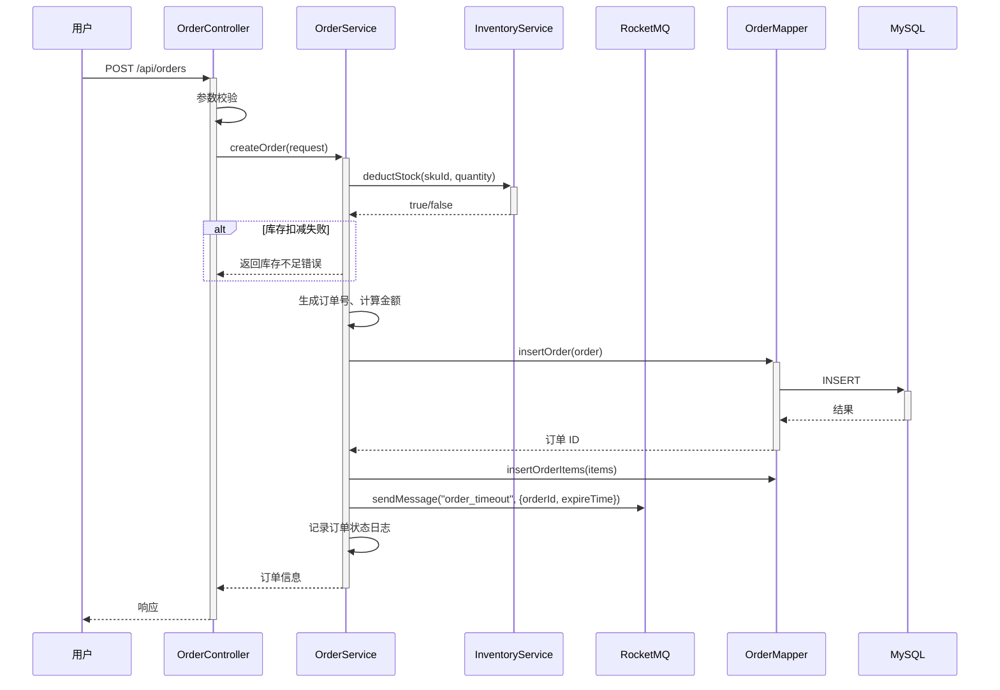

**业务规则：**
| 规则编号 | 规则描述 | 校验时机 | 不满足时的处理 |
|----------|----------|----------|--------------|
| R01 | 库存必须大于等于购买数量 | 创建订单时 | 返回 ORDER_001 |
| R02 | 订单总金额 = SUM(订单项小计) | 创建订单时 | 计算后校验 |
| R03 | 订单过期时间 = 创建时间 + 30 分钟 | 创建订单时 | 自动设置 |
| R04 | 订单创建后发送超时消息到 MQ | 创建订单后 | 异步处理 |

**异常场景：**
| 异常场景 | 处理方式 |
|----------|----------|
| 库存扣减后订单创建失败 | 事务回滚，库存回退，记录异常日志 |
| MQ 发送失败 | 记录补偿任务，定时重试 |
| 数据库主键冲突 | 订单号重试生成，最多 3 次 |

**并发控制：**
- 并发场景：多人同时抢购同一 SKU
- 控制策略：数据库乐观锁（version 字段）+ Redis 分布式锁（锁粒度：sku:{skuId}），秒杀场景额外使用 Redis 预扣库存

**状态机设计：**
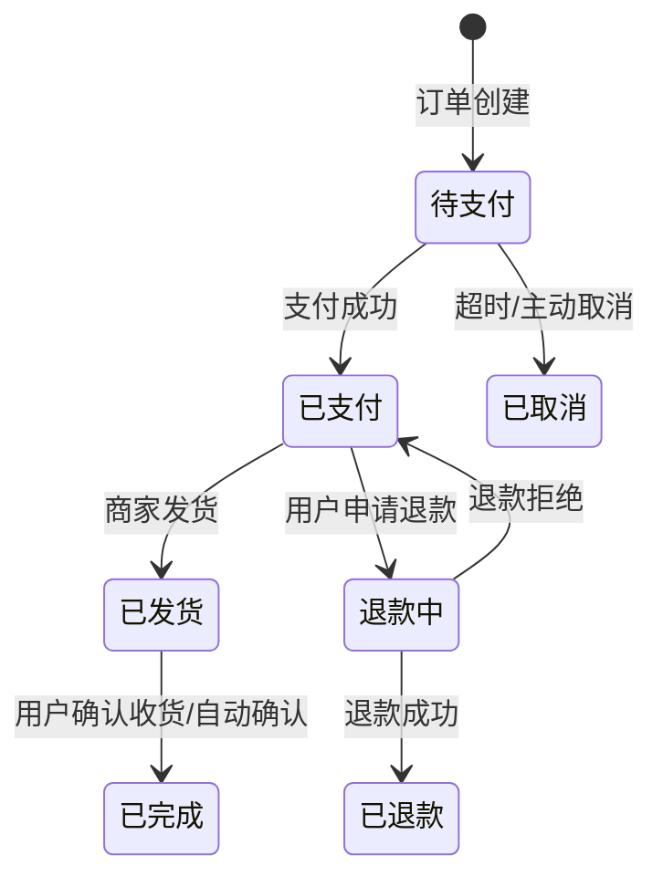

**状态流转规则：**
| 当前状态 | 目标状态 | 流转条件 | 前置校验 | 触发动作 |
|----------|----------|----------|----------|----------|
| 待支付 | 已支付 | 支付回调成功 | 支付金额=订单金额 | 更新 pay_time，发送已支付消息 |
| 待支付 | 已取消 | 超时 30 分钟未支付 | - | 回退库存，发送取消消息 |
| 已支付 | 退款中 | 用户申请退款 | 订单状态=已支付 | 发送退款申请消息 |
| 退款中 | 已退款 | 退款回调成功 | - | 更新 refund_time，发送退款消息 |

##### 5.2.3.2 订单超时取消（F04）

- 处理时序图
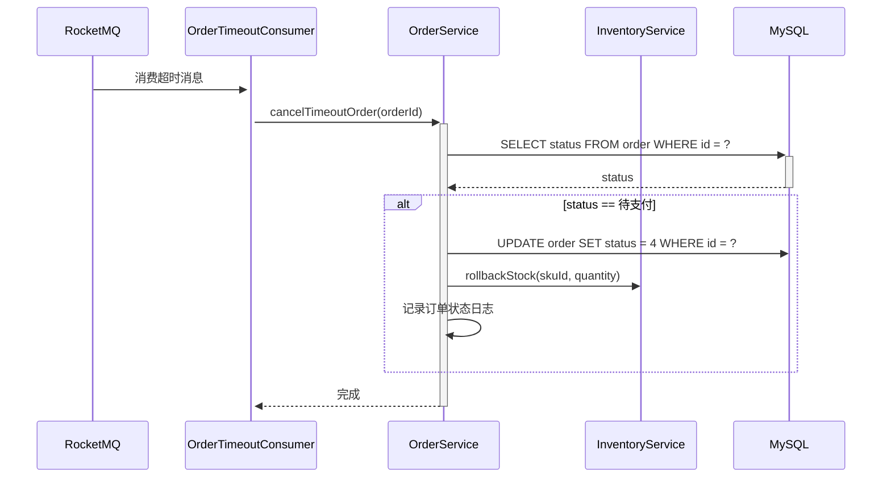

**业务规则：**
| 规则编号 | 规则描述 | 校验时机 | 不满足时的处理 |
|----------|----------|----------|--------------|
| R05 | 仅待支付订单可超时取消 | 消费 MQ 时 | 忽略消息 |
| R06 | 超时取消后必须回退库存 | 取消时 | 异步补偿，失败重试 |
| R07 | 每个订单仅处理一次超时 | 消费时 | 幂等键：order:{orderId}:cancelled |

---

### 5.3 支付模块

#### 5.3.1 表结构设计

##### 5.3.1.1 payment（支付记录表）

| 字段名 | 数据类型 | 约束 | 默认值 | 说明 |
|--------|----------|------|--------|------|
| id | bigint | PK, 自增 | - | 系统自增主键 |
| order_id | bigint | NOT NULL, FK | - | 订单 ID |
| pay_no | varchar(64) | NOT NULL, UK | - | 支付流水号 |
| channel | tinyint | NOT NULL | - | 支付渠道 |
| third_pay_no | varchar(128) | - | - | 第三方支付流水号 |
| amount | decimal(10,2) | NOT NULL | 0.00 | 支付金额 |
| status | tinyint | NOT NULL | 0 | 支付状态 |
| pay_time | datetime | - | - | 支付成功时间 |
| notify_data | text | - | - | 回调通知原始数据 |
| gmt_create | datetime | NOT NULL | CURRENT_TIMESTAMP | 创建时间 |
| gmt_modified | datetime | NOT NULL | CURRENT_TIMESTAMP | 修改时间 |

**索引：**
- UK: `pay_no`
- IDX: `idx_payment_order` (order_id)
- IDX: `idx_payment_third` (third_pay_no)

##### 5.3.1.2 refund（退款记录表）

| 字段名 | 数据类型 | 约束 | 默认值 | 说明 |
|--------|----------|------|--------|------|
| id | bigint | PK, 自增 | - | 系统自增主键 |
| payment_id | bigint | NOT NULL, FK | - | 支付记录 ID |
| refund_no | varchar(64) | NOT NULL, UK | - | 退款流水号 |
| third_refund_no | varchar(128) | - | - | 第三方退款流水号 |
| amount | decimal(10,2) | NOT NULL | 0.00 | 退款金额 |
| status | tinyint | NOT NULL | 0 | 退款状态 |
| reason | varchar(500) | - | - | 退款原因 |
| gmt_create | datetime | NOT NULL | CURRENT_TIMESTAMP | 创建时间 |
| gmt_modified | datetime | NOT NULL | CURRENT_TIMESTAMP | 修改时间 |

**索引：**
- UK: `refund_no`
- IDX: `idx_refund_payment` (payment_id)

##### 5.3.1.3 枚举与常量定义

| 枚举名称 | 取值 | 含义 | 关联字段 |
|----------|------|------|----------|
| pay_channel | 1 | 支付宝 | payment.channel |
| pay_channel | 2 | 微信支付 | payment.channel |
| pay_status | 0 | 待支付 | payment.status |
| pay_status | 1 | 支付成功 | payment.status |
| pay_status | 2 | 支付失败 | payment.status |
| refund_status | 0 | 退款中 | refund.status |
| refund_status | 1 | 退款成功 | refund.status |
| refund_status | 2 | 退款失败 | refund.status |

#### 5.3.2 接口详细设计

##### W08 发起支付

- **URI**: POST /api/payments
- **描述**: 创建支付请求，返回支付所需参数
- **入参**:

| 参数名称 | 类型 | 是否必填 | 描述 |
|----------|------|----------|------|
| orderId | Long | 是 | 订单 ID |
| channel | Integer | 是 | 支付渠道 1-支付宝 2-微信 |

- **出参**:

| 参数名称 | 类型 | 描述 |
|----------|------|------|
| result | String | 结果 code |
| msg | String | 提示信息 |
| data | Object | 支付参数（支付宝 form/微信 prepayId） |

- **错误码**:

| 错误码 | 说明 |
|--------|------|
| PAY_001 | 订单不存在 |
| PAY_002 | 订单状态非法 |
| PAY_003 | 支付渠道不支持 |

##### W09 支付回调通知

- **URI**: POST /api/payments/callback
- **描述**: 接收支付宝/微信异步支付回调
- **入参**:

| 参数名称 | 类型 | 是否必填 | 描述 |
|----------|------|----------|------|
| channel | Integer | 是 | 支付渠道 |
| ... | - | - | 各渠道回调参数 |

- **出参**:

| 参数名称 | 类型 | 描述 |
|----------|------|------|
| result | String | 结果 code |

#### 5.3.3 子功能详细设计

##### 5.3.3.1 支付宝支付（F05）

- 处理时序图
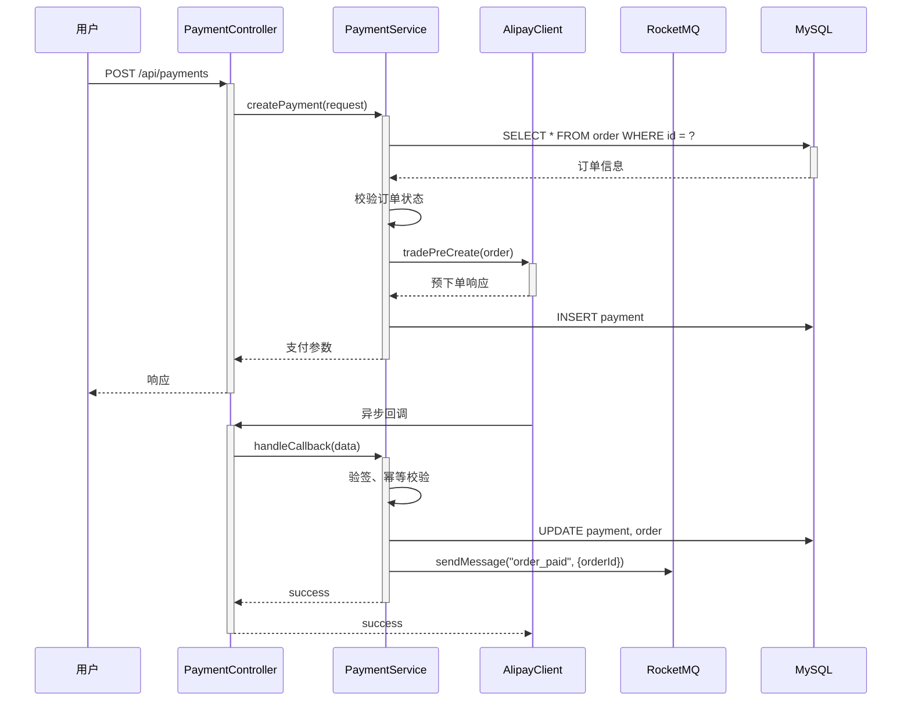

**业务规则：**
| 规则编号 | 规则描述 | 校验时机 | 不满足时的处理 |
|----------|----------|----------|--------------|
| R08 | 仅待支付订单可发起支付 | 创建支付时 | 返回 PAY_002 |
| R09 | 支付金额必须等于订单金额 | 回调时 | 记录异常，人工介入 |
| R10 | 同一订单不可重复支付 | 创建支付时 | 返回已有支付进行中 |
| R11 | 回调通知幂等处理 | 回调时 | 重复通知直接返回 success |

**并发控制：**
- 并发场景：支付回调与超时取消并发
- 控制策略：数据库乐观锁（order.status + version），支付回调更新时校验 status=0

##### 5.3.3.2 退款处理（F07）

- 处理时序图
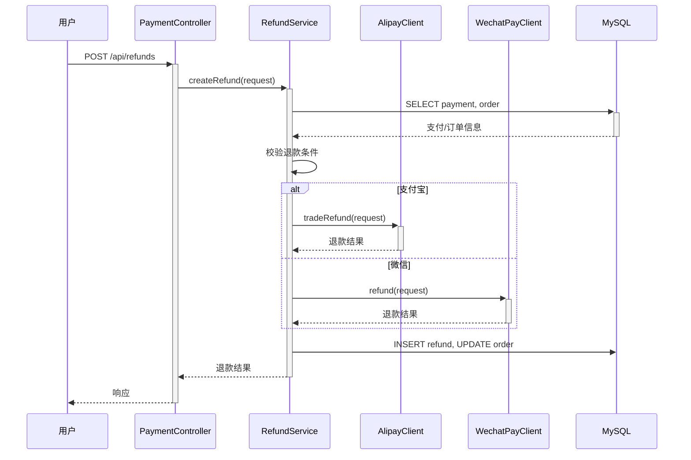

**业务规则：**
| 规则编号 | 规则描述 | 校验时机 | 不满足时的处理 |
|----------|----------|----------|--------------|
| R12 | 仅已支付订单可申请退款 | 申请时 | 返回错误 |
| R13 | 退款金额 <= 订单已支付金额 | 申请时 | 返回错误 |
| R14 | 退款失败支持重试 | 退款回调失败 | 定时任务补偿 |

---

### 5.4 秒杀模块

#### 5.4.1 表结构设计

##### 5.4.1.1 seckill_activity（秒杀活动表）

| 字段名 | 数据类型 | 约束 | 默认值 | 说明 |
|--------|----------|------|--------|------|
| id | bigint | PK, 自增 | - | 系统自增主键 |
| activity_name | varchar(255) | NOT NULL | - | 活动名称 |
| sku_id | bigint | NOT NULL | - | 参与秒杀的 SKU ID |
| seckill_price | decimal(10,2) | NOT NULL | 0.00 | 秒杀价 |
| stock | int | NOT NULL | 0 | 秒杀库存 |
| start_time | datetime | NOT NULL | - | 开始时间 |
| end_time | datetime | NOT NULL | - | 结束时间 |
| status | tinyint | NOT NULL | 0 | 活动状态 |
| gmt_create | datetime | NOT NULL | CURRENT_TIMESTAMP | 创建时间 |
| gmt_modified | datetime | NOT NULL | CURRENT_TIMESTAMP | 修改时间 |

**索引：**
- IDX: `idx_seckill_sku` (sku_id)
- IDX: `idx_seckill_time` (start_time, end_time)

##### 5.4.1.2 seckill_order（秒杀订单表）

| 字段名 | 数据类型 | 约束 | 默认值 | 说明 |
|--------|----------|------|--------|------|
| id | bigint | PK, 自增 | - | 系统自增主键 |
| activity_id | bigint | NOT NULL, FK | - | 活动 ID |
| order_id | bigint | NOT NULL, FK | - | 订单 ID |
| user_id | bigint | NOT NULL | - | 用户 ID |
| seckill_price | decimal(10,2) | NOT NULL | 0.00 | 秒杀价 |
| gmt_create | datetime | NOT NULL | CURRENT_TIMESTAMP | 创建时间 |

**索引：**
- UK: `seckill_order_user_activity` (user_id, activity_id)
- IDX: `idx_seckill_order_order` (order_id)

#### 5.4.2 接口详细设计

##### W12 秒杀下单

- **URI**: POST /api/seckill/orders
- **描述**: 秒杀活动抢购下单
- **入参**:

| 参数名称 | 类型 | 是否必填 | 描述 |
|----------|------|----------|------|
| activityId | Long | 是 | 活动 ID |
| addressId | Long | 是 | 收货地址 ID |

- **出参**:

| 参数名称 | 类型 | 描述 |
|----------|------|------|
| result | String | 结果 code |
| msg | String | 提示信息 |
| data | Object | 订单信息 |

- **错误码**:

| 错误码 | 说明 |
|--------|------|
| SECKILL_001 | 活动未开始/已结束 |
| SECKILL_002 | 库存已售罄 |
| SECKILL_003 | 每人限购已超 |
| SECKILL_004 | 活动不存在 |

#### 5.4.3 子功能详细设计

##### 5.4.3.1 秒杀下单（F08）

- 处理时序图
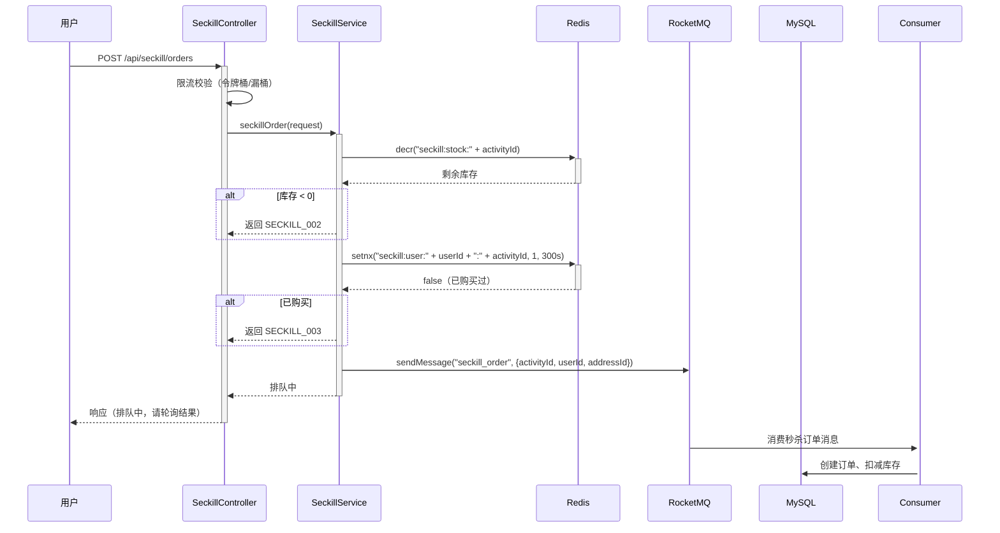

**业务规则：**
| 规则编号 | 规则描述 | 校验时机 | 不满足时的处理 |
|----------|----------|----------|--------------|
| R15 | 活动时间校验 | 下单时 | 返回 SECKILL_001 |
| R16 | Redis 预扣库存 >= 0 | 下单时 | 返回 SECKILL_002 |
| R17 | 每人每活动限购 1 件 | 下单时 | 返回 SECKILL_003 |
| R18 | 异步创建订单，超时 30 秒未成功自动释放库存 | 消费消息时 | 补偿任务回退 |

**并发控制：**
- 并发场景：大量用户同时秒杀同一商品
- 控制策略：
  - Redis 原子递减扣库存（decr），单线程保证原子性
  - Redis setnx 防重复购买
  - 异步 MQ 削峰，控制数据库写入速率
  - 限流：Gateway 层令牌桶限流，每秒 QPS 控制

---

### 5.5 流量管控模块

#### 5.5.1 表结构设计

无需独立表，基于 Redis + Gateway 配置实现。

#### 5.5.2 接口详细设计

无需对外接口，作为基础设施集成到 Gateway。

#### 5.5.3 子功能详细设计

##### 5.5.3.1 限流/降级/熔断（F10）

**业务规则：**
| 规则编号 | 规则描述 | 校验时机 | 不满足时的处理 |
|----------|----------|----------|--------------|
| R19 | 单用户限流：每秒最大请求数 | 请求时 | 返回 429 Too Many Requests |
| R20 | 全局限流：系统最大并发数 | 请求时 | 返回 503 Service Unavailable |
| R21 | 熔断：错误率超过阈值自动熔断 | 运行时 | 返回降级提示 |
| R22 | 降级：非核心功能自动降级 | 负载高时 | 关闭商品推荐等非核心接口 |

**技术方案：**
- **限流**：Sentinel 令牌桶/漏桶算法，支持热点参数限流
- **熔断**：Sentinel 熔断器，基于错误率和响应时间
- **降级**：非核心接口（商品推荐、历史记录）自动降级，返回缓存数据或空值

---

## 6. 非功能性需求设计

### 6.1 高可用性

- **服务多副本**：核心服务（订单、支付、秒杀）至少 3 个副本部署，支持故障自动转移
- **数据库高可用**：MySQL 主从同步，主库故障自动切换；读写分离分散压力
- **Redis 高可用**：主从 + Sentinel 哨兵模式，自动故障转移
- **RocketMQ 高可用**：2m-2s-sync 部署，NameServer 集群，Broker 主从同步复制
- **降级策略**：支付服务异常时，订单进入待支付状态，用户可重新支付；秒杀服务异常时返回活动暂停

### 6.2 可扩展性

- **水平扩容**：无状态服务设计，支持通过 K8s HPA 自动扩容
- **数据库分库分表**：订单表按 user_id 分库分表，支持水平扩展
- **缓存扩容**：Redis 集群模式，支持动态添加节点
- **MQ 扩容**：RocketMQ Broker 支持动态扩缩容

### 6.3 稳定性/可靠性

- **幂等设计**：支付回调、退款、超时取消等接口均实现幂等，幂等键：业务唯一标识
- **事务补偿**：库存扣减与订单创建使用本地事务 + 异步补偿，确保最终一致性
- **超时控制**：所有外部调用（支付 SDK、数据库）设置合理超时时间，防止线程阻塞
- **重试机制**：MQ 消费失败自动重试 3 次，进入死信队列人工处理
- **数据校验**：支付回调金额校验、签名验签，防止篡改

### 6.4 安全性设计

#### 6.4.1 账户系统方案
- 假设已有统一身份认证体系，通过 JWT Token 传递用户身份
- Gateway 层统一鉴权，校验 Token 有效性

#### 6.4.2 授权&访问控制

##### 6.4.2.1 水平权限检查
- Gateway 层解析 Token 获取 user_id，Service 层校验 user_id 与资源归属关系
- 示例：订单详情查询校验 order.user_id == current_user_id

##### 6.4.2.2 垂直权限检查
- 通过统一认证平台配置角色权限
- 管理后台接口独立鉴权，与买家端隔离

##### 6.4.2.3 登录态检查
- /api/** 路径统一拦截校验 Token
- 支付回调 /api/payments/callback 配置白名单，跳过登录态校验（通过签名验签）

#### 6.4.3 数据防护方案

##### 6.4.3.1 敏感数据加密存储
- 支付相关敏感配置（私钥、证书）通过环境变量注入，不存储在代码中
- 用户手机号、身份证号等加密存储（AES-256）

##### 6.4.3.2 敏感数据展示脱敏
- 日志打印脱敏：手机号中间 4 位掩码，身份证号中间 8 位掩码
- 接口返回脱敏：手机号 138****8888
- 支付回调日志：不记录密钥、证书内容

### 6.5 监控/统计/日志/告警

- **监控**：Prometheus + Grafana 监控 QPS、RT、错误率、JVM 指标
- **链路追踪**：SkyWalking/Zipkin 全链路追踪，订单全流程可观测
- **日志**：ELK 日志收集，订单号作为 trace_id 贯穿全链路
- **告警**：
  - QPS 超过阈值告警
  - 错误率 > 5% 告警
  - 支付成功率 < 95% 告警
  - 订单超时未处理告警
  - 秒杀库存不足告警

---

## 7. 变更三板斧

### 7.1 可监控

- **关键埋点**：
  - 订单创建量、支付量、退款量（按分钟/小时/天统计）
  - 支付成功率、退款成功率
  - 秒杀活动参与人数、库存消耗速率
  - 接口 QPS、RT、错误率
- **可视化**：Grafana Dashboard 实时展示核心业务指标

### 7.2 可灰度

- **灰度策略**：
  - 新功能按用户 ID 哈希灰度（如 5% -> 20% -> 50% -> 100%）
  - 支付渠道新增：先灰度部分用户测试，确认无误后全量
  - 秒杀活动：新活动先小范围测试，验证库存扣减逻辑
- **灰度回滚**：配置中心动态开关，发现问题立即关闭新功能开关

### 7.3 可应急

- **关键开关**：
  - 秒杀开关：紧急情况下关闭秒杀入口
  - 支付开关：单个支付渠道异常时关闭该渠道
  - 降级开关：非核心功能一键降级（推荐、历史记录）
- **应急方案**：
  - 秒杀超卖：人工介入补偿，库存数据修复
  - 支付回调丢失：定时任务扫描待支付订单，主动查询支付状态
  - 订单状态不一致：通过 MQ 重试 + 人工干预恢复
  - 注意：回滚前确认依赖关系，避免回滚导致其他问题
