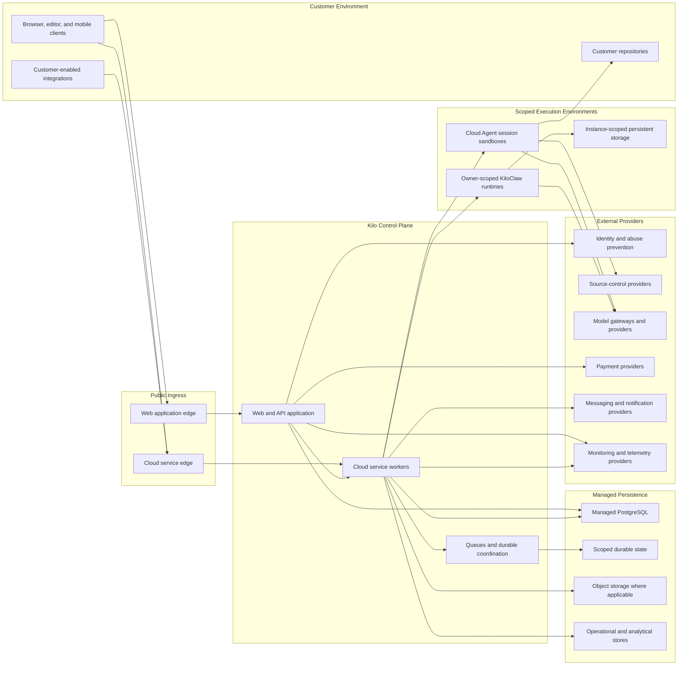
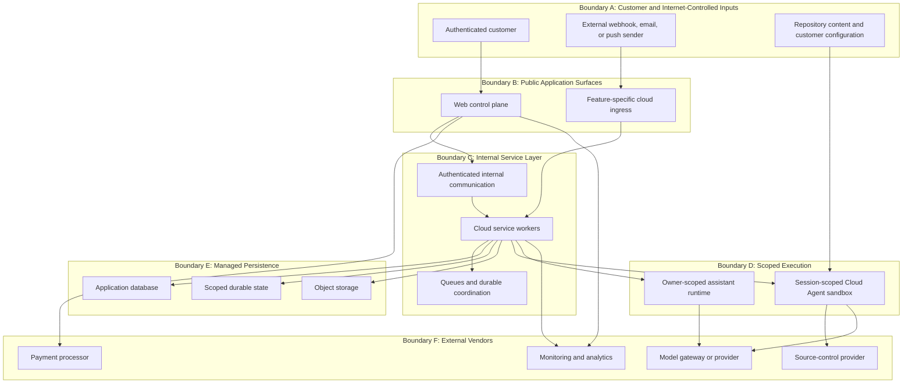
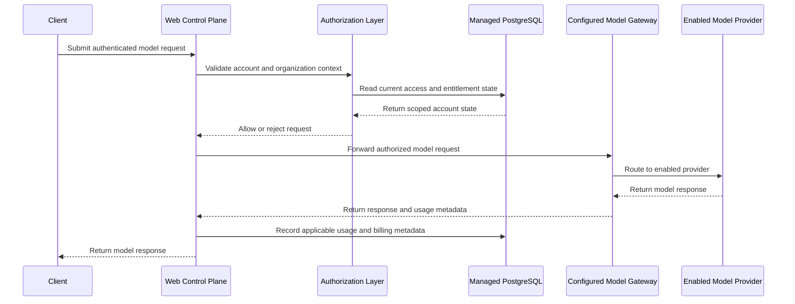
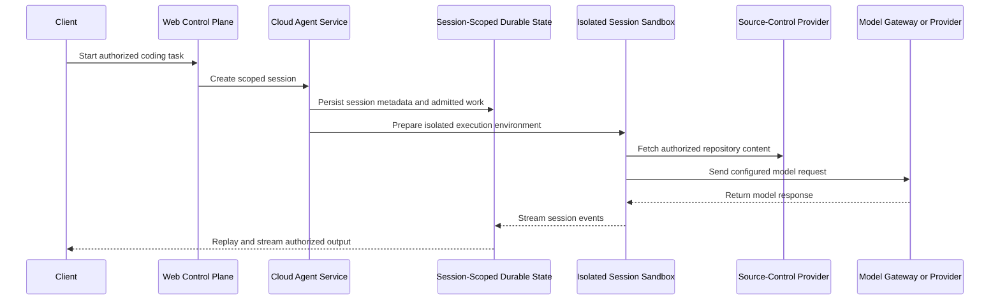
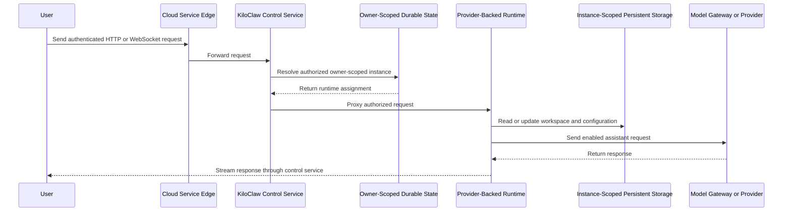
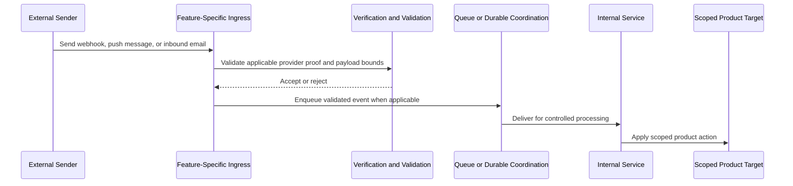
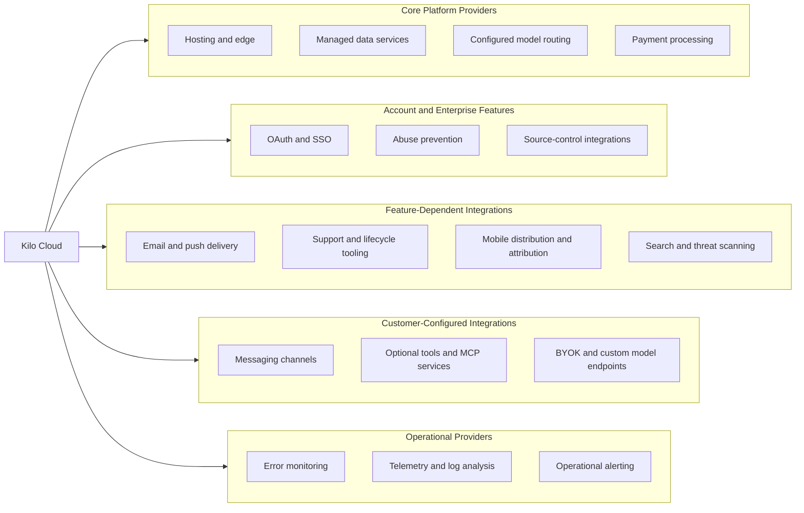

# Kilo Cloud Security Architecture Overview

## Document metadata

| Field | Value |
|---|---|
| Audience | Customer security reviewers and technical due-diligence teams |
| Document version | 1.0 |
| Document owner | Kilo engineering |
| Codebase version | Last reviewed at commit 8d5cdea0d in main branch |
| Review cadence | Quarterly and before material hosting, runtime, or data-flow changes |

## Version history

| Version | Date | Summary |
|---|---|---|
| 1.0 | 2026-06-02 | Established the repository-backed customer-review architecture overview, diagrams, trust boundaries, data flows, and integration inventory. |

## Maintainer agent update prompt

Use the following prompt when refreshing this report after cloud repository changes. The prompt is intentionally self-contained so an agent can perform a repository-backed architecture review without treating the current document as the sole source of truth.

```text
You are a software security engineer updating docs/security-architecture-overview.md for a customer security review.

Goal:
Refresh the document so it accurately describes the current cloud repository's high-level security architecture, including network topology, data flows, trust boundaries, managed persistence, isolated execution environments, privacy-relevant flows, and third-party integrations. Keep the report customer-facing: provide enough resolution for clarity and confidence without exposing sensitive operational details.

Required workflow:
1. Read AGENTS.md and any nested AGENTS.md files relevant to the areas you inspect. Read the current report, the historical web architecture diagram, and any domain specs governing changed areas before editing.
2. Review repository changes since the report's Architecture baseline and inspect the current implementation. At minimum, examine the Vercel-hosted web control plane, Cloudflare Worker manifests and service bindings, Durable Objects, queues, object storage, Hyperdrive/PostgreSQL usage, Cloud Agent sandboxes, KiloClaw runtimes, mobile configuration, privacy deletion flows, telemetry configuration, and integration-related code or documentation.
3. Distinguish repository-supported facts from live production settings. Do not claim that a provider, region, route, rollout, retention period, backup policy, encryption setting, WAF rule, or compliance control is active unless the evidence supports that claim. Use labels such as Platform dependency, Feature-dependent, Customer-configured, Runtime-selected, or Production validation required.
4. Keep diagrams and narrative at a logical architecture level. Do not publish internal routes, hostnames, resource identifiers, secret names, environment-variable names, queue names, binding names, class names, token formats, header names, ports, machine identifiers, retry counts, or low-level reconciliation details.
5. Re-check customer-sensitive areas explicitly: public or optionally authenticated ingress, identity and authorization paths, WebSocket controls, model routing and subprocessors, preview or experiment prompt retention, user soft-delete exceptions, runtime secret transport, mobile diagnostic telemetry, logging redaction, and customer-configured integrations.
6. Update Mermaid diagrams, tables, the Architecture baseline date, Document version, and Version history. Add one concise version-history row describing the refresh. Preserve prior history rows.
7. Ensure the external integration inventory reflects current repository support while making clear that live production enablement requires environment-specific validation.
8. Validate the finished Markdown: run the repository formatter, run bun run script/check-md-table-padding.ts docs/security-architecture-overview.md, inspect the diff, and statically inspect Mermaid fences and syntax. Run a focused security-document review before committing.

Important constraints:
- This is not a penetration-test report, DPA, subprocessor list, business continuity plan, or compliance attestation.
- Do not copy stale provider, residency, certification, privacy, backup, or continuity claims from historical documentation without current evidence.
- Do not log, print, or copy credential values while researching.
- Keep legal and contractual claims in the authoritative legal or compliance documents; link or defer to them where appropriate.
- If live production configuration is unavailable, state the validation requirement instead of guessing.
```

## 1. Purpose and scope

This document provides a high-level security architecture overview of the Kilo Cloud platform. It describes the logical network topology, major data flows, trust boundaries, data stores, and external integrations represented by the current cloud repository.

The document is intentionally more abstract than an internal runbook. It does not publish internal routes, resource identifiers, secret names, queue names, low-level runtime settings, or deployment credentials. It also does not replace a penetration-test report, data processing agreement, subprocessor list, business continuity plan, or compliance attestation.

The repository establishes architectural intent and application-level controls. Some production properties are managed outside source control and require environment-specific validation, including enabled vendor features, exact regions, retention settings, backup policies, firewall policies, web application firewall rules, identity-provider policies, and credential-rotation procedures.

## 2. Executive overview

Kilo Cloud combines a web control plane with Cloudflare-hosted service components and scoped execution environments:

- Customer browsers, editor clients, mobile clients, and enabled integrations connect to public application surfaces.
- A Vercel-hosted Next.js application provides account management, organization authorization, billing, product configuration, and API orchestration.
- Cloudflare Workers provide feature-specific ingress, authenticated internal service communication, queue-backed workflows, durable coordination, real-time streams, and selected sandbox orchestration.
- Managed PostgreSQL stores relational control-plane records. Cloudflare Durable Objects, queues, KV, R2 object storage, and optional specialized stores support scoped state, event processing, caching, and feature-specific content storage.
- Cloud Agent coding sessions execute in isolated Cloudflare sandbox containers coordinated on a per-session basis.
- KiloClaw assistant instances run in owner-scoped, provider-backed runtimes with instance-scoped persistent storage and encrypted configuration delivery.
- External providers may be invoked as platform dependencies, operational services, enabled product capabilities, or customer-selected integrations. Active providers and processing paths must be validated against the live production inventory.

The architecture separates public ingress from internal service communication and separates orchestration from isolated execution. Customer-provided repository content, prompts, configuration, and optional credentials remain important inputs to the effective trust boundary of each enabled feature.

## 3. Logical network topology



### Component summary

| Layer | Customer-facing description | Security relevance |
|---|---|---|
| Client applications | Browser, editor, mobile, and supported application clients | User-controlled environments where authentication begins |
| Web control plane | Next.js application hosted on Vercel | Identity, organization authorization, billing, configuration, and API orchestration |
| Cloud service layer | Cloudflare Workers connected through feature-specific ingress and service bindings | Authenticated APIs, asynchronous workflows, durable coordination, streaming, and integration delivery |
| Managed persistence | PostgreSQL, Durable Object storage, queues, object storage, caches, and feature-specific analytical stores | Scoped application records, durable state, reliable background processing, and operational telemetry |
| Cloud Agent execution | Session-scoped sandbox containers | Isolated coding-task execution with authorized repository and model access |
| KiloClaw execution | Owner-scoped provider-backed runtimes with persistent storage | Dedicated assistant runtime with scoped configuration and lifecycle coordination |
| External providers | Identity, source-control, model, billing, messaging, telemetry, and optional tool providers | Explicit third-party trust boundaries invoked by enabled capabilities |

## 4. Trust boundaries



| Boundary | What crosses it | Primary controls represented in the repository |
|---|---|---|
| Customer clients to public application surfaces | User sessions, bearer tokens, API requests, WebSocket connections, and customer input | Session and token validation, organization-aware authorization, client blocking logic, security headers, short-lived stream tickets where applicable, and configured origin allowlists on selected WebSocket paths |
| External systems to feature-specific ingress | Webhooks, inbound email, push messages, and scheduled callbacks | Provider signatures or tokens when applicable, optional shared-secret protection for customer-configured trigger endpoints, payload validation, bounded request sizes on selected paths, header redaction, idempotency handling, and queue-backed processing |
| Web control plane to Cloudflare services | Session preparation, orchestration, integration delivery, and internal callbacks | Service credentials, scoped callback tokens, or Cloudflare service bindings depending on the flow |
| Cloudflare services to persistence | Relational records, durable coordination state, queue messages, objects, and telemetry | Scoped identifiers, schema validation, service-specific authorization, and storage separation by feature |
| Control plane to execution environments | Repository metadata, task input, protected credentials, and runtime configuration | Session or owner scoping, isolated runtime allocation, encrypted secret transport for supported flows, and just-in-time secret availability |
| Kilo Cloud to third-party providers | OAuth flows, repository operations, model requests, payments, notifications, and telemetry | Provider-specific credentials, customer opt-in where applicable, scoped tokens where supported, and feature-based routing |

## 5. Identity and access model

### 5.1 Customer authentication

The web control plane uses JWT-backed application sessions and supports multiple sign-in methods. Repository-supported identity providers include Google, Apple, GitHub, GitLab, Discord, LinkedIn OpenID Connect, WorkOS enterprise SSO, and email magic links. Development-only test login behavior is conditionally gated and is not a production identity path.

Cloudflare Turnstile is used as an anti-abuse control during applicable sign-in flows. Stytch telemetry is used as an additional fraud and abuse signal. WorkOS supports organization SSO and domain-based enterprise login routing.

### 5.2 API and service authorization

Kilo Cloud distinguishes among several authorization contexts:

- Browser sessions for customer use of the web application.
- Signed bearer tokens for non-browser clients and selected cloud services.
- Organization membership and role checks for tenant-scoped operations.
- Administrative authorization for restricted operational capabilities.
- Internal service credentials, callback tokens, and Cloudflare service bindings for machine-to-machine communication.
- Short-lived streaming or connection tickets for selected real-time channels.
- Provider-specific signature validation or token validation for supported external ingress paths.

Repository code includes token-version checks in shared JWT validation paths and revocation-pepper checks in selected web and Worker authorization paths. The exact lifetime, rotation cadence, and emergency-revocation process for production credentials are operational controls managed outside this overview.

### 5.3 Tenant and execution scoping

Application data is commonly scoped to either a user or an organization. Cloud Agent durable state is session-scoped. KiloClaw runtimes are owner-scoped rather than shared global assistant processes. Some product areas are actively evolving from user-specific instances toward broader owner-scoped multi-instance support; this document describes the stable security boundary rather than transitional routing details.

## 6. Data categories and persistence

### 6.1 High-level data categories

| Data category | Examples | Typical processing context |
|---|---|---|
| Identity and account data | Email address, name, profile metadata, authentication-provider links, and account state | Sign-in, account administration, support, and privacy workflows |
| Organization and access data | Organization membership, roles, invitations, SSO domains, and audit actors | Tenant authorization and enterprise administration |
| Billing metadata | Customer identifiers, subscription state, transaction references, invoices, and limited payment-method metadata | Billing, entitlement, reconciliation, and financial record keeping |
| Usage and operational metadata | Model selection, token counts, costs, feature status, session identifiers, timestamps, and error summaries | Usage metering, product operation, support, and reliability monitoring |
| Repository and automation data | Repository metadata, branch and commit references, issue or review context, webhook payloads, and security findings | Source-control integration, Cloud Agent work, review automation, and security features |
| AI and session content | Prompts, responses, conversation history, task metadata, attachments, and session events | AI inference, Cloud Agent sessions, KiloClaw, and explicitly enabled experiments |
| Integration configuration | OAuth connection metadata, provider configuration, webhook settings, and customer-provided secrets | Enabled integrations and owner-scoped runtime configuration |
| Network and anti-abuse telemetry | IP address, user agent, device or browser signals, and risk metadata | Abuse prevention, fraud controls, and security investigation |
| Mobile and notification data | Device tokens, notification status, and mobile-store transaction metadata | Mobile authentication, subscription handling, and notifications |

### 6.2 Persistence surfaces

| Persistence surface | Primary role | Notes for security review |
|---|---|---|
| Managed PostgreSQL | Relational application system of record and workflow state | Production database vendor, regions, backup policy, and network controls must be confirmed from the live environment |
| Cloudflare Durable Objects | Strongly consistent, scoped coordination and feature-specific state | Used for session, instance, notification, chat, ingestion, and orchestration workflows |
| Cloudflare Queues | Asynchronous processing, retry, and dead-letter workflows | Used where delivery should be decoupled from public ingress or long-running processing |
| Cloudflare R2 object storage | Session blobs, attachments, feature assets, staging objects, and telemetry export where applicable | Bucket policy, lifecycle, encryption, residency, and deletion behavior are verified through production configuration rather than repository code alone |
| Cloudflare KV | Cache, rollout, deduplication, and operational configuration | Used for cache and configuration scenarios rather than strongly consistent authority |
| Optional cache and specialized stores | Redis-compatible cache, vector indexes, and analytical stores | Active provider and feature usage are environment-dependent |
| Runtime persistent storage | Owner-scoped KiloClaw workspace and configuration persistence | Bound to the assigned provider-backed runtime and treated as a separate execution trust boundary |

Explicitly selected preview or experiment models may retain request bodies for experiment analysis under a separate opt-in disclosure and retention policy. This data is not part of the default user soft-delete path and requires the dedicated experiment-data wipe process.

### 6.3 Data protection approach

Repository-supported application controls include:

- Sensitive customer-provided secrets are not intended to be embedded in source code or public configuration.
- Cloud Agent supports encrypted backend-to-backend secret delivery with injection into isolated execution environments only when needed.
- KiloClaw user-provided secrets follow an encrypted transport pipeline and sensitive runtime configuration is decrypted during controlled bootstrap.
- KiloClaw bootstrap fails closed when encrypted runtime values cannot be decrypted as expected.
- Shared logging guidance prohibits logging tokens, credentials, authentication headers, cookies, and webhook secrets.
- Header-redaction helpers are available for stored or logged HTTP headers.
- Selected webhook records store redacted headers rather than raw sensitive header values.
- The web application includes a user soft-delete flow that anonymizes or deletes many user-linked records and resources while retaining records required for financial, audit, anti-abuse, or explicitly documented product purposes.

This overview intentionally does not make a universal claim that every external provider, store, log destination, or backup uses the same retention or encryption configuration. Those controls must be confirmed against the production inventory and applicable vendor assurance documentation.

## 7. Core data flows

### 7.1 Web application and model request flow



The exact model subprocessor can vary by selected model, configured gateway, customer BYOK choice, organization-specific endpoint configuration, and controlled experiment routing. A production subprocessor inventory should therefore be generated from current runtime configuration rather than inferred solely from static source code.

### 7.2 Cloud Agent session flow



Cloud Agent sessions are coordinated durably and execute inside isolated sandbox containers. Session events can be replayed to authorized clients after reconnect. Repository credentials and supported user-provided secrets are resolved through scoped services and protected delivery paths.

### 7.3 KiloClaw owner-scoped runtime flow



KiloClaw separates lifecycle coordination from the runtime process. The control service authenticates and scopes requests, durable state coordinates instance lifecycle, and the assigned runtime uses persistent storage for its workspace and configuration. Sensitive runtime values follow the encrypted configuration path before controlled bootstrap.

### 7.4 External event ingestion flow



Externally reachable ingestion exists only for feature-specific purposes. Examples include source-control webhooks, payment events, mobile-store notifications, customer-configured webhook triggers, Gmail push notifications, and inbound email. Verification varies by provider and feature; selected paths use signatures, scoped tokens, OIDC claims, hashed shared secrets, payload limits, idempotency records, and queue-backed processing. Some customer-configured webhook-trigger endpoints may be intentionally public unless the customer configures shared-secret protection; those paths still apply payload-size, content-type, and in-flight bounds.

## 8. Security controls summary

| Control area | Architecture-level control |
|---|---|
| Authentication | JWT-backed web sessions, bearer-token support for non-browser clients, enterprise SSO support, and provider-specific ingress verification |
| Authorization | User, organization, role, and administrative checks applied according to the operation |
| Abuse prevention | Turnstile login checks, fraud telemetry, client blocking logic, bounded payload handling on selected external ingress, and deployment threat scanning |
| Internal service separation | Cloudflare service bindings, scoped callback tokens, and service credentials separate public access from internal orchestration |
| Execution isolation | Session-scoped Cloud Agent sandboxes and owner-scoped KiloClaw runtimes separate untrusted task execution from the web control plane |
| Secret handling | Protected configuration storage, encrypted delivery for supported runtime secrets, fail-closed bootstrap behavior, and logging prohibitions for sensitive values |
| Data minimization and privacy | Soft-delete and anonymization workflows, redacted webhook headers, explicit experiment opt-in paths, and retention exceptions documented by purpose |
| Reliability and integrity | Durable coordination, queue-backed workflows, retries, dead-letter patterns, idempotency handling, and instance reconciliation where applicable |
| Browser hardening | HSTS, framing restrictions, MIME sniffing protection, referrer policy, cross-origin policies, permissions restrictions, and configurable Content Security Policy reporting or enforcement |
| Observability | Error reporting, structured operational metrics, log aggregation, and alerting integrations with production retention and access settings managed operationally |

## 9. Third-party integration topology



### 9.1 Integration status legend

| Status | Meaning |
|---|---|
| Platform dependency | Represented as part of the platform architecture or deployment path |
| Feature-dependent | Repository-supported integration invoked when the relevant capability is used or enabled; live production enablement requires validation |
| Customer-configured | Opt-in integration or endpoint selected and configured by the customer |
| Runtime-selected | Supported by the repository, but the active provider, route, or rollout is determined outside static source code |
| Production validation required | Referenced by code or configuration, but live enablement or provider details must be confirmed before making an external contractual claim |

### 9.2 Hosting, edge, storage, and runtime providers

| Provider or service | Status | Security-relevant role |
|---|---|---|
| Vercel | Platform dependency | Hosts the Next.js web control plane and API application |
| Cloudflare | Platform dependency | Provides Workers, edge ingress, Durable Objects, queues, KV, R2 object storage, Hyperdrive connectivity, containers, email routing, and selected operational telemetry capabilities |
| Managed PostgreSQL | Platform dependency | Primary relational application database; current production hosting vendor and regions require live inventory validation |
| Provider-backed KiloClaw runtime hosting | Runtime-selected | Hosts owner-scoped KiloClaw runtimes and persistent runtime volumes; active providers and rollout require live inventory validation |
| Redis-compatible cache | Runtime-selected | Optional cache and adapter storage for selected web functionality; active production provider is environment-driven |
| Vector index services | Runtime-selected | Feature-specific code-indexing storage; active production provider and residency require validation |
| Snowflake | Feature-dependent | Analytical and billing-query integration for selected operational workflows |

### 9.3 Identity, security, and source-control providers

| Provider or service | Status | Security-relevant role |
|---|---|---|
| Google, Apple, GitHub, GitLab, Discord, and LinkedIn | Feature-dependent | Supported customer sign-in providers |
| WorkOS | Feature-dependent | Enterprise SSO and organization-domain administration |
| Cloudflare Turnstile | Feature-dependent | Login anti-abuse challenge verification |
| Stytch | Feature-dependent | Device and fraud telemetry for abuse prevention |
| GitHub Apps and GitHub APIs | Feature-dependent | Repository installation access, webhook handling, and repository-scoped automation |
| GitLab APIs, including self-hosted GitLab support | Feature-dependent | Repository integration, webhook handling, and automation; customer-configured hosts expand the outbound trust boundary |
| DoltHub | Feature-dependent | Specialized collaboration and workflow integration |
| Google Web Risk | Feature-dependent | Deployment URL threat scanning |

### 9.4 AI, search, and customer-selected model providers

| Provider or service | Status | Security-relevant role |
|---|---|---|
| OpenRouter | Feature-dependent | Default model gateway for applicable AI requests |
| Vercel AI Gateway | Feature-dependent | Optional model-routing and BYOK path |
| Enabled direct model providers | Runtime-selected | Selected models can use direct upstream routes; the active provider list should come from the production model catalog |
| Customer BYOK providers | Customer-configured | Customers can provide supported provider credentials for selected model routes |
| Organization custom model endpoints | Customer-configured | Authorized organizations can configure custom model endpoints, expanding the outbound trust boundary |
| Exa | Feature-dependent | Search API proxy for enabled search capability |
| Mistral | Feature-dependent | Direct model and embedding capability where selected |

The repository supports dynamic model routing, including controlled experiments. A current legal or procurement subprocessor list should be maintained independently from this static architecture overview.

### 9.5 Billing, messaging, support, and mobile providers

| Provider or service | Status | Security-relevant role |
|---|---|---|
| Stripe | Feature-dependent | Web billing, subscriptions, payment methods, invoices, and signed billing events |
| Apple App Store | Feature-dependent | Mobile subscription verification and signed store notifications |
| Churnkey | Feature-dependent | Optional retention and cancellation-management capability |
| Impact.com | Feature-dependent | Affiliate and referral conversion reporting |
| Mailgun | Feature-dependent | Transactional email delivery |
| NeverBounce | Feature-dependent | Email deliverability validation for applicable sends |
| Customer.io | Feature-dependent | Lifecycle integration and privacy-cleanup path |
| Pylon | Feature-dependent | Authenticated customer-support widget |
| Expo | Feature-dependent | Mobile push notifications and mobile build services |
| Google Cloud Pub/Sub and Gmail APIs | Feature-dependent | Gmail push delivery for enabled KiloClaw integrations |
| Slack, Discord, Telegram, and Linear | Customer-configured or feature-dependent | Messaging, bot, and workflow integrations depending on product context |
| AppsFlyer | Feature-dependent | Consent-gated mobile attribution |
| Apple App Store Connect and Google Play | Feature-dependent | Mobile application distribution; this does not by itself establish billing support for both stores |

### 9.6 Monitoring and operational providers

| Provider or service | Status | Security-relevant role |
|---|---|---|
| Sentry | Feature-dependent | Web, mobile, and selected service error reporting |
| PostHog | Feature-dependent | Product analytics and selected KiloClaw telemetry |
| Axiom | Feature-dependent | Cloudflare log analysis destination |
| Cloudflare Analytics Engine and Pipelines | Feature-dependent | Structured operational metrics and export pipelines |
| Better Stack | Feature-dependent | Scheduled-worker heartbeat monitoring |
| Slack | Feature-dependent | Operational alert delivery |
| Snowflake | Feature-dependent | Analytical export and selected billing-query workflows |

The mobile application is configured for Sentry error reporting with sampled session replay and error-time diagnostic attachments, including screenshots and view hierarchy. Production privacy review must validate masking, access controls, retention, and the effective deployed configuration.

### 9.7 Customer-configured KiloClaw extensions

KiloClaw can support optional credentials supplied by a customer for an individual owner-scoped runtime. Examples represented in the repository include messaging channels, GitHub access, 1Password, Brave Search, Linear, AgentCard, Composio CLI, and customer-configured MCP services.

These integrations are opt-in and expand the effective trust boundary of the configured runtime. Composio is supported only as explicit user-provided configuration; Kilo does not provision managed Composio identities or fall back to operator-owned credentials. Supported KiloClaw secrets follow the encrypted instance-secret transport path.

## 10. Privacy, logging, and retention considerations

### 10.1 Privacy handling

The repository contains an explicit user soft-delete flow. At a high level, it anonymizes direct user PII, rotates or invalidates authentication material, deletes many user-owned records and integrations, removes selected object-storage content, and requests deletion from selected downstream services. Financial, audit, anti-abuse, and product-specific records can have documented retention exceptions. Request bodies retained for explicitly selected preview or experiment models use a separate opt-in retention policy and dedicated experiment-data wipe process rather than the default user soft-delete path.

A production privacy review should validate deletion coverage for object storage, Durable Object state, vector stores, analytical stores, runtime volumes, backups, telemetry providers, and each enabled third-party processor.

### 10.2 Logging safety

Repository policy prohibits logging tokens, credentials, authentication headers, cookies, and webhook secrets. Shared redaction helpers exist for HTTP headers, and selected integrations add feature-specific sanitization. Operational telemetry can still contain customer-linked identifiers and diagnostic content, so production access control, filtering, retention, and vendor configuration remain important controls. The mobile application is configured for sampled Sentry replay and error-time diagnostic attachments, including screenshots and view hierarchy; deployed masking, access, and retention controls require production validation.

### 10.3 Data residency and retention

Data paths vary by product and enabled integration. Residency and retention commitments should be stated only in the applicable contractual or product documentation after validation against the live production inventory. This includes managed PostgreSQL, Cloudflare persistence, KiloClaw runtime volumes, model providers, telemetry providers, mobile services, customer-configured endpoints, and backups.

## 11. Shared responsibility

Kilo Cloud provides platform controls for authentication, scoped authorization, internal-service separation, durable coordination, execution isolation, and protected handling of supported secrets. Customers remain responsible for decisions that expand their enabled trust boundary, including:

- Which repositories, organizations, users, and source-control installations they authorize.
- Which models, BYOK credentials, custom model endpoints, and optional integrations they enable.
- Which setup commands, repository code, MCP servers, and third-party tools they permit inside an isolated agent session or owner-scoped runtime.
- Whether customer-configured endpoints and credentials meet their own security, privacy, and compliance requirements.
- How they review generated changes before merging or deploying them.

## 12. Environment-specific validation checklist

Before external publication or use as contractual evidence, validate the following against the live production environment:

1. Active hosting providers, KiloClaw runtime-provider rollout, database vendor, and deployed regions.
2. PostgreSQL, R2, experiment-prompt object, Durable Object, queue, KV, runtime-volume, analytical-store, and backup retention policies.
3. Encryption-at-rest, TLS, private-networking, firewall, WAF, DDoS, rate-limit, configured WebSocket-origin allowlists, and Cloudflare Access policies managed outside source control.
4. Active OAuth, SSO, billing, telemetry, messaging, mobile, model, and customer-support integrations.
5. Current model gateway routes, direct upstream model providers, experiments, BYOK options, and custom-endpoint controls.
6. Secret ownership, least-privilege access, rotation cadence, emergency revocation, and cross-environment separation.
7. Logging filters, Sentry configuration, replay or screenshot collection, telemetry data dictionaries, access policies, and retention periods.
8. Privacy deletion coverage across databases, object storage, Durable Objects, vector stores, runtime volumes, backups, enabled external processors, and the dedicated experiment-data wipe process.
9. Backup, recovery, queue dead-letter handling, reconciliation, and incident-response procedures.
10. Current DPA, subprocessor list, compliance reports, and vendor assurance documentation.

## 13. Internal evidence baseline

This report was compiled from repository sources, including the following internal architecture and policy references:

- `AGENTS.md`
- `apps/web/src/docs/network-compliance-diagram.md`
- `apps/web/src/lib/user/server.ts`
- `apps/web/src/lib/user/index.ts`
- `apps/web/src/lib/security-headers.ts`
- `apps/web/next.config.mjs`
- `packages/db/src/schema.ts`
- `packages/encryption/src/encryption.ts`
- `packages/worker-utils/src/redact-headers.ts`
- `services/cloud-agent-next/AGENTS.md`
- `services/cloud-agent-next/docs/diagrams.md`
- `services/kiloclaw/README.md`
- `services/kiloclaw/AGENTS.md`
- `.specs/kiloclaw-controller.md`
- `.specs/kiloclaw-composio.md`
- `.specs/model-experiments.md`
- `services/webhook-agent-ingest/README.md`
- `services/gmail-push/README.md`
- `services/kiloclaw-inbound-email/README.md`

The prior web-only network diagram remains useful historical context but does not represent the current hybrid web, Worker, sandbox, and owner-scoped runtime architecture on its own.
