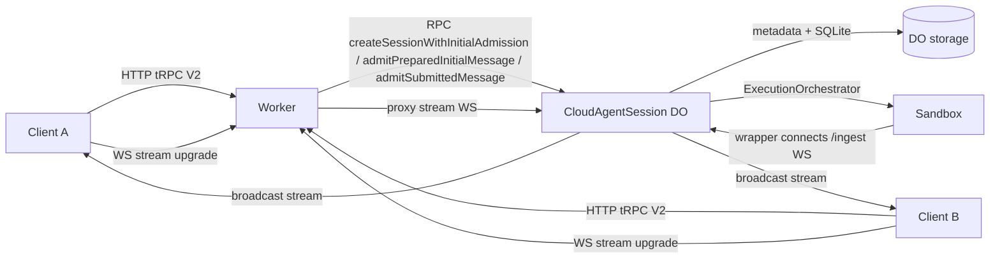
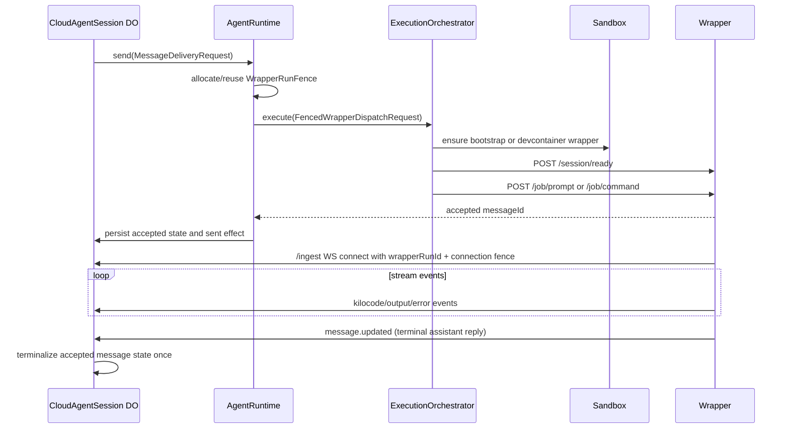
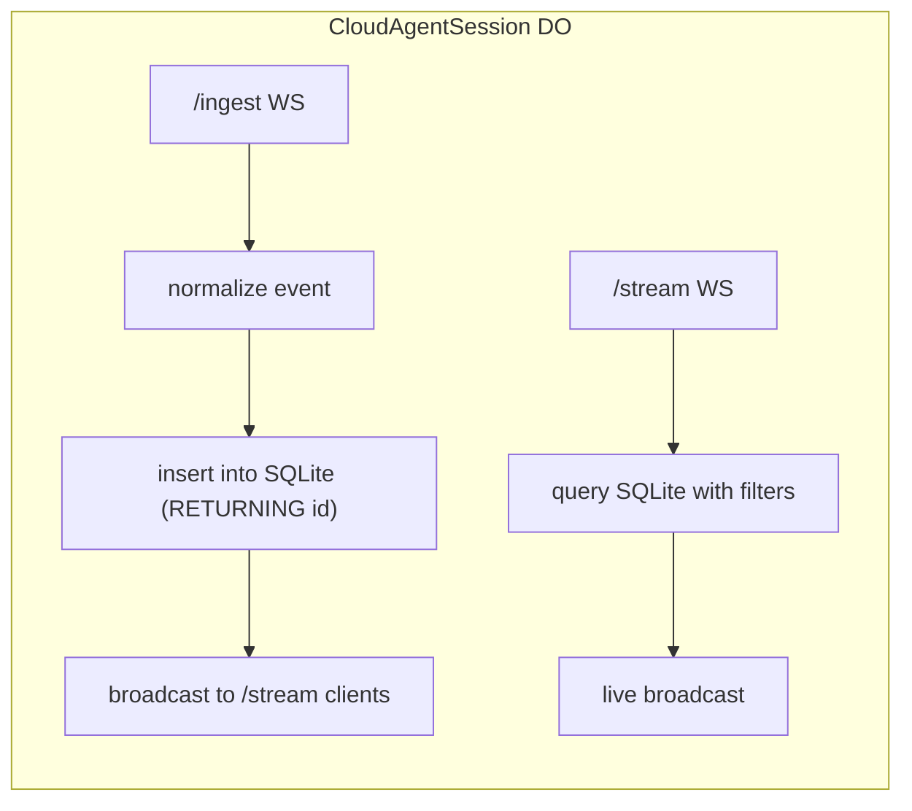
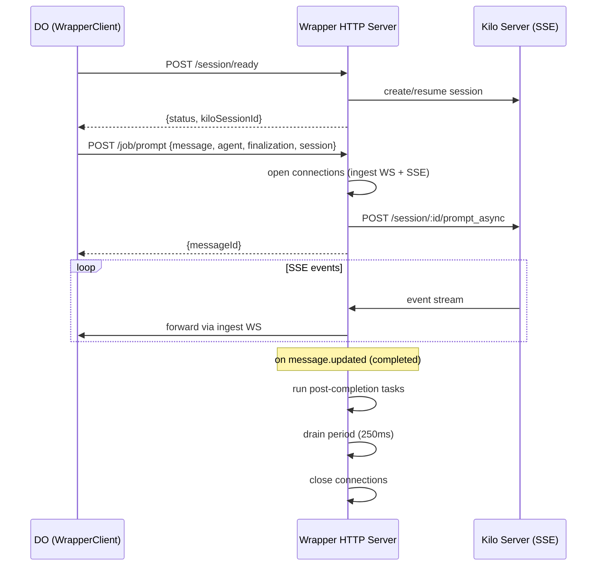
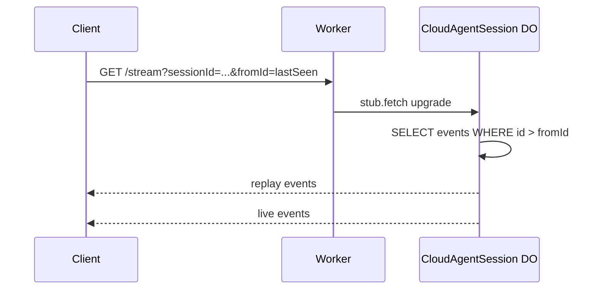
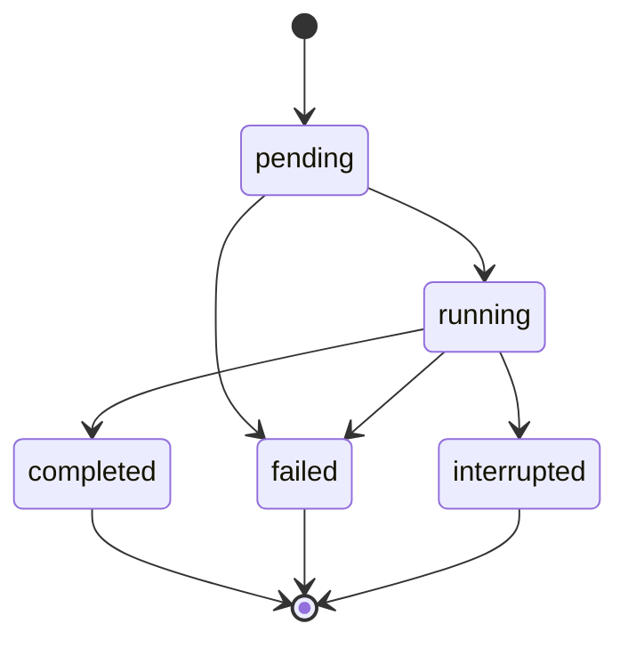
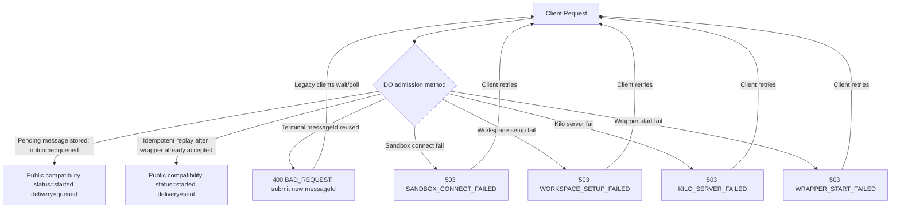

# Cloud-Agent WebSockets: Core Diagrams

These diagrams capture the core loops/patterns for queue-first V2 acceptance,
DO ingestion + replay, and client reconnect.

---

## 1) System overview (data flow)



---

## 2) Queue-first handoff

```mermaid
sequenceDiagram
  participant C as Client
  participant W as Worker (tRPC)
  participant SI as Session Ingest
  participant DO as CloudAgentSession DO
  participant SB as Sandbox

  alt grouped start
    C->>W: start(initial turn)
    W->>SI: create ownership row (external prerequisite)
    W->>DO: createSessionWithInitialAdmission(accepted initial turn)
    DO->>DO: register metadata, persist V2 intent + lifecycle state, ensure one queued event, schedule drain
    Note over DO: One DO-owned command; staged writes, retries repair missing event/drain effects
    DO-->>W: outcome=queued (durable admission)
    W-->>C: compatibility ack {cloudAgentSessionId, kiloSessionId, messageId, delivery=queued}
    Note over W,SI: Explicit DO rejection attempts best-effort onlyIfEmpty deletion; unknown RPC outcome retains possibly orphaned state for cleanup
  else legacy prepared initiation
    C->>W: initiateFromKilocodeSessionV2
    W->>DO: admitPreparedInitialMessage() adapter reconstructs stored turn
    DO->>DO: persist V2 intent + lifecycle state and schedule drain
    DO-->>W: outcome=queued (durable admission)
    W-->>C: compatibility ack {cloudAgentSessionId, executionId=messageId, status=started, streamUrl, messageId, delivery=queued}
  else follow-up submission
    C->>W: send / sendMessageV2
    W->>DO: admitSubmittedMessage(submitted turn + overrides)
    DO->>DO: persist V2 intent + lifecycle state and schedule drain
    DO-->>W: outcome=queued (durable admission)
    W-->>C: compatibility ack {cloudAgentSessionId, executionId=messageId, status=started, messageId, delivery=queued}
  end

  Note over C,DO: queued acknowledgement is durable admission; wrapper delivery may fail asynchronously
  DO->>DO: alarm takes next eligible pending message
  DO->>DO: AgentRuntime reuses/allocates complete WrapperRunFence
  DO->>SB: dispatch FencedWrapperDispatchRequest to wrapper
  SB->>SB: submit prompt or command to Kilo
  Note over SB: Ambiguous handoff may resubmit the same messageId; wrapper delivery is at-least-once until Kilo exposes atomic idempotent submit
  SB->>DO: acknowledge acceptance / fenced wrapperRunId ingest events
  DO->>DO: persist accepted state, ensure one sent-message event, remove pending residue
  alt terminal ingest arrives over current fence
    SB->>DO: forward terminal message.updated
    DO->>DO: settle once through terminal effect/callback seams
  else accepted wrapper is gone before terminal ingest
    DO->>DO: disconnect/liveness expiry fails accepted work without redispatch
    Note over DO,SB: No authoritative post-loss Kilo recovery contract exists today
  end
```

---

## 3) Fenced wrapper delivery lifecycle



---

## 4) DO ingest + stream handling



---

## 5) Wrapper lifecycle



---

## 6) Client reconnect + replay



---

## 7) Execution state machine (high-level)



---

## 8) Prepared session lifecycle (split legacy and auto-initiate)

```mermaid
sequenceDiagram
  participant B as Backend
  participant W as Worker (tRPC)
  participant DO as CloudAgentSession DO
  participant SB as Sandbox

  alt retained split legacy flow
    B->>W: prepareSession(autoInitiate=false)
    W->>DO: registerSession(metadata)
    DO-->>W: success + registered metadata only
    B->>W: initiateFromKilocodeSessionV2
    W->>DO: admitPreparedInitialMessage()
  else first-party creation flow
    B->>W: prepareSession(autoInitiate=true)
    W->>DO: createSessionWithInitialAdmission(canonical initial turn)
  end
  DO->>DO: persist V2 intent + lifecycle state and schedule drain
  DO-->>W: outcome=queued
  W-->>B: compatibility output (prepare shape unchanged; V2 alias remains status=started)
  DO->>SB: dispatch during drain

  B->>W: sendMessageV2 (follow-up)
  W->>DO: admitSubmittedMessage(submitted turn)
  DO-->>W: outcome=queued
  W-->>B: compatibility ack status=started, delivery=queued
```

---

## 9) Error handling and retries


